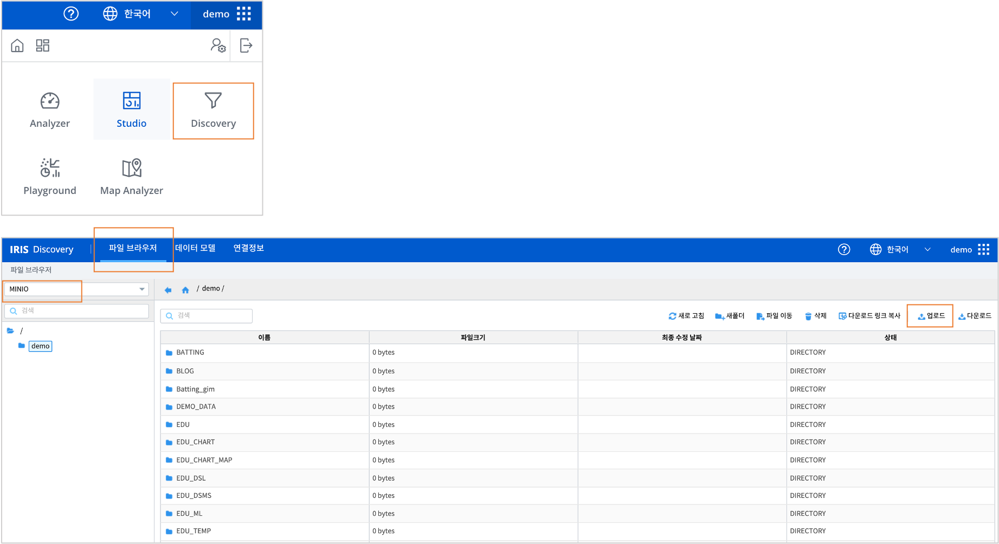
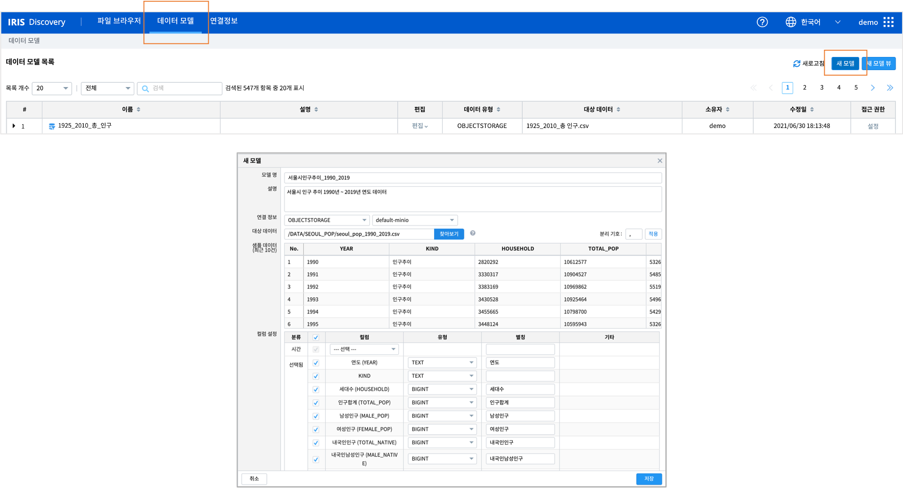
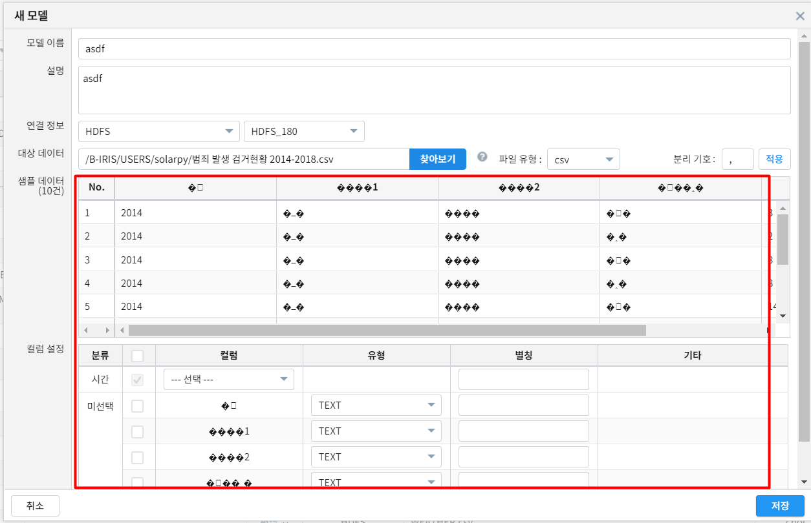
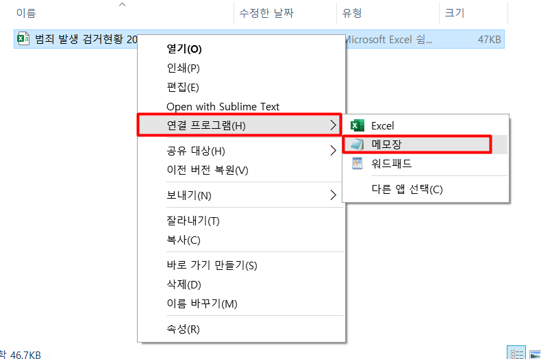
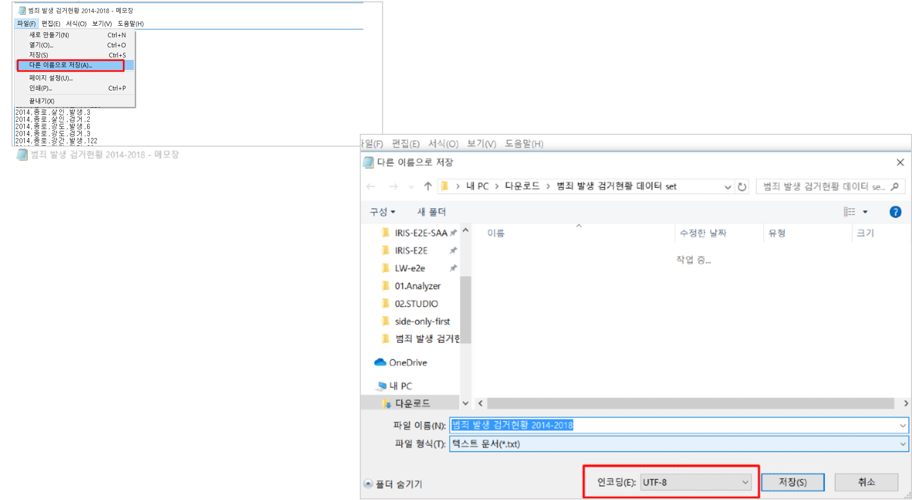
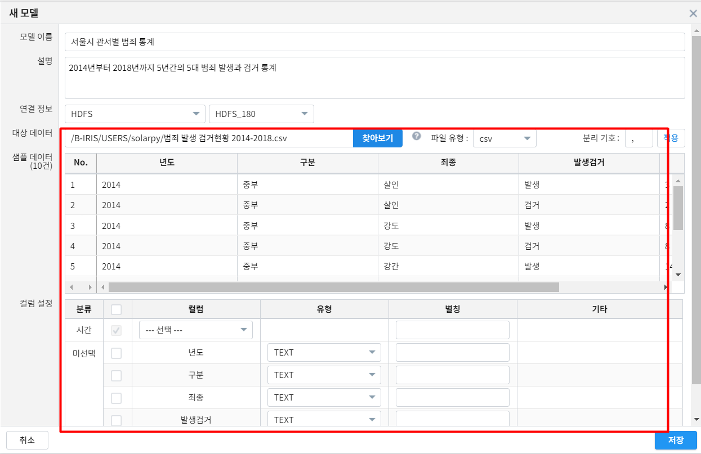
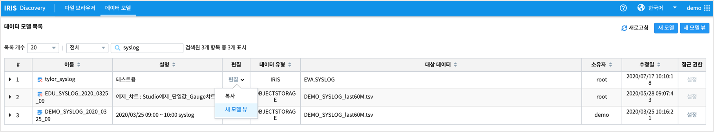
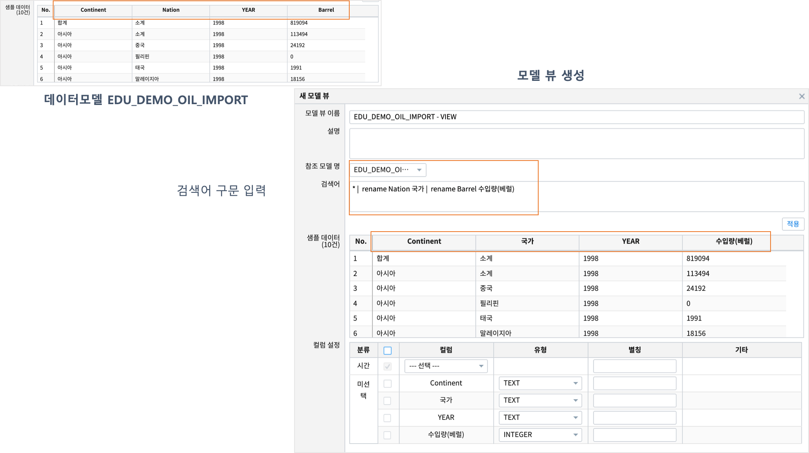
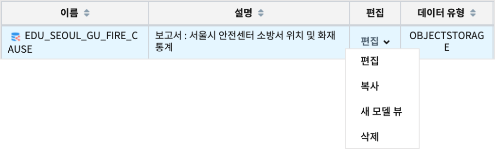
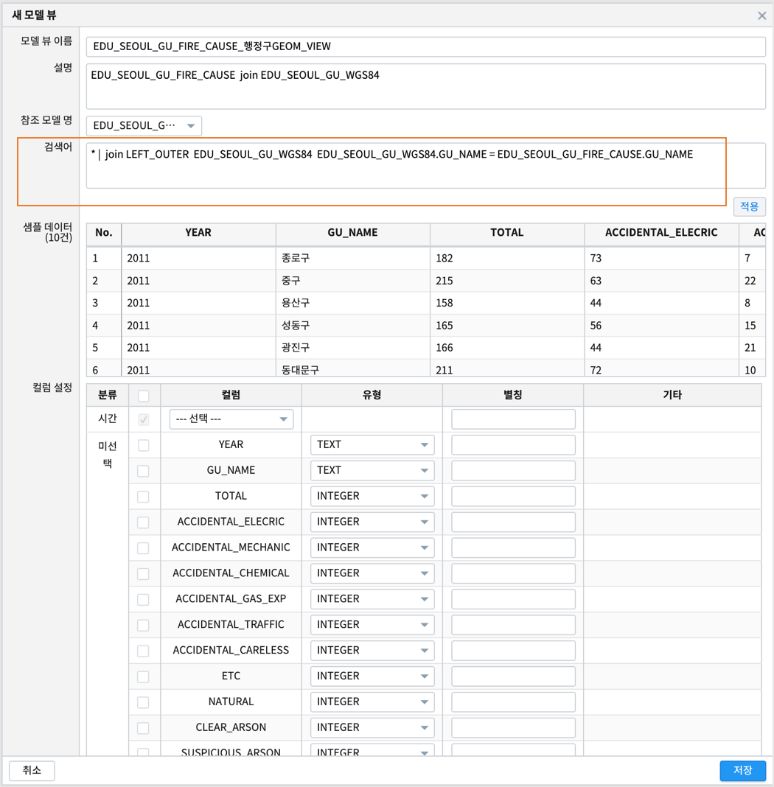

데이터 파일 IRIS 업로드와 분석준비 수행 
=======================================================================================

파일을 IRIS 에 업로드하기 
----------------------------------------------

로컬 PC 에 있는 파일들을 MinIO 에 업로드하는 방법을 예제로 설명합니다.

| 업로드 대상 데이터는 서울시 열린데이터광장(`서울열린데이터광장 <https://data.seoul.go.kr/>`__) 에서 내려 받은 공공 데이터 셋 파일입니다.
| 데이터의 특성 상 text 로 다운로드 되는 경우가 많으므로, 
| 분석을 위해서는 csv로 적절히 변환한 후에 MinIO 에 업로드합니다.
| MinIO 에 업로드한 csv 파일은 IRIS의 데이터모델로 만들어야 **분석/보고서** 메뉴에서 활용할 수 있습니다.

공공 데이터 내려 받기
----------------------------------------------

| 대상 데이터는 `서울시 인구 추이 (주민등록인구) 통계 <https://data.seoul.go.kr/dataList/418/S/2/datasetView.do?tab=S>`__ 입니다.
| 해당 데이터의 기간을 1990년 ~ 2019년 까지로 하여 text 로 다운로드합니다.
| 데이터를 다운로드 한 후, 컬럼 이름을 영문으로 다시 만들고, 숫자에 표시된 콤마를 제거한 후에 구분자를 콤마로 수정하여 csv 로 저장합니다.

.. image:: images/minio_pop_01.png
   :alt: text data

|

데이터 업로드 / 데이터 모델 생성하기
--------------------------------------------------------------------------------------

| IRIS 에서 제공하는 기본 Object 저장소로 해당 데이터 파일을 업로드합니다.
| **브라우저** 메뉴를 클릭하여 나의 MINIO 저장소로 이동한 후, 데이터가 저장될 새 폴더를 생성하고, **업로드** 를 클릭 한 후, 파일을 업로드를 진행 합니다.

| 업로드한 파일을 IRIS 의 **분석(Analyzer), 보고서(Studio)** 에서 사용하기 위해서는 **데이터 모델** 로 만들어야 합니다.
| **데이터 모델** 메뉴를 클릭하여 새모델을 만들어 봅니다.
| 모델 이름을 정한 후, 연결정보로 OBJECTSTORAGE 와 default-minio 로 선택하고, 브라우저에서 업로드한 파일이름을 찾아서 클릭합니다.
| 선택한 파일 내용이 샘플로 10개 만 로딩되어 보여집니다.

| MinIO 에 저장된 각 컬럼의 유형은 TEXT 로 저장되므로, 데이터모델에서 컬럼별 유헝을 변경해야 합니다. 유형은 TEXT, REAL, INTEGER, BIGINT, DATE, TIMESTAMP 로 변환할 수 있습니다.
| 또한 컬럼명이 영문이라 직관적이지 않으면, 한글 별칭을 추가로 입력할 수 있습니다. 
| **Manual » IRIS Discovery » 데이터 모델** 부분을 참조하시기 바랍니다.

| 이제부터는 새로 만든 데이터 모델을 **분석** 메뉴와 **보고서** 메뉴 등에서 사용할 수 있습니다.

.. image:: images/minio_pop_04.png
   :alt: data model 검색

| 

데이터 업로드 전에 확장자 확인하기
--------------------------------------------------------------------------------------

| 공공데이터 포털에서 csv를 다운받은 경우 인코딩이 ANSI 로 되어있어서 IRIS에서 데이터 모델 생성시 아래 그림과 같이 문자가 깨지는 경우가 발생할 수 있습니다.

   

|

1. csv 데이터를 인코딩 해주는 과정을 진행하기 위해서는 먼저 파일을 메모장으로 열어야 합니다.

   
   
|

2. 데이터 파일을 메모장으로 열고, 다른 이름으로 저장하기를 클릭한 후 인코딩을 UTF-8로 바꿔줍니다.

   
   
|

3. 위의 과정을 통해서 IRIS의 새 모델 만들기에서 정상적으로 글자가 나타나도록 할 수 있습니다.

|

데이터 모델 뷰 생성하기
--------------------------------------------------------------------------------------

| 데이터 모델 목록에 있는 데이터 모델에 대해 뷰(View) 를 생성할 수 있습니다.
| 데이터 모델을 집계, 변환, 필터링 등 검색어로 전처리하여 데이터 모델 뷰로 생성하거나
| 다른 데이터 모델과 join 하여 모델 뷰를 생성하여 Studio, Analyzer 에서 데이터 모델처럼 사용할 수 있습니다. 

데이터 모델 뷰를 활용하면 좋은 점
..............................................................................................................

- 보고서를 만들 때 검색어를 더 단순하게 사용할 수 있습니다.
- 다른 사용자가 공유한 데이터 모델 중 연결 정보권한이 없어 복사할 수 없는 데이터모델은 모델 뷰 생성으로 복사 기능을 대신할 수 있습니다.

예시 : 다른 데이터 모델과 join 하여 생성한 모델 뷰
--------------------------------------------------------------------------------------

| 대상 데이터 모델  : EDU_SEOUL_GU_FIRE_CAUSE

| 검색어

.. code::

  * |  join LEFT_OUTER  EDU_SEOUL_GU_WGS84  EDU_SEOUL_GU_WGS84.GU_NAME = EDU_SEOUL_GU_FIRE_CAUSE.GU_NAME

| 모델 뷰 생성  : EDU_SEOUL_GU_FIRE_CAUSE_행정구GEOM_VIEW

