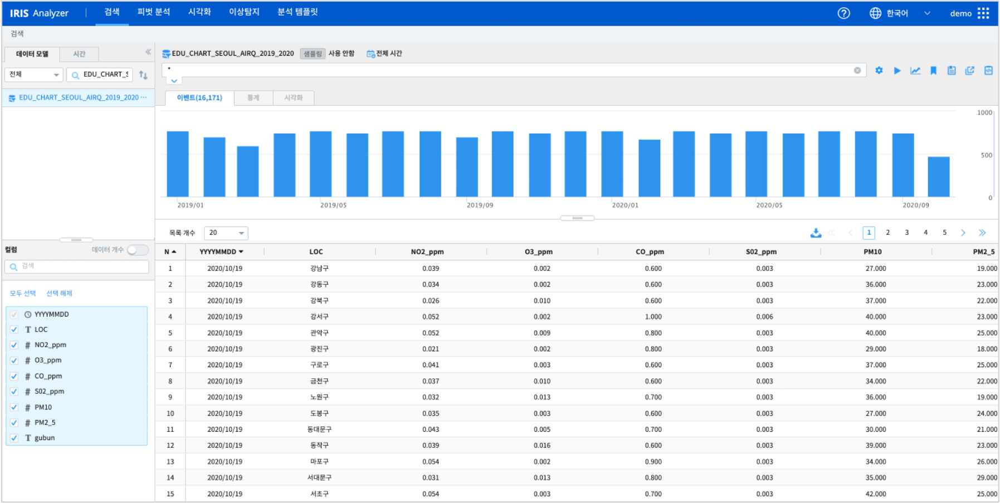
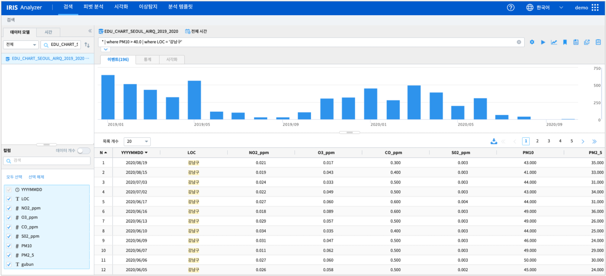

===================================================================
조건에 맞는 데이터 검색과 추출(where 명령어)
===================================================================

| ``IRIS Analyzer >> 검색`` 메뉴에서 IRIS 데이터모델을 대상으로 DSL(Domain-Specific Language) 를 이용하여 특정 조건에 부합하는 데이터를 조회합니다.

-------------------------------------------------------------------
단일 조건을 만족하는 데이터 검색
-------------------------------------------------------------------

| 원본 데이터 출처  :  `서울시 열린 데이터 광장 <http://data.seoul.go.kr/dataList/OA-2218/S/1/datasetView.do>`__  
| IRIS 데이터 모델 이름 : EDU_CHART_SEOUL_AIRQ_2019_2020
|
| IRIS 데이터모델 **EDU_CHART_SEOUL_AIRQ_2019_2020**  는 2019.01 ~ 2020.10 까지 서울시 구별 일평균 대기질 정보를 측정한 데이터입니다.

| 16171 건의 전체 데이터에서 ``where`` 명령어를 이용하여 조건을 입력하여 필터링합니다.

.. code:: 
    
    조건1. PM10(미세먼지농도) 가 40 이상인 데이터

- DSL 명령어

.. code::

    * | where PM10 > 40.0

- 결과로 5779건이 조회됩니다. 

-------------------------------------------------------------------
여러 조건을 만족하는 데이터 검색
-------------------------------------------------------------------

**파이프 문자로 여러 조건을 묶어서 검색하기** 

- 필터 조건 내용

.. code:: 
    
    조건1. PM10(미세먼지농도) > 40.0  인 날
    조건2. LOC(측정지점) 이 강남구

- DSL 검색어

.. code::

    * | where PM10 > 40.0 | where LOC = '강남구'

- 결과 : 196건이 조회됩니다.

**AND, OR, IN 을 이용하여 조건 생성**

- and : PM10(미세먼지농도) > 40.0  이고 LOC(측정지점)이 '강남구' 인 데이터

.. code::

    * | where PM10 > 40.0 and LOC = '강남구'

- or :  PM10(미세먼지농도) > 40.0 이거나 PM2_5(초미세먼지농도) > 30.0  인 데이터
  
.. code::

    * | where PM10 > 40.0 OR PM2_5 > 30.0

- in : where 절의 ``IN`` 문법은 대상 컬럼이 "TEXT" 일 때만 가능합니다.

   PM10(미세먼지농도) > 40.0 이거나 PM2_5(초미세먼지농도) > 30.0  인 데이터 중에서
   LOC(측정지점) 이 '강남구' 또는 '송파구'  인 데이터

.. code::

    * | where PM10 > 40.0 OR PM2_5 > 30.0 |  where LOC in ( '강남구', '송파구')

