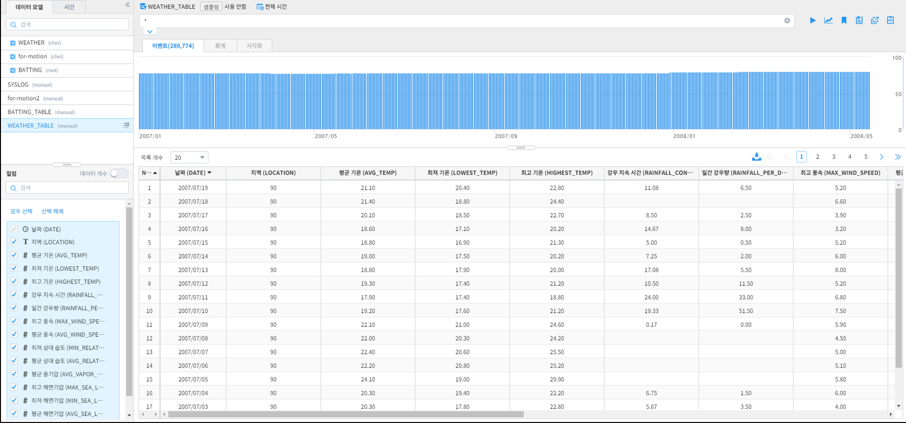
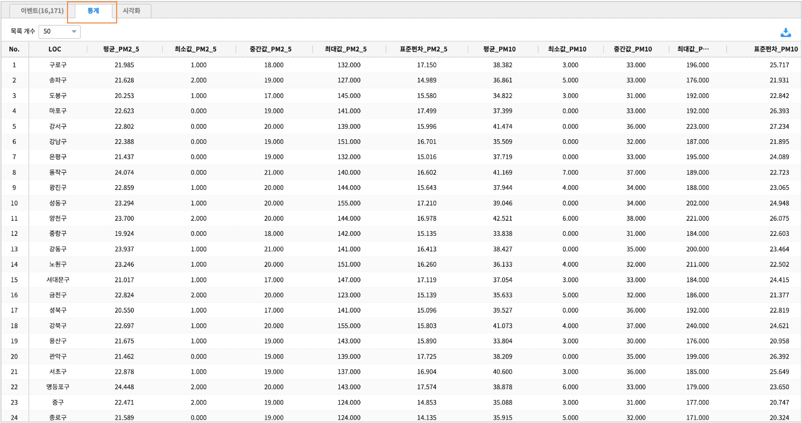
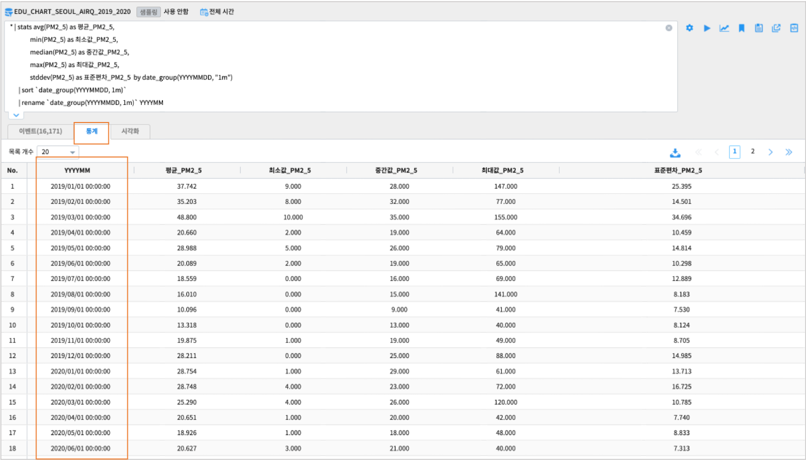
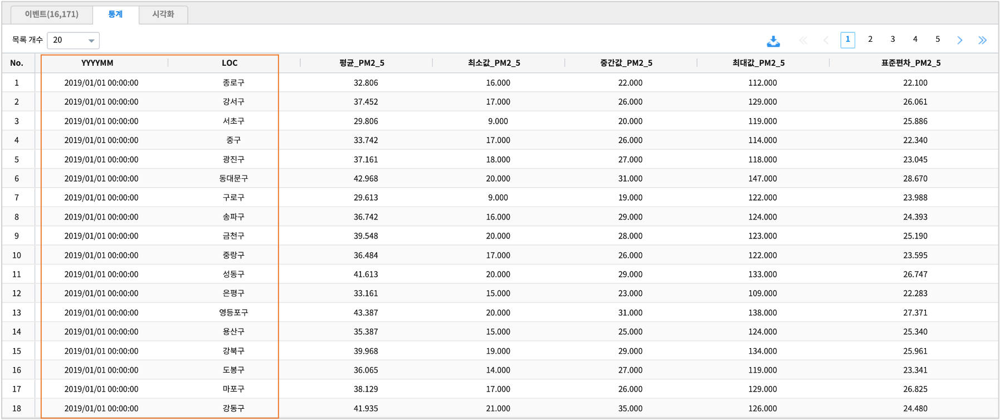

===================================================================
데이터의 기초 통계 분석 (stats 명령어)
===================================================================

| ``IRIS Analyzer >> 검색`` 메뉴에서 지원하는 Command 중 ``stats`` 를 이용하여 데이터의 기초 통계 분석을 진행하는 방법에 대한 설명입니다.
| **stats** 명령어는 기초 통계 분석을 위한 여러 통계 함수들을 지원하고 있습니다. 

| `stats manual 이동 <https://docs.iris.tools/manual/IRIS-Manual/IRIS-Discovery-Middleware/command/commands/stats.html#stats>`__ 

* stats 에서 제공하는 통계 함수

.. list-table::
   :header-rows: 1

   * - Arguments
     - Description
     - UseCase
     - ETC
   * - ``avg()``
     - 평균 값을 구합니다.
     - avg(컬럼명)
     - ``TEXT``\ , ``BINARY``\ , ``BOOLEAN`` 불가능
   * - ``count()``
     - 카운트를 구합니다.
     - count(컬럼명)
     - 모든 Type 가능
   * - ``countDistinct()``
     - 유니크한 개별 값의 개수를 구합니다
     - countDistinct(컬럼명)
     - 모든 Type 가능
   * - ``max()``
     - 가장 큰 값을 구합니다
     - max(컬럼명)
     - ``TEXT``\ , ``BINARY``\ , ``BOOLEAN`` 불가능
   * - ``median()``
     - 중간 값을 구합니다.
     - median(컬럼명)
     - ``TEXT``\ , ``BINARY``\ , ``BOOLEAN`` 불가능
   * - ``min()``
     - 제일 작은 값을 구합니다.
     - min(컬럼명)
     - ``TEXT``\ , ``BINARY``\ , ``BOOLEAN`` 불가능
   * - ``stddev()``
     - 표본표준편차 값을 구합니다.
     - stddev(컬럼명)
     - ``TEXT``\ , ``BINARY``\ , ``BOOLEAN`` 불가능
   * - ``stddev_samp()``
     - 표본표준편차 값을 구합니다.
     - stddev_samp(컬럼명)
     - ``TEXT``\ , ``BINARY``\ , ``BOOLEAN`` 불가능
   * - ``stddev_pop()``
     - 모표준편차 값을 구합니다.
     - stddev_pop(컬럼명)
     - ``TEXT``\, ``BINARY``\ , ``BOOLEAN`` 불가능
   * - ``sum()``
     - 전체의 합을 구합니다.
     - sum(컬럼명)
     - ``TEXT``\ , ``BINARY``\ , ``BOOLEAN`` 불가능
   * - ``variance()``
     - 표본분산 값을 구합니다.
     - variance(컬럼명)
     - ``TEXT``\ , ``BINARY``\ , ``BOOLEAN`` 불가능
   * - ``var_samp()``
     - 표본분산 값을 구합니다.
     - var_samp(컬럼명)
     - ``TEXT``\ , ``BINARY``\ , ``BOOLEAN`` 불가능
   * - ``var_pop()``
     - 모분산 값을 구합니다. (SQL 의 VAR_POP와 동일).
     - var_pop(컬럼명)
     - ``TEXT``\ , ``BINARY``\ , ``BOOLEAN`` 불가능
   * - ``iqr()``
     - 사분위수 범위(IQR = Q3 - Q1)
     - iqr(컬럼명)
     - ``TEXT``\ , ``BINARY``\ , ``BOOLEAN`` 불가능
   * - ``quantile()``
     - 지정한 percentage 를 이용하여 각 분위별 값을 구합니다. |br| percentage 는 정수로 입력하며 0 < percentage < 100 까지 입력이 가능합니다.
     - quantile(컬럼명, 10) |br| quantile(컬럼명, 25)
     - ``TEXT``\ , ``BINARY``\ , ``BOOLEAN`` 불가능

**예제 데이터 모델** 

| 원본 데이터 출처  :  `서울시 열린 데이터 광장 <http://data.seoul.go.kr/dataList/OA-2218/S/1/datasetView.do>`__  
| IRIS 데이터 모델 이름 : EDU_CHART_SEOUL_AIRQ_2019_2020
|
| IRIS 데이터모델 **EDU_CHART_SEOUL_AIRQ_2019_2020**  는 2019.01 ~ 2020.10 까지 서울시 구별 일평균 대기질 정보를 측정한 데이터입니다.
|

-----------------------------------------------
기초 통계 산출
-----------------------------------------------

LOC(측정지점)별 통계
'''''''''''''''''''''''''''''''''''''''''''''''

| ``TEXT형`` 변수인 LOC(측정지점)을 기준으로 
.. code::

    PM2_5(초미세먼지농도)의 평균, 최댓값, 중간값, 최솟값, (표본)표준편차
    PM10(미세먼지농도)평균, 평균, 최댓값, 중간값, 최솟값, (표본)표준편차

| 를 구해봅니다.
|
.. code::

    * |  stats avg(PM2_5) as 평균_PM2_5,
               min(PM2_5) as 최소값_PM2_5,
               median(PM2_5) as 중간값_PM2_5, 
               max(PM2_5) as 최대값_PM2_5,
               stddev(PM2_5) as 표준편차_PM2_5,

               avg(PM10) as 평균_PM10,
               min(PM10) as 최소값_PM10,
               median(PM10) as 중간값_PM10, 
               max(PM10) as 최대값_PM10,
               stddev(PM10) as 표준편차_PM10 by LOC

- stats 명령어의 실행결과는 **통계** 탭에 출력됩니다.

|

YYYYMMDD(날짜)별 통계
'''''''''''''''''''''''''''''''''''''''''''''''

| YYYYMMDD 는 ``date`` 타입 변수입니다.
| 이런 시간단위 컬럼은 ``date_group`` 으로 원하는 단위 시간으로 변경하여 by 구문에 사용합니다.

|
| 데이터모델 **EDU_CHART_SEOUL_AIRQ_2019_2020** 는 일단위(YYYYMMDD) 로 측정된 데이터입니다.
| 다음 예시는 일단위 데이터를 **월(month)** 단위 통계로 구하는 예시입니다.
| ``date_group`` 함수를 이용합니다.
|
- 검색어 
  
.. code::

    * | stats avg(PM2_5) as 평균_PM2_5,
              min(PM2_5) as 최소값_PM2_5,
              median(PM2_5) as 중간값_PM2_5, 
              max(PM2_5) as 최대값_PM2_5,
              stddev(PM2_5) as 표준편차_PM2_5  by date_group(YYYYMMDD, "1m")  
      | sort `date_group(YYYYMMDD, 1m)`
      | rename `date_group(YYYYMMDD, 1m)` YYYYMM

- 결과

|

- 날짜형 변수를 처리하는 함수 ``date_group`` 의 사용법은 다음과 같습니다.

.. code:: 

    형식: date_group(컬럼명, 단위)

.. list-table::
   :header-rows: 1

   * - 단위
     - 의미
     - 예시
   * - y
     - 년
     - 1년 : date_group(컬럼명, "1y")
   * - m
     - 월
     - 1개월 : date_group(컬럼명, "1m")
   * - d
     - 일
     - 1일 : date_group(컬럼명, "1d")
   * - H
     - 시간
     - 1시간 : date_group(컬럼명, "1H")
   * - M
     - 분
     - 1분 : date_group(컬럼명, "1M")
   * - S
     - 초
     - 10초 : date_group(컬럼명, "10S")
  

기준 변수가 2개 이상일 때
'''''''''''''''''''''''''''''''''''''''''''''''''''''''''''''''''''

| 기준이 되는 그룹 변수가 2개 이상일 경우, "by" 뒤의 변수를 기준이 되는 순서대로  ``,`` 로 구분하여 나열합니다.
|
| 예) stats ... by A,B,C
|

- 검색어
  
.. code::

    * | stats avg(PM2_5) as 평균_PM2_5,
              min(PM2_5) as 최소값_PM2_5,
              median(PM2_5) as 중간값_PM2_5, 
              max(PM2_5) as 최대값_PM2_5,
              stddev(PM2_5) as 표준편차_PM2_5  by date_group(YYYYMMDD, "1m"), LOC  
      
      | sort `date_group(YYYYMMDD, 1m)`
      | rename `date_group(YYYYMMDD, 1m)` YYYYMM

|
- 결과

|

결측치 처리
'''''''''''''''''''''''''''''''''''''''''''''''''''''''''''''''''''

.. code::

    [Notice 01] stats 의 결측치 처리 방식

    기초 통계를 산출할 때 산출 과정에서 결측값이 존재할 경우, 결측값이 존재하는 행(row)을 연산 과정에서 제외합니다.

    만약 기초 통계 산출에 활용될 컬럼에 결측값이 존재한다면, 반드시 사전에 전처리(pre-processing)를 수행한 후 연산을 진행하시기 바랍니다.

- 참고 : 결측치 처리 DSL 명령어 `fillna <https://docs.iris.tools/manual/IRIS-Manual/IRIS-Discovery-Middleware/command/commands/fillna.html#fillna>`__ 
