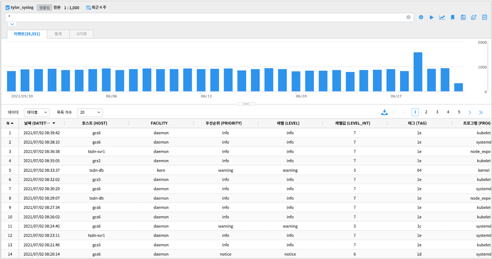
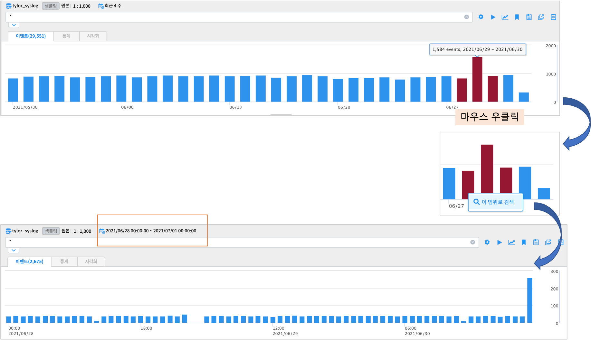

==================================================
타임라인 그래프에서 특정 구간 선택하여 검색
==================================================

| ``IRIS Analyzer >> 검색`` 메뉴에서 시간(timestamp) 컬럼이 포함되어 있는 데이터모델은 데이터를 조회할 때 "타임라인 그래프" 가 출력됩니다.
| 타임라인 그래프는 단위 시간당 이벤트 오브젝트(=레코드의 수) 의 수를 보여줍니다.
| 다른 시간 구간들의 패턴이나 데이터 특성의 예상과 달리 급등이나 급감의 패턴이 보이는 구간이 있을 때, 마우스 조작으로 해당 구간으로 **범위를 한정** 하여 조회하는 방법을 설명합니다.

-------------------------------------------------------------------
타임라인 그래프에서의 구간 선택 방법
-------------------------------------------------------------------

| 시간 컬럼이 있는 데이터모델을 선택하고, 시간 범위를 설정하여 검색을 실행합니다.

| 그래프 상에서 추가적으로 탐색하고자 하는 구간의 bar 를 마우스 드래그&드롭으로 선택하면 선택한 bar 의 색상이 변경됩니다.
| 그 상태에서 ``마우스 우클릭`` 하면  ``이 범위로 검색`` 박스를 클릭하여 실행합니다.

