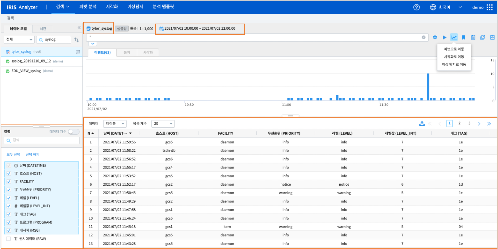

==================================================
검색 결과를 다른 메뉴로 이동하여 작업하기
==================================================

| ``IRIS Analyzer >> 검색`` 에서 데이터모델과 조회가 필요한 시간을 탐색할 수 있습니다.
| 검색 메뉴에서 ``데이터모델`` 대상으로 시간과 조건으로 필터링하여 **이벤트** 그리드에 출력된 결과를 그대로  Analyzer 의 다른 메뉴로 이동하여 작업을 진행할 수 있습니다.

-------------------------------------------------------------------
다른 메뉴로 이동
-------------------------------------------------------------------

| ``IRIS Analyzer >> 검색`` 메뉴에 검색 결과가 나온 상태에서 Analyzer 의 ``피벗`` , ``시각화``, ``이상탐지``  로 검색 결과를 이동하여 분석과 조회가 가능합니다.
| 검색 메뉴에서 적절한 검색 조회 시간을 찾은 후에 다른 메뉴로 이동하여 추가 분석과 시각화를 진행하고자 할 때 이용합니다.
|
| 다른 메뉴로 이동되는 요소는
| - 데이터모델
| - 검색 시간
| - 검색어
| - 데이터모델의 컬럼 필드
| - "이벤트" 그리드에 출력된 검색 결과
| 입니다.
|

**주의 : 제한적 사용**

| 데이터모델과 데이터모델의 메타컬럼 정보 즉 데이터모델이 가진 원본 컬럼 스키마정보가 이동되기 때문에, 새로 생성되는 컬럼은 이동되지 않습니다.
| 즉 ``as`` 로 새로 만든 컬럼에 대한 정보는 이동되지 않습니다.
|
| ``stats``, ``pivot`` 처럼 **통계** 탭에 나오는 결과는 이동이 되지 않고, **이벤트** 그리드에 나온 결과가 이동됩니다.
|
| 그림의 사각형 안의 요소가 이동 대상입니다.
|

