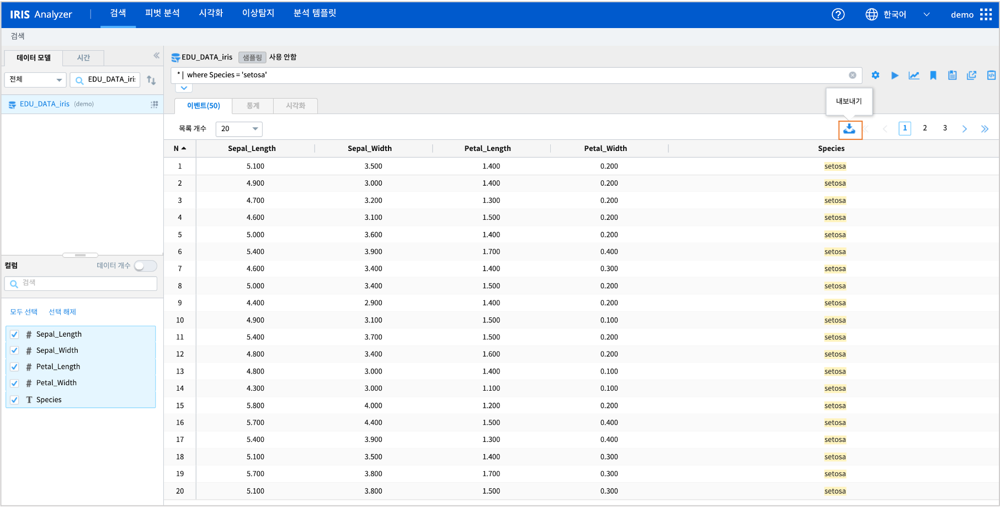
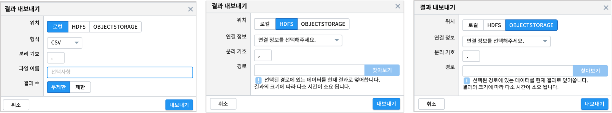

.. |br| raw:: html

   

==================================================
검색 결과를 파일로 내보내기
==================================================

| ``IRIS Analizer >> 검색`` 메뉴에서 조회한 결과를 로컬PC와 HDFS, OBJECTSTORAGE 로 내보낼 수 있습니다.

-----------------------------
기본 절차
-----------------------------

| ``IRIS Analizer >> 검색`` 에서 데이터모델을 지정하고, 필요한 검색결과로 조회합니다.
| 

| 내보내기 아이콘을 클릭하면 ``결과 내보내기``  팝업창이 뜹니다.  파일이 저장되는 위치는 로컬PC와 HDFS, OBJECTSTORAGE 중 하나로 선택할 수 있습니다.

--------------------------------------------
 로컬로 내보내기
--------------------------------------------

로컬로 내보낼 때는 아래와 같은 옵션을 설정할 수 있습니다.

.. list-table::
   :header-rows: 1
   :widths: 20 100

   * - 옵션
     - 설명
   * - 위치
     - 내보낸 파일이 저장될 위치를 선택합니다. |br| |br|
       로컬PC로 내보낼 것이므로 "로컬"을 선택합니다.
   * - 형식
     - 파일의 형식을 선택합니다. |br| |br| CSV, TSV, JSON 중 1개를 선택할 수 있습니다.
   * - 분리 기호
     - "형식"에서 "CSV" 와 "TSV"를 선택했을 때만 표시됩니다. |br|
       임의의 파일 구분자(delimiter)를 설정하여 내보낼 수 있습니다.
   * - 파일 이름 (선택)
     - 내보내지는 파일의 파일명을 설정할 수 있습니다. |br| |br| 만약 설정하지 않을 경우, "download"라는 이름으로 자동 설정됩니다.
   * - 결과 수
     - 내보내지는 파일에 포함될 데이터의 수를 설정합니다. |br| |br|
       사용자가 아무리 많은 양의 데이터를 조회하더라도 [검색] 화면에서는 제한된 개수의 데이터만을 표시합니다.
       |br| |br| 만약 [검색] 화면에 표시된만큼의 데이터만 내보내고자 할 경우 "제한"을, |br| 화면에 표시되지 않았지만 사용자가 조회한 데이터 전체를 내보내고자 할 경우 "무제한"을 선택합니다.

| 내보내기가 완료되면 완료 팝업창이 뜹니다.
| 해당 경로에서 파일을 확인합니다.

--------------------------------------------------------------
 HDFS / OBJECTSTORAGE 에 내보내기
--------------------------------------------------------------

HDFS 또는 OBJECTSTORAGE(= MinIO) 로 내보낼 때는 아래와 같은 옵션을 설정할 수 있습니다.

|

.. list-table::
   :header-rows: 1
   :widths: 20 100

   * - 옵션
     - 설명
   * - 위치
     - 내보낸 파일이 저장될 위치를 선택합니다. |br| |br|
   * - 연결 정보
     - 보내고자 하는 HDFS 또는 MinIO 의 연결 정보를 선택합니다. |br| |br|
       등록된 연결정보는 ``IRIS Discovery >> 연결정보`` 메뉴를 통해 확인하실 수 있습니다.
   * - 분리 기호
     - 내보내지는 파일의 구분자(delimiter)를 설정합니다.
   * - 경로
     - 파일이 내보내질 HDFS 또는 MinIO 내의 경로를 선택합니다. |br| |br|
       경로를 선택하면 파일명이 자동으로 "download.csv"로 설정되는데, 사용자가 원하는 명칭으로 수정하셔야 합니다.

-------------------------------------------------------------------
주의사항
-------------------------------------------------------------------

.. code::

    [Notice 01] HDFS으로 내보낼 때 파일명 중복으로 인한 덮어쓰기 주의

    HDFS로 내보낼 때, 내보낼 경로를 설정하고 파일명을 "download.csv"에서 원하는 것으로 수정하는데,

    만약 새로 수정된 파일명과 동일한 이름을 가진 파일이 해당 경로에 존재할 경우, 기존 파일은 새로 내보내지는 파일에 덮어쓰기됩니다.

    파일명을 설정하실 때 반드시 내보내기 대상 경로에 동일한 이름을 가진 파일이 존재하는지 확인하시기 바랍니다.
