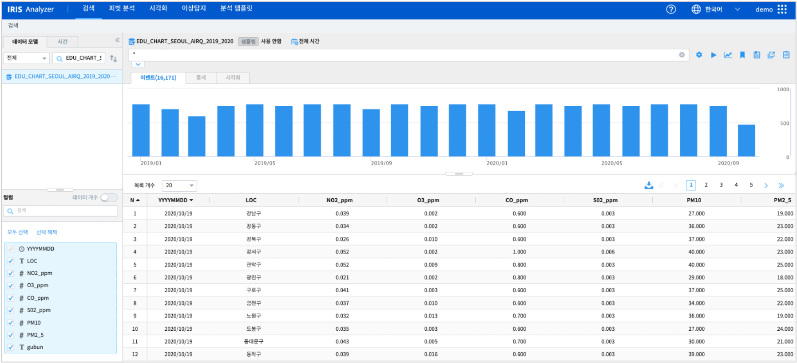
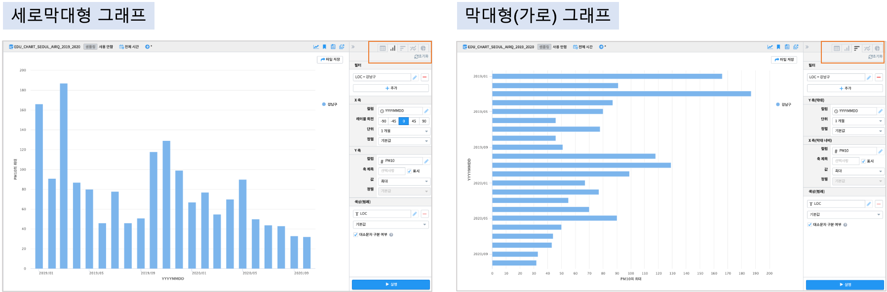
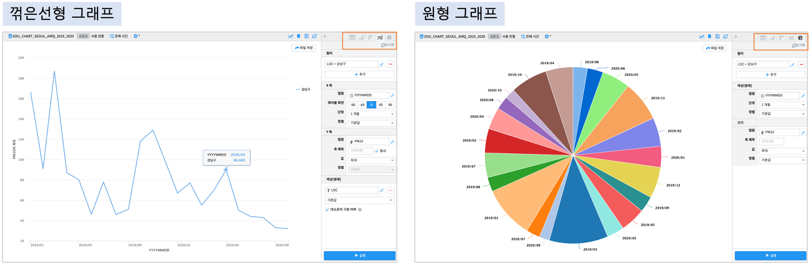
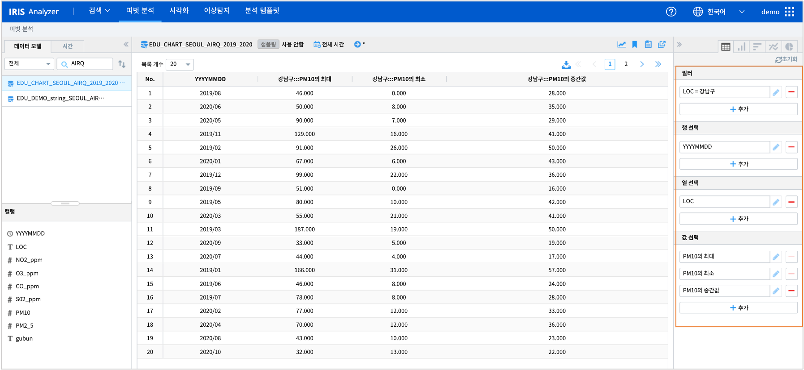

=============================
피벗 분석하기 - 테이블
=============================

| ``IRIS Analyzer >> 피벗 분석``  메뉴는 데이터의 행과 열을 재정렬하고 간단한 계산을 수행하여 ``테이블`` 로 결과를 출력합니다.
| ``테이블`` 의 출력 결과를 ``세로막대형``, ``막대형``, ``꺾은선형``, ``원형`` 챠트로 표시할 수 있습니다.
| 그리고 각 개별 챠트에서 세부 옵션을 설정할 수 있습니다.

-------------------------------------
피벗 테이블 생성하기 예제
-------------------------------------

| 원본 데이터 출처  :  `서울시 열린 데이터 광장 <http://data.seoul.go.kr/dataList/OA-2218/S/1/datasetView.do>`__  
| IRIS 데이터 모델 이름 : EDU_CHART_SEOUL_AIRQ_2019_2020
|
| IRIS 데이터모델 **EDU_CHART_SEOUL_AIRQ_2019_2020**  는 2019.01 ~ 2020.10 까지 서울시 구별 일평균 대기질 정보를 측정한 데이터입니다.
|

|

데이터 설정과 결과 예시 (1) : 1개의 값
===========================================================

| 전체 데이터에서  LOC(측정지점) = '강남구'  로 필터링합니다.
| 그리고 월별로  PM10 의 최대값을 구해 봅니다.
|
- 필터

    - 데이터모델과 조회 시간의 데이터대상으로 필터링 조건을 추가합니다.
    - 예) LOC = 강남구

- 행 선택

    - 행으로 값이 출력되는 컬럼을 선택합니다.
    - 예) YYYYMMDD 컬럼을 "1개월" 단위로 만들어서 행으로 값이 출력됩니다. 일단위 YYYYMMDD 가 월단위로 출력됩니다.

- 열 선택
  
    - 선택한 컬럼의 distinct 한 값이 열(컬럼)으로 생성됩니다.
    - 예) LOC   => LOC 의 distinct 한 값이 컬럼으로 생성됩니다. '강남구' 로 필터링되어 있어 '강남구' 라는 컬럼만 생성됩니다.

- 값 선택

    - 테이블의 셀에 표시될 값을 정합니다.
    - 예) PM10 의 최대값으로 선택합니다. 

- 테이블 결과
 
.. image:: ./images/03_pivot_table/03_pivot_table_02.png
    :alt: 테이블

- 값을 1개로 설정한 경우에는 개별 설정없이 다른 챠트로 테이블의 값을 바로 표시할 수 있습니다.

- 세로막대형 챠트 결과 / 막대형(가로) 챠트 결과
|

|

- 꺾은 선형 챠트 결과 / 원형 챠트 결과
|

|

데이터 설정과 결과 예시 (2) : 복수개 값 설정
=============================================================

| "데이터 설정과 결과 예시 (1)" 의 ``값 선택`` 에서 1개 값이 아닌 최대값, 최소값, 중간값 3개를 선택합니다.
| 즉 셀의 값이 3개로 늘어나므로, ``열 선택`` 에서 지정한 LOC 의 값 '강남구' 가 3개 컬럼으로 생성됩니다.
|
- 테이블 결과

| 
- 값이 3개로 나오는 경우에는 다른 그래프 챠트에서 표시할 값을 개별로 설정할 수 있습니다.

.. image:: ./images/03_pivot_table/03_pivot_table_06.png
    :alt: 피벗구성

