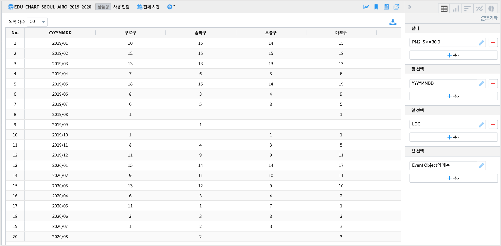
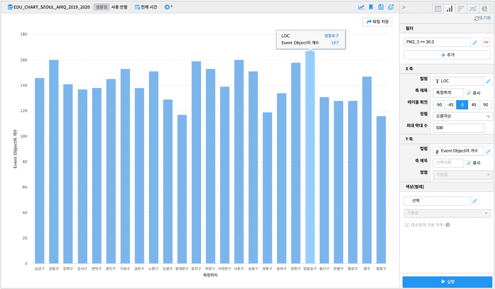
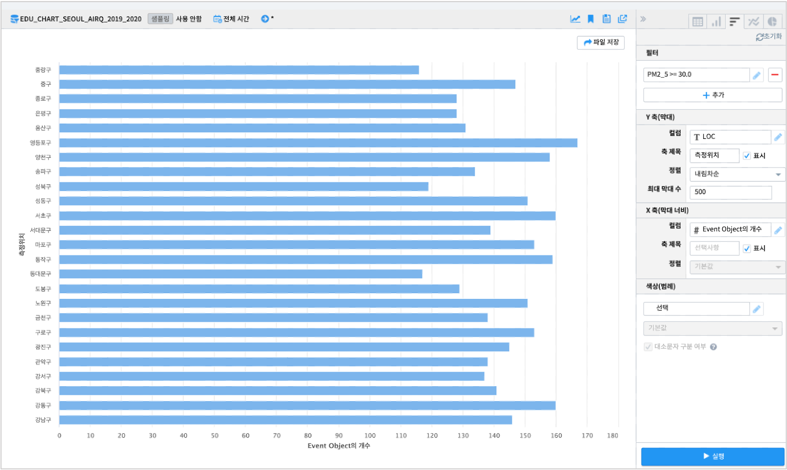
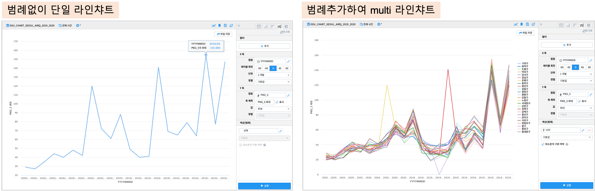
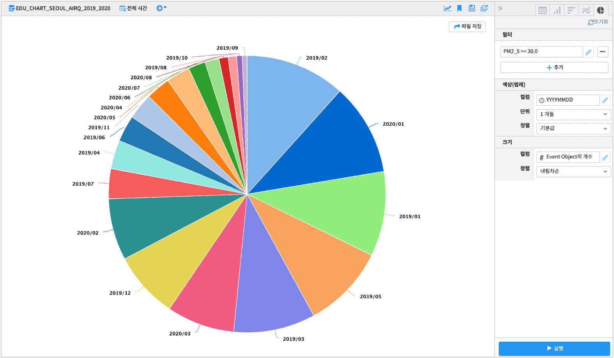

=============================
피벗 챠트 예시
=============================

| ``IRIS Analyzer >> 피벗 분석``  메뉴에서 데이터의 행과 열을 재정렬하고 간단한 계산을 수행하여 나온 결과를 ``테이블``, ``세로막대형``, ``막대형``, ``꺾은선형``, ``원형 챠트`` 로 표현이 가능합니다.
| 

-------------------------
데이터
-------------------------

| 원본 데이터 출처  :  `서울시 열린 데이터 광장 <http://data.seoul.go.kr/dataList/OA-2218/S/1/datasetView.do>`__  
| IRIS 데이터 모델 이름 : EDU_CHART_SEOUL_AIRQ_2019_2020
|
| IRIS 데이터모델 **EDU_CHART_SEOUL_AIRQ_2019_2020**  는 2019.01 ~ 2020.10 까지 서울시 구별 일평균 대기질 정보를 측정한 데이터입니다.
|
.. image:: ./images/03_pivot_table/03_pivot_table_01.png
    :alt: 예제 데이터 EDU_CHART_SEOUL_AIRQ_2019_2020

테이블
=======================================

| 피벗 분석 메뉴에서 가장 기본이 되는 챠트입니다.
| 개별 챠트에 그려지는 데이터는 ``테이블`` 에서 먼저 필터, 정렬을 수행 한 후, 개별 챠트에서 그려집니다.
| 
| 데이터모델 "EDU_CHART_SEOUL_AIRQ_2019_2020" 에서 월단위로 PM2_5 >= 30.0 즉 초미세먼지농도가 30.0 이상인 날의 수를 측정지점(LOC) 별로 구한 결과입니다.

세로막대형 챠트
===============================================================

| 위의 테이블 결과를 세로막대형 챠트로 그리면 9개 이상의 많은 범례 수로 warning 이 뜹니다.
| 또한 25개의 측정지점(LOC) 를 multi-bar 챠트로 그리면 가독성도 떨어집니다.
| 피벗 분석 메뉴는 개별 챠트별로 다른 데이터 조건을 설정하여 그릴 수 있습니다.
|
.. code::
    전체 기간의 데이터에서 초미세먼지농도(PM2_5)가 30.0 이상인 날의 수를 구해서 측정지점(LOC) 별로 세로막대형 챠트로 그립니다.
    어느 측정지점이 초미세먼지농도(PM2_5)가 30.0 이상인 날이 많았는지 파악할 수 있습니다.

- 필터 
  
  - ``PM2_5 >= 30.0``

- X축
  
  - 컬럼 : ``LOC``
  - 축제목 : ``측정위치``
  
- Y축 
  
  - 컬럼 : ``# EventObject의 개수``

- 범례 : 없음

막대형 챠트
===============================================================

| 막대형 챠트는 막대(bar) 가 가로로 표시되는 챠트입니다.
| 세로막대형 챠트의 내용을 막대형 챠트로 표시해 봅니다.
| 
- 필터 
  
  - ``PM2_5 >= 30.0``

- Y축(막대)
  
  - 컬럼 : ``LOC``

- X축(막대너비)
  
  - 컬럼 : ``# EventObject의 개수``

- 범례 : 없음

꺾은선형 챠트
===============================================================

| 꺾은선형 챠트는 주로 시계열챠트로 많이 활용되는 챠트입니다.
| X 축을 시간으로 두고, 시간에 따른 값의 추이를 볼 때 유용합니다.
| 범례에 카테고리 그룹 변수를 지정하면 multi-line chart 가 그려집니다.
|
- 필터 : 없음

- X축
  
  - 컬럼 : ``YYYYMMDD``
  - 단위 : ``1개월``

- Y축
  
  - 컬럼 : ``# PM2_5``
  - 축제목 : ``PM2_5 최대``
  - 값 : ``최대``

- 범례 : ``LOC`` 

원형 챠트
===============================================================

| 원형챠트는 Pie chart 라고 합니다.
| 데이터의 계열(범주형 변수)이 전체에서 차지하는 비율을 원형으로 그린 챠트로 각 계열이 얼마만큼의 비중을 가지는 지 파악하기에 유용합니다.
|
| 초미세먼지농도 PM2_5 >= 30.0 인 날의 수를 월별로 구합니다.
| 원형챠트로 PM2_5 >= 30.0 인 날의 수가 가장 많은 ``달`` 을 보여줍니다.

- 필터 :
  
  - ``PM2_5``  ``>=`` ``30.0``

- 색상(범례)
  
  - 컬럼 : ``YYYYMMDD``
  - 단위 : ``1개월``

- 크기
  
  - 컬럼 : ``# EventObject의 개수``

| (팁!) 필요한 항목에 정렬 옵션이 비활성화 되어 있다면 ``테이블`` 로 돌아가서 해당 컬럼의 정렬을 설정후 실행하시기 바랍니다.
