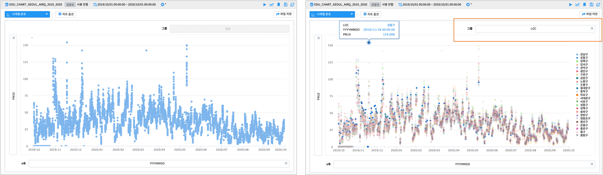

------------------------------------
시계열
------------------------------------

| 분석 유형 ``시계열`` 에 분류된 시각화 챠트는 시간에 따른 데이터의 추이를 분석하는 데 많이 이용되는 챠트들입니다.
| ``꺽은선형(line chart)``, ``시계열 분포``, ``모션`` 챠트가 포함되어 있습니다.

꺾은선형
''''''''''''''''''''''''''''''''''''''''''''''''''

| X 축에 시간 컬럼을 두고, 시간의 흐름에 따른 Y축 데이터의 변화 추이를 쉽게 볼 수 있습니다.

- 데이터
  
    원본 데이터 출처  :  `서울시 열린 데이터 광장 <http://data.seoul.go.kr/dataList/OA-2218/S/1/datasetView.do>`__  
    IRIS 데이터 모델 이름 : EDU_CHART_SEOUL_AIRQ_2019_2020

    IRIS 데이터모델 **EDU_CHART_SEOUL_AIRQ_2019_2020**  는 2019.01 ~ 2020.10 까지 서울시 구별 일평균 대기질 정보를 측정한 데이터입니다.

|

.. image:: images/ko/show_charts_02.png
    :alt: 차트옵션

|
- X축

    - 데이터모델에서 시간(DATE, TIMESTAMP) 타입의 컬럼이 자동으로 선택됩니다.
    - 옵션에서  ``Summary 시간 단위`` 를 설정합니다. 해당 데이터의 YYYYMMDD 는 일별 데이터인데, 월단위 집계로 트랜드를 보기 위해 ``1개월`` 로  설정한니다.

- Y축

    - Y축 값으로 ``PM10`` 컬럼의 최대값을 설정합니다.
    - 일단위로 측정되는 PM10 데이터에서 한달동안의 최대 PM10 데이터가 챠트에 표시됩니다.

- 챠트 옵션

    - 꺾은 선형 챠트의 시각화 옵션
      - ``Null 값`` 이 있을 때 연결(null을 무시하고 선과 선을 연결), 표시(null 을 0 으로 표시), 간격(동일한 X축 간격으로 null이면 선을 표시하지 않음.즉 선이 단절됨) 중 표시 방법을 설정합니다.
      - ``데이터 값 표시`` 는 각 시점마다 라인에 Y축 값을 표시할 지 여부를 설정합니다.
      - X축, Y 축의 축제목, 레이블 표시, 간격 등을 설정합니다.
      - ``범례`` 는 그룹 변수를 지정한 경우에 그룹 변수의 값인 범례의 표시 여부, 위치를 설정합니다.
   

.. image:: images/ko/show_charts_04.png
    :alt: 차트옵션

- 다중 챠트
  
    - ``Y축 +`` 를 클릭하면 Y축 컬럼의 값을 드래그-드롭이 추가로 가능하도록 설정칸이 하나 더 생성됩니다.
    - 추가된 Y축 데이터 칸에 "CO_ppm" 컬럼을 드래그-드롭 한 후 "평균" 으로 값을 설정합니다.
    - 아래에 추가생성된 꺾은 선형 그래프가 각 측정위치(LOC)의 월별 평균 CO 농도 추이입니다. 

.. image:: images/ko/show_charts_03.png
    :alt: 차트옵션

시계열 분포 - 산점도
'''''''''''''''''''''''''''''''''''''''''''''''''''''''''''''''''''''''''''''''''

| 산점도는 X축, Y축으로 이루어진 좌표 위에 값을 점으로 나타내어 변수 간의 관계를 나타내는 시각화 챠트입니다. 
| ``시계열 분포``  는 산점도에서 X측을 시간 변수로 두어 시간과 Y축 변수간의 관계를 보기 위해 활용합니다.

- X축에는 시간 필드인 YYYYMMDD 가 자동지정됩니다.(변경 가능합니다)

- Y축에 PM10 을 설정합니다.

- 왼쪽은 그룹 변수를 지정하지 않은 경우이고, 오른쪽 챠트는 그룹 변수에 LOC(측정위치)를 지정한 챠트입니다.

|

- 시계열 분포의 X축에 시간변수 대신 PM2_5 와 PM10 의 관계를 보는 산점도로 활용한 경우

    - 그룹 변수에 LOC 를 설정한 챠트는 오른쪽입니다. 많은 수의 범례에서 토글로 특정 LOC를 선택, 해제하여 챠트에 출력할 수 있습니다.

.. image:: images/ko/show_charts_06.png
    :alt: 시계열분포

모션 차트
'''''''''''''''''''''''''''''''''''''''''''''''''''''''''''''''''''''''''''''''''

| 모션챠트는 시간에 따른 데이터의 흐름을 보여주는 챠트입니다.
| 모션챠트는 시간필드, X축, Y축, 크기(원의 크기), 그룹(원의 색상) 에 변수를 지정할 수 있습니다.
|
.. code::

    데이터모델 : **EDU_DSL_population_for_motion**
    1975년 ~ 2008년 동안 국가(country)별 연간 인구(population), 조사망율(deaths), 조출생율(births)

    - 시간 : 시간유형의 필드 year
    - X축 : 조출생율(births)
    - Y축 : 조사망율(deaths)
    - 그룹 : country
      - 원의 색상으로 구분
    - 크기 : 인구(population)
    - 원의 크기에 인구를 반영

| 재생버튼을 누르면 시간에 따른 각 데이터의 변화를 보여줍니다.

.. image:: images/ko/show_charts_07.png
    :alt: 모션
