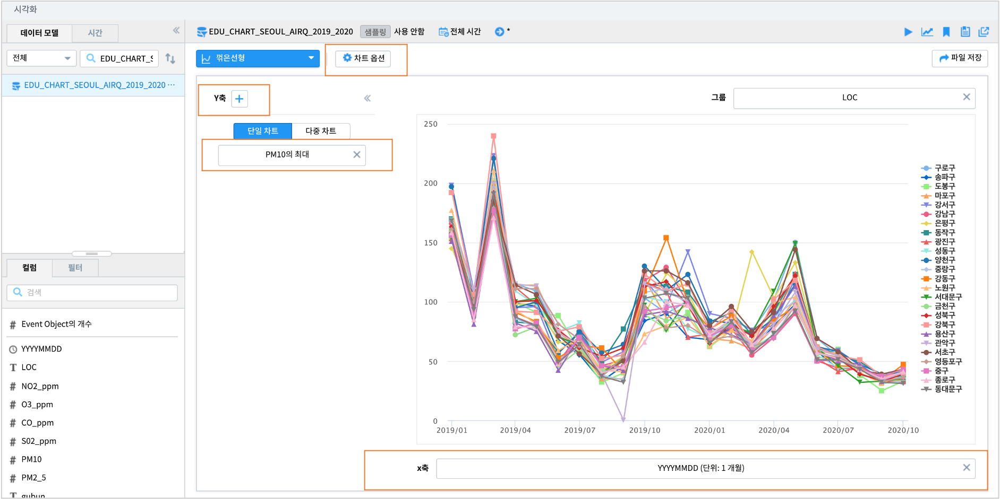
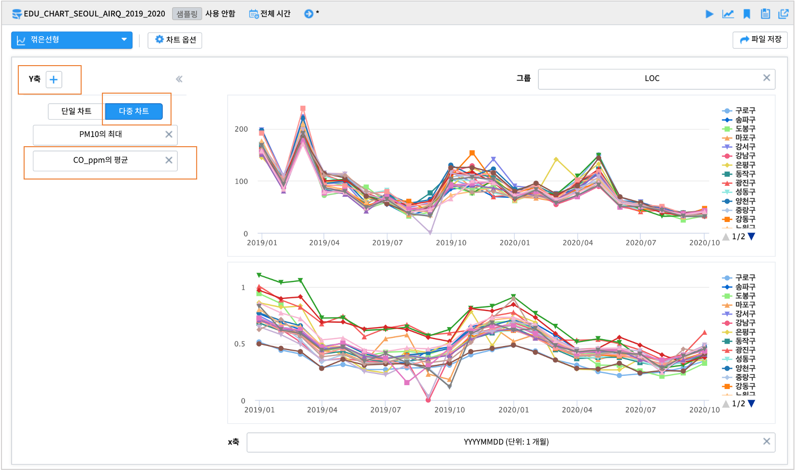
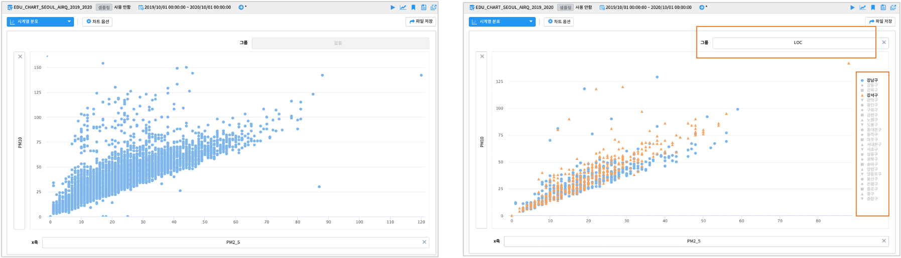
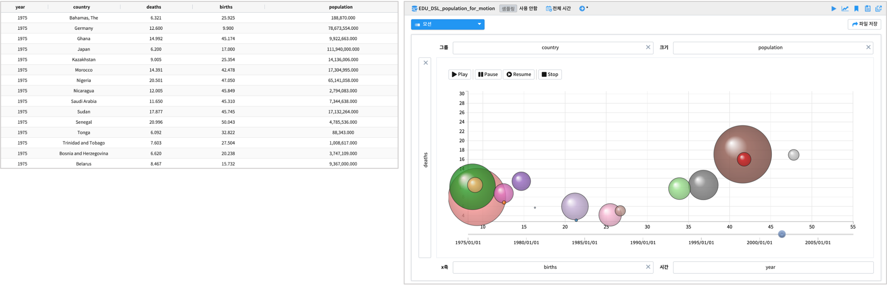

------------------------------------
시계열형 그래프
------------------------------------

꺾은선형 - 단일 차트 - 시계열 그래프
'''''''''''''''''''''''''''''''''''''''''''''''''''''''''''''''''''''''''''''''''''''''''''''''''''''''''''''''''''''
| 시간의 흐름(x축)에 따라 y축의 시계열 변화를 보고자 할 때 사용합니다.

.. image:: images/ko/show_charts_01.png
    :alt: 꺾은선단일

|

**x축 옵션**

**y축 옵션**

**차트 옵션**

.. image:: images/ko/show_charts_04.png
    :alt: 차트옵션

| x축과 y축에 설정한 변수를 각각 클릭하면 축 옵션을 이용가능합니다. 집계 시간단위(1시간, 1일, 1개월, 1년 등)나 집계 방식(합계, 평균, 최대, 최소 등)을 변경할 수 있습니다. 차트 옵션을 이용하면 결측값 표시여부, 축 제목, 범례 위치, 범례 표시 여부 등 다양한 시각화 옵션 조정이 가능합니다.
| 축 옵션 및 차트 옵션에 관한 자세한 사항은 매뉴얼을 참조하시기 바랍니다.

|
|

꺾은선형 - 단일 차트 - 그룹별 시계열 그래프
'''''''''''''''''''''''''''''''''''''''''''''''''''''''''''''''''''''''''''''''''''''''''''''''''''''''''''''''''''''
| 축의 단위가 같은 시계열을 그룹별로 구분하여 그래프를 그릴 수 있습니다. 일부 그룹의 필터링을 하기위해서 차트 왼쪽에 있는 필터를 사용할 수 있습니다.

.. image:: images/ko/show_charts_05_0.png
    :alt: 꺾은선단일그룹

.. image:: images/ko/show_charts_05_1.png
    :alt: 꺾은선단일그룹결과

|

**필터링**

| 필터에 관한 자세한 사항은 매뉴얼의 필터링 부분을 참조하시길 바랍니다.
|
|

꺾은선형 - 단일 차트 - 중첩 시계열 그래프
'''''''''''''''''''''''''''''''''''''''''''''''''''''''''''''''''''''''''''''''''''''''''''''''''''''''''''''''''''''
| 축의 단위(속력, 전력량, 온도 등)가 같은 그래프들을 하나의 축을 기준으로 그릴 수 있습니다. 주로 유사한 단위나 scale이 비슷한의 변수를 비교할 때 사용합니다.
  중첩 시계열 그래프를 그리기 위해 y축 변수를 추가하고자 할때는 "+" 버튼을 눌러 변수를 추가합니다.
  이때 차트의 범례 순서는 y축의 순서를 조정하여 변경할 수 있습니다.

**축의 scale이 동일한 경우**

|

**축의 scale이 다른 경우**

.. image:: images/ko/show_charts_08.png
    :alt: 축스케일 비동일

| 주의) 비교하고자 하는 변수들의 단위가 다르거나 특정 변수의 scale이 매우 큰 경우에는 단일 차트를 시용하기보다는 다중 차트를 이용하는것을 권장합니다. (예:전력량 0~1000과 온도 -10~30)
|

꺾은선형 - 다중 차트 - 다중 시계열 그래프
'''''''''''''''''''''''''''''''''''''''''''''''''''''''''''''''''''''''''''''''''''''''''''''''''''''''''''''''''''''
| 축의 단위(속력, 전력량, 온도 등)가 다르거나, 축이 동일해도 scale이 다른 그래프들을 다중 차트로 그릴 수 있습니다.
| 다중 시계열 그래프를 그리기 위해 y축 변수를 추가하고자 할때는 + 버튼을 눌러 컬럼을 추가합니다.

.. image:: images/ko/show_charts_09.png
    :alt: 꺾은선 다중

|
|

시계열 분포 - 산점도
'''''''''''''''''''''''''''''''''''''''''''''''''''''''''''''''''''''''''''''''''''''''''''''''''''''''''''''''''''''
| x축, y축으로 이루어진 직교좌표 위에 값을 점으로 나타내어 두 개 변수 간의 관계를 나타내는 방법입니다. 두 변수 간의 관계를 통해 선형 이나 비선형의 형태와 같은 모델을 확인해봄으로써 그 방향성과 강도를 조사할 수 있습니다.

.. image:: images/ko/show_charts_10.png
    :alt: 산점도

|
|

모션 차트
'''''''''''''''''''''''''''''''''''''''''''''''''''''''''''''''''''''''''''''''''''''''''''''''''''''''''''''''''''''
| 시간에 따른 데이터를 x축, y축으로된 2차원 공간에서 버블의 크기와 다양한 색상, 데이터의 변화를 보여주는 차트입니다.
| 재생, 일시정지, 다시 재생, 중단의 옵션을 통해 데이터의 움직임을 조정할 수 있습니다.

.. image:: images/ko/show_charts_11.png
    :alt: 모션

|
|