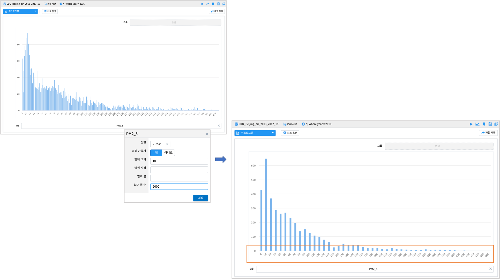
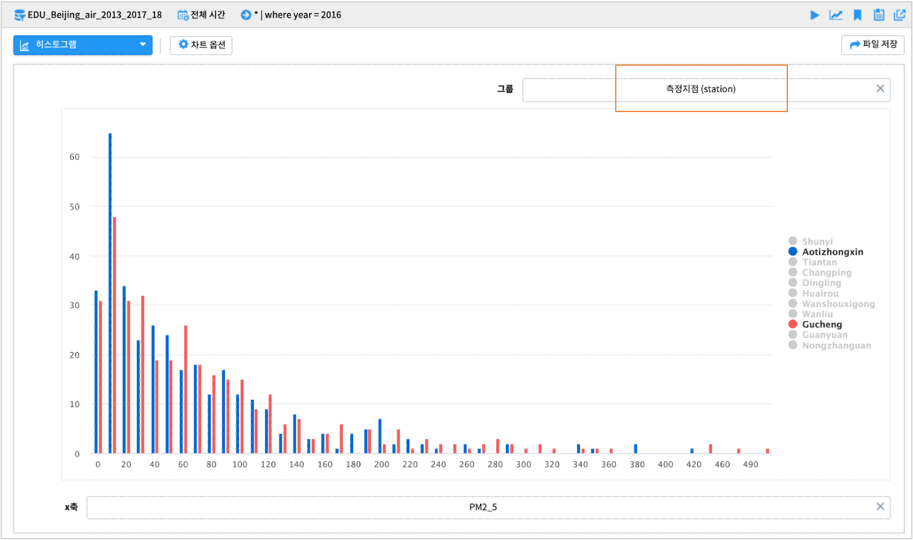
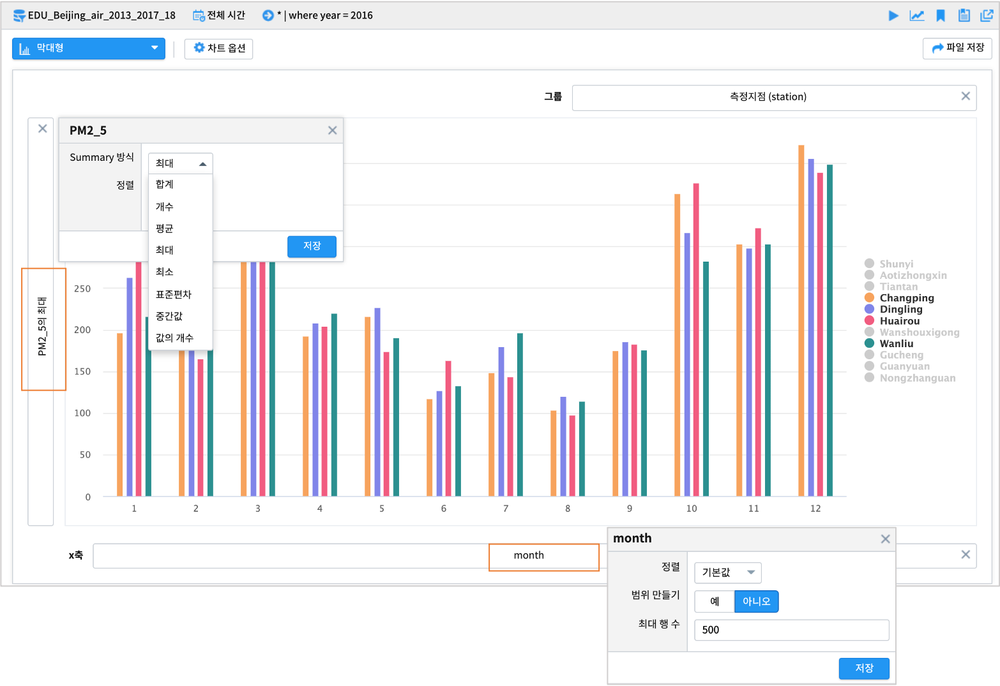
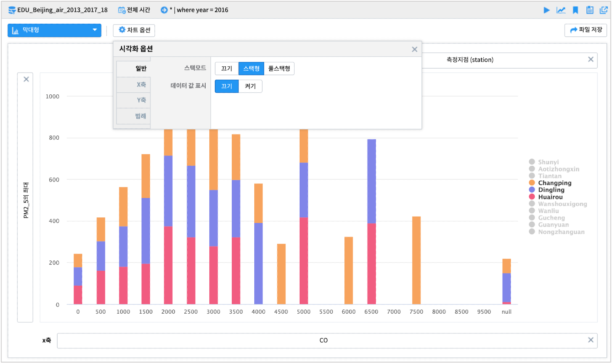

------------------------------------
분포형 그래프
------------------------------------

히스토그램 - 단일 히스토그램
'''''''''''''''''''''''''''''''''''''''''''''''''''''''''''''''''''''''''''''''''''''''''''''''''''''''''''''''''''''
| 연속형 변수를 일정 구간을 나누어 그 빈도를 그래프로 나타낸 것입니다. x축의 구간 간격(bin size) 조정을 통해 집계 빈도를 조정 할 수 있습니다.
|

**기본형**

|

**기본형 - 구간 간격 조정**

|

**x축 옵션**

| x축에 설정한 변수를 클릭하면 축 옵션을 이용가능합니다. 특히 범위 만들기를 '예'로 변경하여 구간 간격(bin size; range size)를 조정 할 수 있습니다.
  축 옵션에 관한 자세한 사항은 매뉴얼을 참조하시기 바랍니다.
|
|

히스토그램 - 그룹별 히스토그램
'''''''''''''''''''''''''''''''''''''''''''''''''''''''''''''''''''''''''''''''''''''''''''''''''''''''''''''''''''''
| 연속형 변수를 일정 구간을 나누어 그 빈도를 그래프로 나타낸 것입니다. 그룹에 변수를 매핑하여 그룹간 분포를 비교할 수 있습니다.

|
|

막대형 그래프 - 기본형
'''''''''''''''''''''''''''''''''''''''''''''''''''''''''''''''''''''''''''''''''''''''''''''''''''''''''''''''''''''
| 범주형 변수의 빈도를 막대 그래프로 나타낸 것입니다. 히스토그램보다 심화된 작업을 할때 주로 사용합니다.

.. image:: images/ko/show_charts_16_0.png
    :alt: 막대형기본

|
|

막대형 그래프 - 집계형
'''''''''''''''''''''''''''''''''''''''''''''''''''''''''''''''''''''''''''''''''''''''''''''''''''''''''''''''''''''
| 범주형 변수의 빈도를 막대 그래프로 나타낸 것입니다. y축(이벤트 개수)에 원하는 변수를 넣어서 집계(합계, 평균 등)된 막대그래프를 표현할 수 있습니다.

.. image:: images/ko/show_charts_16_1.png
    :alt: 막대형집계

| x축과 y축에 설정한 변수를 각각 클릭하면 축 옵션을 이용가능합니다. x축의 순서(오름차순/내림차순)나 y축의 집계 방식(합계, 평균, 최대, 최소 등)을 변경할 수 있습니다. 차트 옵션을 이용하면 결측값 표시여부, 축 제목, 범례 위치, 범례 표시 여부 등 다양한 시각화 옵션 조정이 가능합니다.
| 축 옵션 및 차트 옵션에 관한 자세한 사항은 매뉴얼을 참조하시기 바랍니다.

|
|

막대형 그래프 - 스택형/풀스택형
'''''''''''''''''''''''''''''''''''''''''''''''''''''''''''''''''''''''''''''''''''''''''''''''''''''''''''''''''''''
| 범주형 변수의 그룹별 빈도를 막대 그래프로 나타낸 것입니다. 현재 x축 변수에서 그룹 변수가 차지하고 있는 빈도를 확인 가능합니다.
| 스택형은 데이터의 빈도를 그룹별로 누적 빈도를, 풀스택형은 전체를 기준으로 그룹별 상대적 비율(누적퍼센트)을 집계해 줍니다.
|

**스택형**

.. image:: images/ko/show_charts_17.png
    :alt: 막대형 - 스택형

|

**풀스택형**

.. image:: images/ko/show_charts_18.png
    :alt: 막대형 - 풀스택형

|

**차트 옵션**

.. image:: images/ko/show_charts_19.png
    :alt: 차트옵션

| 차트 상단의 차트 옵션을 이용하면 스택형/풀스택형의 모드 유형, 데이터 값의 표현 여부 등을 조정 할 수 있습니다.
| 축 옵션 및 차트 옵션에 관한 자세한 사항은 매뉴얼을 참조하시기 바랍니다.

|
|

원형 그래프 - 기본형
'''''''''''''''''''''''''''''''''''''''''''''''''''''''''''''''''''''''''''''''''''''''''''''''''''''''''''''''''''''
| 원형 그래프는 섹터로 구분된 원 그래프이며 각 파이 섹터는 일부 관련 정보의 크기를 표시합니다. 원형 그래프는 전체를 기준으로 한 부분의 상대적 크기를 표시하는 데 사용됩니다.
  기본형은 그룹의 단순 빈도를 나타낼때 사용할 수 있습니다.

.. image:: images/ko/show_charts_20.png
    :alt: 원형기본

|

**차트 옵션**

.. image:: images/ko/show_charts_21.png
    :alt: 차트시각화옵션

차트 옵션을 통해 최소 조각의 크기를 설정하여 그보다 작은 크기의 조각들을 그외(other) 조각으로 병합할 수 있습니다.

|
|

원형 그래프 - 집계형
'''''''''''''''''''''''''''''''''''''''''''''''''''''''''''''''''''''''''''''''''''''''''''''''''''''''''''''''''''''
| 원형 그래프는 섹터로 구분된 원 그래프이며 각 파이 섹터는 일부 관련 정보의 크기를 표시합니다. 집계형은 변수의 집계값(합계, 평균 등)의 값을 파이 조각의 크기에 반영합니다.

.. image:: images/ko/show_charts_22.png
    :alt: 원형집계

|
|
