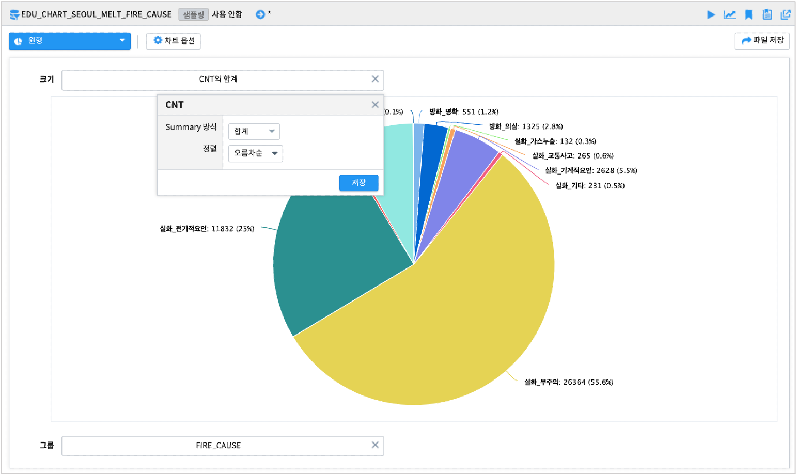

------------------------------------
분포
------------------------------------

| **분포** 유형에 속한 챠트는 ``히스토그램``, ``막대형``, ``원형`` 으로 구분하였습니다.
| 카테고리, 범주형 변수가 있어 해당 범주별로 데이터가 어떻게 분포하는지 파악하거나 전반적으로 데이터가 어떻게 퍼져 있는지 그려볼 때 많이 사용하는 챠트들입니다.

히스토그램 
'''''''''''''''''''''''''''''''''''''''''''''''''''''''''''''''''''''''''''

| 데이터를 동일한 폭의 구간으로 나누어 해당 구간에 속한 데이터의 빈도를 막대로 나타낸 것입니다. 도수분포표라고도 합니다.
| X축은 구간을 나타내고, Y축은 해당 구간에 속한 빈도를 표시합니다.
| 막대그래프(bar-chart) 는 X축에 카테고리, 범주형 변수가 올 수 있고, 수치형 변수도 가능합니다.
| 히스토그램은 반드시 수치형 데이터가 와야 합니다.
|

- 데이터

    - 데이터모델 : EDU_Beijing_air_2013_2017_18
    - 2016년도 북경 시내 11개 station 별 대기질 측정 데이터
  
- 2016년 동안 초미세먼지농도(PM2_5) 의 분포를 히스토그램으로 그려봅니다.

- 초미세먼지농도(PM2_5) 컬럼을 X축으로 설정 후  **구간 간격 조정** 을 ``10`` 으로 지정합니다.

    - X축의 PM2_5 를 클릭하여 ``범위만들기`` 를 ``예`` 로 변경하고, ``범위크기`` 를 **10** 으로 설졍합니다.

.. image:: images/ko/show_charts_12.png
    :alt: 히스토그램기본

- 그룹 변수 지정한 경우

    - 그룹에 station 컬럼을 지정하면 각 station 별 PM2_5 구간 분포를 알 수 있습니다.

.. image:: images/ko/show_charts_13.png
    :alt: 히스토그램기본

막대형 
'''''''''''''''''''''''''''''''''''''''''''''''''''''''''

| 막대형 그래프(bar-chart) 는 X축에 카테고리, 범주형 변수가 올 수 있고, 수치형 변수도 가능합니다.
| (반면 히스토그램은 반드시 수치형 데이터가 와야 합니다.)

- X축 : month 는 01, 02, ,,, 12 월로 범주형 변수의 특성을 가집니다.
- Y축 : PM2_5 의 최대값
- 그룹 : station
  
- 2016년 1년동안 월별로 가장 높은 초미세먼지농도(PM2_5) 를 station 별로 그립니다.
  
.. image:: images/ko/show_charts_14.png
    :alt: 막대형기본

| 막대형 그래프는 X축에 CO 같은 수치형 데이터도 가능합니다.
| 일반적인 막대형 그래프의 기본 옵션이 제공되어, 스택,풀스택형으로 옵션을 설정이 가능합니다. 

- 스택형으로 그리면 어느 station 이 가장 높은 초미세먼지 농도인지 알 수 있습니다.
- 11개 station 을 다 그리지 않고, 범례에서 선택해서 그릴 수 있습니다.

.. image:: images/ko/show_charts_15.png
    :alt: 막대형기본

원형
''''''''''''''''''''''''''''''''''''''''''''''''''''''''''''''''

| 원형 그래프는 섹터로 구분된 원 그래프이며 Pie chart 라고도 합니다.
| 각 파이 조각의 크기는 전체에서 해당 데이터의 상대적 크기를 표시합니다.
|
- 데이터 모델 : EDU_CHART_SEOUL_MELT_FIRE_CAUSE
    
- 화재원인(FIRE_CAUSE) 별 발생건수(CNT) 의 합을 원형 챠트로 그린 결과

- ``크기`` 에 컬럼을 지정하고 클릭하면 Summary 방식과 정렬 방식을 설정할 수 있습니다.
