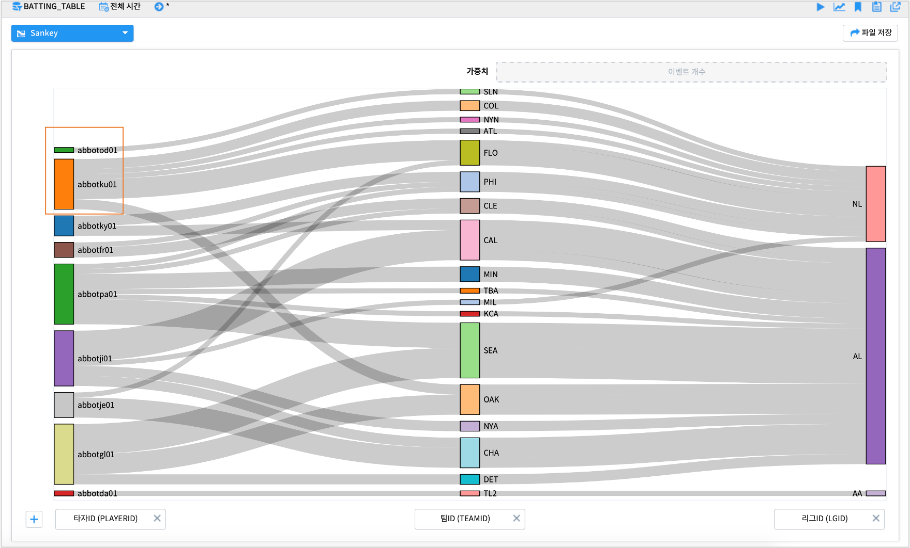
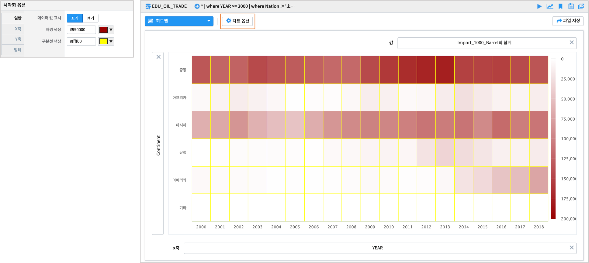

------------------------------------
관계형 그래프
------------------------------------

Sankey chart
'''''''''''''''''''''''''''''''''''''''''''''''''''''''''''''''''''''''''''''''''''''''''''''''''''''''''''''''''''''
| Sankey chart는 각 변수간의 데이터의 흐름을 나타내는 그래프로 굵기의 정도로 흐름의 양을 표현합니다.

|
|

히트맵
'''''''''''''''''''''''''''''''''''''''''''''''''''''''''''''''''''''''''''''''''''''''''''''''''''''''''''''''''''''
| 히트맵은 행/열에 따른 데이터의 값의 크기를 색상으로 변환하여 시각적으로 나타냅니다.

**기본형**

|

**색상 변경 및 값 표시**

.. image:: images/ko/show_charts_25.png
    :alt: 히트맵옵션

|

**차트 옵션**

.. image:: images/ko/show_charts_26.png
    :alt: 히트맵시각화옵션

| 차트 옵션에서는 데이터의 값을 보여주거나, 배경 색상을 변경 할 수 있습니다. 배경색상은 hex color code를 따릅니다.
| 축 옵션 및 차트 옵션에 관한 자세한 사항은 매뉴얼을 참조하시기 바랍니다.

|
|
