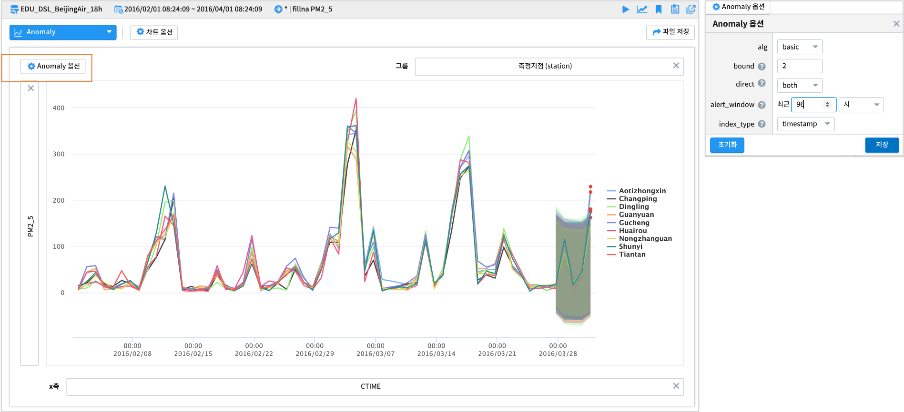

------------------------------------
이상치
------------------------------------

| 시각화 유형 ``이상치`` 는 데이터에서 이상치(anomaly) 를 찾아내기 위해 사용하는 시각화 챠트들입니다.
| 이상치는 제조, 바이오, 금융 등 각 분야별로 다른 의미로 사용되고 있어, 하나의 정의로 설명하기는 어렵습니다.
| 하지만 데이터 측면에서 설명을 하자면 
|

  - 평균같은 통계량의 결과를 왜곡시킬 정도의 매우 크거나 작은 값
  - 자주 발생하는 데이터 패턴과 달리 매우 드물게 나타나는 패턴
  - 대다수의 데이터가 가지는 값과 따로 떨어져 있는 데이터

| 로 이상치의 개념적인 정의를 하겠습니다.
|

- 챠트 설명에 사용한 데이터모델 : EDU_DSL_BeijingAir_18h
- 2013/03/01 ~ 2017/02/28 동안 중국 북경 11개 지점(station) 에서 매일 18:00 시에 측정한 대기질 정보
- 중간에 대상 데이터로 사용될 컬럼중 값이 null 인 행은 삭제하는 조건을 넣었습니다.  `fillna <https://docs.iris.tools/manual/IRIS-Manual/IRIS-Discovery-Middleware/command/commands/fillna.html#fillna>`__ 명령어 메뉴얼을 참조하세요.
 
.. code::

    * | fillna PM2_5
    # PM2_5 가 null 인 행을 삭제합니다.
   
.. image:: images/ko/show_charts_27_2.png
  :alt: 이상치

Anomaly
'''''''''''''''''''''''''''''''''''''''''''''''''''

| ``Anomaly`` 그래프는 데이터에서 이상치를 찾아내어 꺾은 선형 챠트로 보여줍니다.
| 이상치를 찾는 내부 알고리즘은 DSL 명령어 `anomalies <https://docs.iris.tools/manual/IRIS-Manual/IRIS-Discovery-Middleware/command/commands/anomalies.html#anomalies>`__ 를 적용합니다.
|
- X축 : 시간유형(timestamp/date) 
- Y축 : 수치형 데이터만 가능.
- 그룹 : 범주형 데이터

|
- Anomaly 옵션  : 물음표 아이콘에 툴팁으로 각 옵션에 대한 설명이 나옵니다.
  
  - alg : 이상치를 찾는 알고리즘. bagic / robust
  - bound : 이상치와 정상값을 구분하는 임계치 범위의 폭을 결정하는 값. 이 값이 정상값으로 판정하는 범위가 넓어집니다. 
  - direct : 이상치와 정상값을 구분하는 임계치가 위로만 있는 경우(above), 아래에만 있는 경우(below), 위,아래 다 있을 때(both)
  - alert_window : 이상치를 판별하는 데이터의 시간 범위를 정합니다. 데이터의 가장 최근 시간 기준입니다.
  - index_type : X축 필드의 시간 유형. timestamp / date

 
  
.. code::

  - basic 알고리즘 / 2 bound / both direction / alert_window 96시간 / timestamp 시간유형
  - basic 알고리즘은 평균과 표준편차를 기반으로 이상치를 판별하는 알고리즘이며, 이상치의 기준선인 임계치를 표준편차의 2배(bound)로 범위를 정합니다.
  - 이상치를 판별하는 기준을 하한과 상한 임계치로 both direction 으로 정합니다.
  - 이상치 판별 알고리즘의 input 은 전체데이터이고, 데이터의 최근 96시간 데이터를 이상치 판별 대상 데이터로 설정합니다.
  

Outlier
'''''''''''''''''''''''''''''''''''''''''''''''''''

| ``Outlier`` 그래프는 DSL 명령어 `outlier <https://docs.iris.tools/manual/IRIS-Manual/IRIS-Discovery-Middleware/command/commands/outlier.html#outlier>`__  의 결과를 보여주는 꺾은선형 그래프입니다.
|
| outlier 명령어의 디폴트 알고리즘인 **dbscan** 은 원래의 그룹데이터를 개별화하여 알고리즘으로 clustering 을 한 결과에서 패턴이 달라서 묶이지 않는 데이터를 가진 그룹을 찾습니다.
| 알고리즘을 **mad**  로 지정하여 실행하면 그룹 내의 데이터중에서 일정 비율 이상의 이상치를 갖고 있는 그룹을 탐지합니다.
|
.. code::

    dbscan 알고리즘: 여러 개의 그룹 데이터를 clustering 하여 어느 cluster 에도 포함이 되지 않는 그룹을 찾아 냅니다.
    mad 알고리즘: 그룹 내의 데이터에서 중간값을 기반으로 탐지한 anomal 데이터가 일정비율 이상으로 발생한 그룹을 찾아 냅니다.

**데이터개수 제한** 으로 시각화에 제한(데이터개수 500개 한정)이 있습니다. 업그레이트 예정입니다.

이상치
'''''''''''''''''''''''''''''''''''''''''''''''''''

| 시각화 ``이상치``  그래프는 특정 변수에 대한 기술통계량과 함께 IQR(Inter Quantile Range)기반으로 비정상적으로 벗어난 값을 찾아줍니다. 

- 이상치 판단 기준
  
    - 하한 임계치(Q1 - 1.5 * IQR) 보다 작은 값이거나  
    - 상한 임계치(Q3 + 1.5 * IQR) 보다 큰 값을 이상치로 판단합니다.

    - IQR = Q3 - Q1
    - Q1 : 1st 사분위수(25% 값) , Q3 : 3rd 사분위수(75% 값)

  
| ``히스토그램`` 과 ``시계열 분포`` 에서는 실 데이터의 분포를 보여주고, ``기술통계량`` 에서는 데이터의 사분위수 값을 보여줍니다.
| ``이상치(Outlier)`` 에서 이상치로 판정된 데이터를 대상으로 사분위수를 보여줘서 전체 데이터의 기술통계량과 비교할 수 있게 합니다.

.. image:: images/ko/show_charts_27.png
    :alt: 이상치

