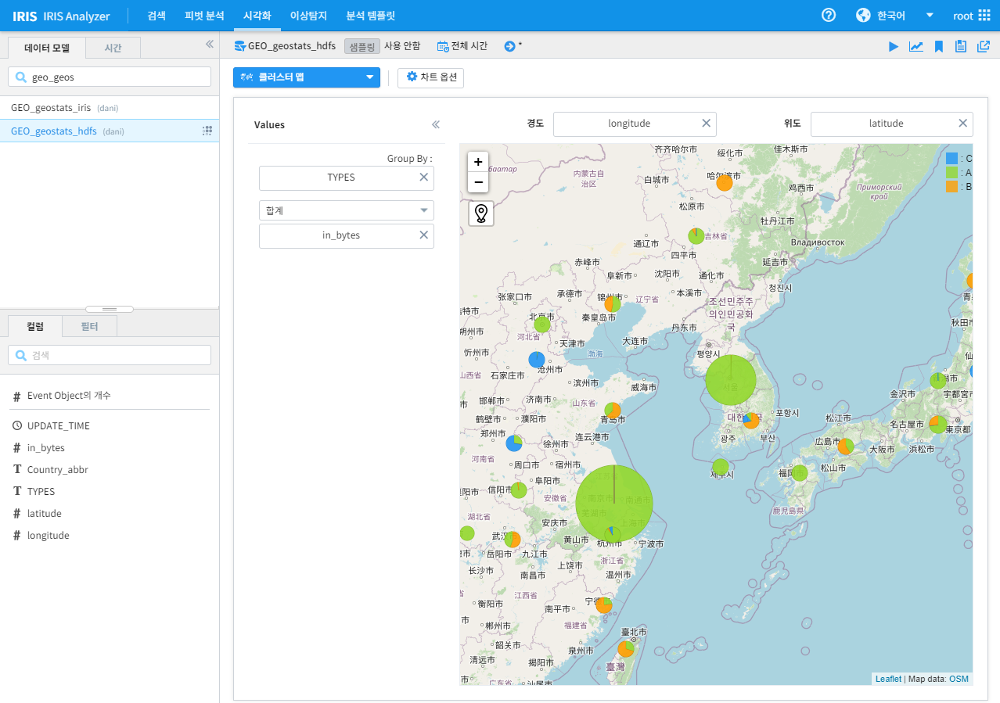
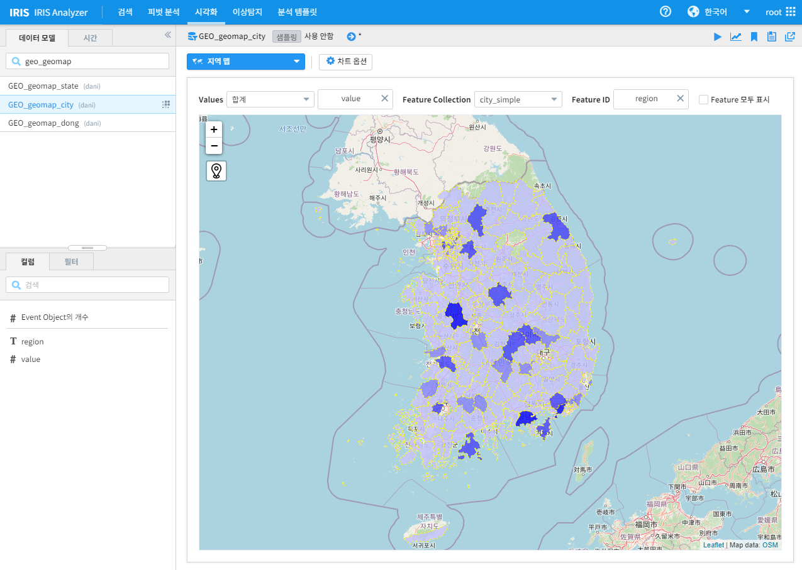

------------------------------------
지도형 그래프
------------------------------------

지도형 그래프는 데이터의 분포에 따라 지도 위에 데이터를 표시합니다. 

클러스터 맵
''''''''''''''''''''''
통계값을 이용해 데이터를 클러스터링하여 지도 위에 표시하는 지도 차트 입니다. 

지역 맵
''''''''''''''''''''''
이미 정의되어 있는 지도 영역(콜렉션)을 사용하여 데이터를 지도 위에 표시하는 지도 차트 입니다. 

