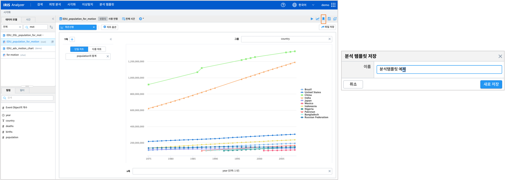
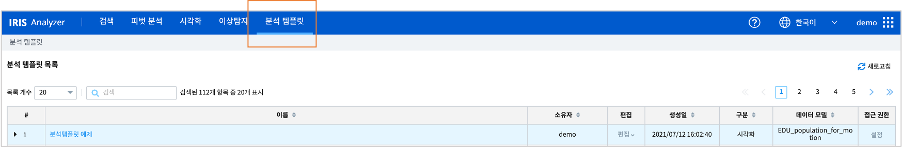

======================================================================================================================
분석 템플릿으로 저장
======================================================================================================================

| 시각화 메뉴에서 사용한 ``데이터모델``, ``조회시간``, ``검색어``, ``시각화 옵션`` 등을 **분석탬플릿** 으로 저장하여 나중에 시각화 메뉴에서 다시 불러오거나, IRIS Studio 에서 재사용할 수 있습니다.
| ``Analyzer >> 분석 탬플릿`` 메뉴의 "분석 탬플릿 목록" 에서 생성일, 구분, 설정 사항 등을 확인하거나 권한 변경을 할 수 있습니다.
| 단, ``지도형`` 시각화는 분석 탬플릿으로 **저장되지 않습니다**
|

**분석 템플릿 저장** 

| 시각화 차트 오른쪽 상단의 분석 템플릿 버튼을 눌러 설정 내용을 저장합니다. 
|

**저장된 분석 템플릿 확인** 

| ``Analyzer >> 분석 탬플릿`` 메뉴에 진입하면 저장된 분석 템플릿 목록에서 확인 가능합니다. 
| 저장한 분석 탬플릿 이름을 클릭하면  ``Analyzer >> 시각화`` 의 챠트 화면으로 바로 이동하며, "실행" 버튼을 누르면 분석 탬플릿 저장 시의 결과가 그대로 나옵니다.
