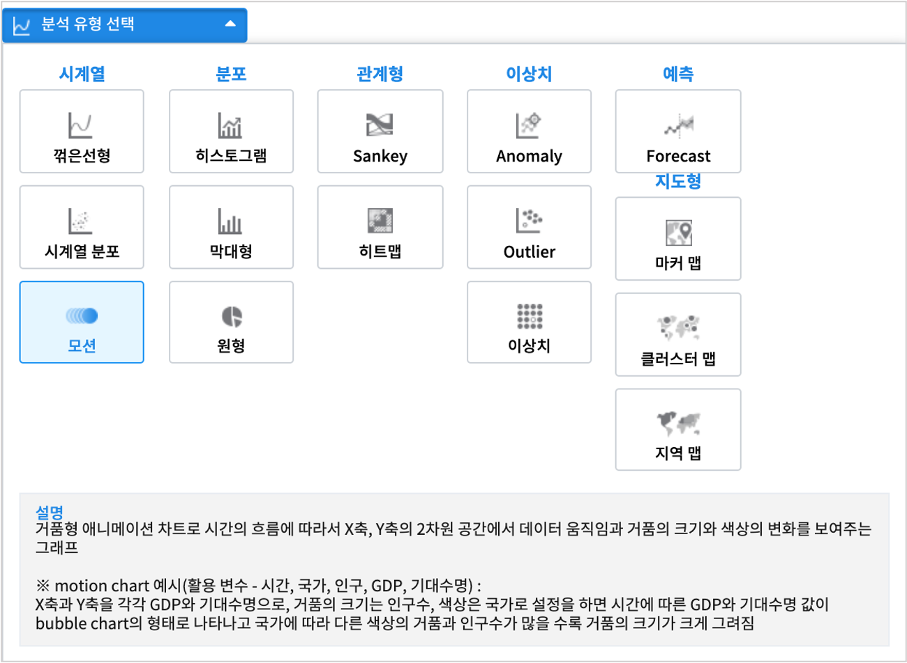

====================
시각화
====================

.. toctree::
    :hidden:

    # 01_overview/overview.rst
    02_show_charts/show_charts.rst
    03_save_charts/save_charts.rst
    04_save_templates/save_templates.rst

| ``IRIS Analyzer >> 시각화`` 메뉴는 분석 유형별로 대표적인 챠트를 매치하여 사용자가 쉽게 데이터 시각화를 시도해 볼 수 있게 만든 메뉴입니다.
| 분석 유형을 ``시계열``, ``분포``, ``관계형``, ``이상치``, ``예측``, ``지도형`` 으로 나누고, 각 분석 유형에서 대표적으로 사용하는 시각화 챠트를 구분하여 배치하였습니다.
|

