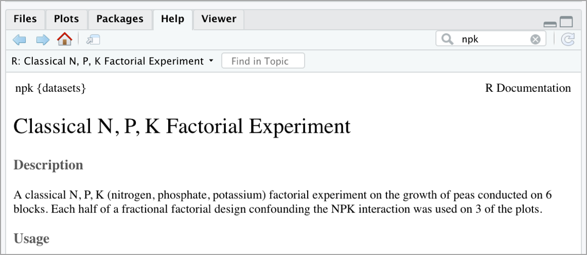

R 과 MINIO - (1) : CSV 파일 저장하기 / 가져오기 
=============================================================

IRIS SaaS 의 기본 스토리지로 제공되는 MINIO(`minio 홈페이지 <https://min.io>`__) 는 
100 % 오픈 소스(Apache V2 라이센스)의 분산 객체 스토리지 시스템입니다.

현재 MINIO는 272.5M + 이상의 docker pull 및 18K + git commit을 통해 전 세계적으로 배포되고 있습니다.

MINIO 는 Amazon S3 클라우드 서비스와 호환됩니다. 
따라서 기술적으로 S3 호환 API를 사용하여 MinIO 스토리지에 액세스 할 수 있습니다. 
R을 통해 Amazon Web Services (AWS)에 액세스하기위한 패키지로는 cloudR 팀이 개발한 aws.s3 이라는 패키지가 있습니다.

하지만 MINIO 에 access 하는데는 사용상의 어려움이 있어 **minio.s3** 라는 패키지를 사용합니다.

현재(2020.04월) minio.s3 는 CRAN 이 아닌 github 에서 설치해야 합니다.

|

이 문서에는 
IRIS SaaS 의 **대화형 분석** 에 embedding 되어 있는 분석 툴인 RStudio 에서 
  - MINIO 의 파일이나 R object 를 가져오거나
  - R 에서 만든 파일이나 R object 를 MINIO 에 저장하는 방법을 설명합니다.

|

설치
-------------------

먼저 aws.s3 패키지를 CRAN 에서 설치하고, 
minio.s3 를 install_github 로 설치합니다.

.. code::
 
    install.packages(aws.s3)    # from CRAM

    library(devtools)
    install_github("nagdevAmruthnath/minio.s3")

|

AWS 환경변수 설정하기 
----------------------------------------

대화형 분석 RStudio 에서 AWS 환경 변수를 설정합니다.

.. code::

   Sys.setenv("AWS_ACCESS_KEY_ID" = "*******", # enter your credentials
              "AWS_SECRET_ACCESS_KEY" = "******", # enter your credentials
              "AWS_DEFAULT_REGION" = "local",
              "AWS_S3_ENDPOINT" = "***.***.***.***:****")   # ip:port

|

minio bucket 을 확인해 봅니다.

.. code::

    library("minio.s3")
    bucketlist(add_region = FALSE) 
    # access 가능한 bucket list 가 출력됩니다.

    get_bucket(bucket = 'my-bucket', use_https = F) 
    #  퍼블릭 버킷에있는 모든 객체의 목록이 나옵니다.

minio.s3 패키지의 자세한 설명은 `Nagdev Amruthnath 의 minio.s3 github <https://github.com/nagdevAmruthnath/minio.s3>`__  를 꼭 보시기 바랍니다.

|

R 에서 만든 dataframe 을 CSV 파일 형태로 MINIO 에 저장하기
-----------------------------------------------------------------------

R 에 내장되어 있는 dataset 중 하나인 npk 데이터를 CSV 파일 형태로 MINIO 에 저장하는 예제입니다.

npk 데이터에 대한 설명은 help 에서 npk 로 검색해보세요.

|

npk 데이터는 5개 컬럼의 24개 rows 로 된 dataframe 입니다.

.. code::

  > data("npk")
  > npk
     block N P K yield
  1      1 0 1 1  49.5
  2      1 1 1 0  62.8
  3      1 0 0 0  46.8
  4      1 1 0 1  57.0
  5      2 1 0 0  59.8
  6      2 1 1 1  58.5
  7      2 0 0 1  55.5
  8      2 0 1 0  56.0
  9      3 0 1 0  62.8
  10     3 1 1 1  55.8
  11     3 1 0 0  69.5
  12     3 0 0 1  55.0
  13     4 1 0 0  62.0
  14     4 1 1 1  48.8
  15     4 0 0 1  45.5
  16     4 0 1 0  44.2
  17     5 1 1 0  52.0
  18     5 0 0 0  51.5
  19     5 1 0 1  49.8
  20     5 0 1 1  48.8
  21     6 1 0 1  57.2
  22     6 1 1 0  59.0
  23     6 0 1 1  53.2
  24     6 0 0 0  56.0

  > str(npk)
  'data.frame':	24 obs. of  5 variables:
   $ block: Factor w/ 6 levels "1","2","3","4",..: 1 1 1 1 2 2 2 2 3 3 ...
   $ N    : Factor w/ 2 levels "0","1": 1 2 1 2 2 2 1 1 1 2 ...
   $ P    : Factor w/ 2 levels "0","1": 2 2 1 1 1 2 1 2 2 2 ...
   $ K    : Factor w/ 2 levels "0","1": 2 1 1 2 1 2 2 1 1 2 ...
   $ yield: num  49.5 62.8 46.8 57 59.8 58.5 55.5 56 62.8 55.8 ...
 
|

dataframe 인 npk 를 CSV 파일로 MINIO 에 저장합니다. 
s3write_using 을 이용하여 npk_data.csv 로 MINIO 에 저장합니다.

.. code::

  s3write_using(npk, FUN = write.csv, row.names= F, object = "/TEST/npk_data.csv", bucket = "my-bucket") 

|

MINIO 의 CSV파일을 가져와서 dataframe 저장
------------------------------------------------------------------

MINIO 에 저장된 CSV 파일을 가져와서 R 의 file path 에 다운로드하여 저장하는 예제입니다.
이 방법은 파일을 다운받아서 계속 사용할 경우에 유용하며, 특히 파일을 다양한 옵션으로 읽어 들일 때 사용합니다.

.. code::

  > save_object("/TEST/npk_data.csv", file = "local_my_npk.csv", bucket = "demo", use_https =F)
    [1] "local_my_npk.csv"
  > my_data <- read.csv("local_my_npk.csv", header=T)
  > my_data
     block N P K yield
  1      1 0 1 1  49.5
  2      1 1 1 0  62.8
  3      1 0 0 0  46.8
  4      1 1 0 1  57.0
  5      2 1 0 0  59.8
  6      2 1 1 1  58.5
  7      2 0 0 1  55.5
  8      2 0 1 0  56.0
  9      3 0 1 0  62.8
  10     3 1 1 1  55.8
  11     3 1 0 0  69.5
  12     3 0 0 1  55.0
  13     4 1 0 0  62.0
  14     4 1 1 1  48.8
  15     4 0 0 1  45.5
  16     4 0 1 0  44.2
  17     5 1 1 0  52.0
  18     5 0 0 0  51.5
  19     5 1 0 1  49.8
  20     5 0 1 1  48.8
  21     6 1 0 1  57.2
  22     6 1 1 0  59.0
  23     6 0 1 1  53.2
  24     6 0 0 0  56.0

|

다른 방법은 s3read_using() 에 user define Function 을 넣어서 데이터파일을 바로 dataframe 으로 생성하는 방법입니다.

.. code::

  # 예제 1
  > my_npk <- s3read_using(FUN=read.csv, header=T, object='npk_data.csv', bucket='demo', opts=list( use_https=F))
  > str(my_npk)
  'data.frame':	24 obs. of  5 variables:
  $ block: int  1 1 1 1 2 2 2 2 3 3 ...
  $ N    : int  0 1 0 1 1 1 0 0 0 1 ...
  $ P    : int  1 1 0 0 0 1 0 1 1 1 ...
  $ K    : int  1 0 0 1 0 1 1 0 0 1 ...
  $ yield: num  49.5 62.8 46.8 57 59.8 58.5 55.5 56 62.8 55.8 ...

  # 예제 2
  # read.csv 함수의 argument 를 모두 추가할 수 있습니다.
  > my_npk <- s3read_using(FUN=read.csv, header=T, colClasses=c('block' = 'character'), object='npk_data.csv', bucket='demo', opts=list( use_https=F))
  > str(my_npk)
  'data.frame':	24 obs. of  5 variables:
  $ block: chr  "1" "1" "1" "1" ...
  $ N    : int  0 1 0 1 1 1 0 0 0 1 ...
  $ P    : int  1 1 0 0 0 1 0 1 1 1 ...
  $ K    : int  1 0 0 1 0 1 1 0 0 1 ...
  $ yield: num  49.5 62.8 46.8 57 59.8 58.5 55.5 56 62.8 55.8 ...

