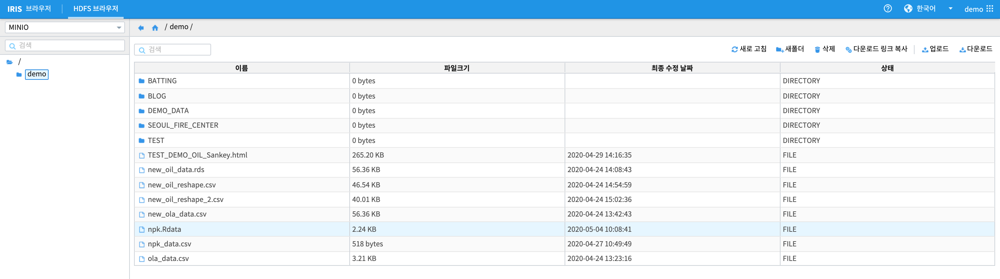

R 과 MINIO - (2) : R Object 를  MINIO 에 저장 / 다운로드
========================================================================

RStudio 에서 생성된  in-memory R Object 를 **.Rdata 파일** 로 MINIO 에 저장하거나

MINIO 에 .Rdata 파일로 저장된 R object 를 RStudio 의 memory 로 load 하는 예제 입니다.

|

R object 를 MINIO 로 저장하기  : s3save
--------------------------------------------------------

먼저 minio.s3 패키지의 `설치 <http://docs.iris.tools/manual/IRIS-Tutorial/IRIS_Analyzer/05_ia/07_R_and_minio/R_MINIO_01.html#id1>`__ 와 `AWS 환경변수 설정하기 <http://docs.iris.tools/manual/IRIS-Tutorial/IRIS_Analyzer/05_ia/07_R_and_minio/R_MINIO_01.html#aws>`__ 를 확인합니다.

R 에서 프로그래밍 중에 생성되는 1개 또는 여러 개의 in-memory R-object 는 
.Rdata 파일 포맷으로 MINIO 에 저장합니다.

아래 예제는 R 에 내장되어 있는 데이터셋 중 하나인 npk 를 object 로 저장하는 예시입니다.

.. code::

  > str(npk)
   'data.frame':	24 obs. of  5 variables:
   $ block: Factor w/ 6 levels "1","2","3","4",..: 1 1 1 1 2 2 2 2 3 3 ...
   $ N    : Factor w/ 2 levels "0","1": 1 2 1 2 2 2 1 1 1 2 ...
   $ P    : Factor w/ 2 levels "0","1": 2 2 1 1 1 2 1 2 2 2 ...
   $ K    : Factor w/ 2 levels "0","1": 2 1 1 2 1 2 2 1 1 2 ...
   $ yield: num  49.5 62.8 46.8 57 59.8 58.5 55.5 56 62.8 55.8 ...

  > npk$N <- as.character(npk$N)
  > npk$P <- as.character(npk$P)
  > npk$K <- as.character(npk$K)
  > str(npk)
  'data.frame':	24 obs. of  5 variables:
   $ block: Factor w/ 6 levels "1","2","3","4",..: 1 1 1 1 2 2 2 2 3 3 ...
   $ N    : chr  "0" "1" "0" "1" ...
   $ P    : chr  "1" "1" "0" "0" ...
   $ K    : chr  "1" "0" "0" "1" ...
   $ yield: num  49.5 62.8 46.8 57 59.8 58.5 55.5 56 62.8 55.8 ...

  > npk_desc <- summary(npk)
  > npk_desc
   block      N                  P                  K                 yield      
   1:4   Length:24          Length:24          Length:24          Min.   :44.20  
   2:4   Class :character   Class :character   Class :character   1st Qu.:49.73  
   3:4   Mode  :character   Mode  :character   Mode  :character   Median :55.65  
   4:4                                                            Mean   :54.88  
   5:4                                                            3rd Qu.:58.62  
   6:4                                                            Max.   :69.50

   # 4분위수 구하기  
  > npk_q <- quantile(npk$yield, c(0, 0.25, 0.5, 0.75, 1), type=1)
  > npk_q
    0%  25%  50%  75% 100% 
  44.2 49.5 55.5 58.5 69.5 

in-memory object 인 npk, npk_desc, npk_q 를 .Rdata 파일로 MINIO 에 저장합니다.

.. code::

  s3save ( npk , npk_desc, npk_q, bucket  =  "demo" , object  =  "npk.Rdata" , use_https  =  F )

|

MINIO 에 저장된 R object load 하기 : s3load
----------------------------------------------------

MINIO 에 저장된 npk.Rdata 파일을 확인합니다.

|

대화형 분석 RStudio 에서 load 합니다.

.. code::

  # R 의 object 에서 npk_q, npk_desc 가 없음을 확인합니다.
  > npk_q
  Error: object 'npk_q' not found
  > npk_desc
  Error: object 'npk_desc' not found

  # s3load 로 npk.Rdata 파일에서 object load
  > s3load("npk.Rdata", bucket = "demo", use_https = F)
  > npk_q
    0%  25%  50%  75% 100% 
  44.2 49.5 55.5 58.5 69.5 
  > npk_desc
   block      N                  P                  K                 yield      
   1:4   Length:24          Length:24          Length:24          Min.   :44.20  
   2:4   Class :character   Class :character   Class :character   1st Qu.:49.73  
   3:4   Mode  :character   Mode  :character   Mode  :character   Median :55.65  
   4:4                                                            Mean   :54.88  
   5:4                                                            3rd Qu.:58.62  
   6:4                                                            Max.   :69.50  

   # npk 역시 N, P, K 의 타입이 factor 에서 character 로 변경된 dataframe 으로 load 된 것을 확인합니다.
  > str(npk)
  'data.frame':	24 obs. of  5 variables:
   $ block: Factor w/ 6 levels "1","2","3","4",..: 1 1 1 1 2 2 2 2 3 3 ...
   $ N    : chr  "0" "1" "0" "1" ...
   $ P    : chr  "1" "1" "0" "0" ...
   $ K    : chr  "1" "0" "0" "1" ...
   $ yield: num  49.5 62.8 46.8 57 59.8 58.5 55.5 56 62.8 55.8 ...

