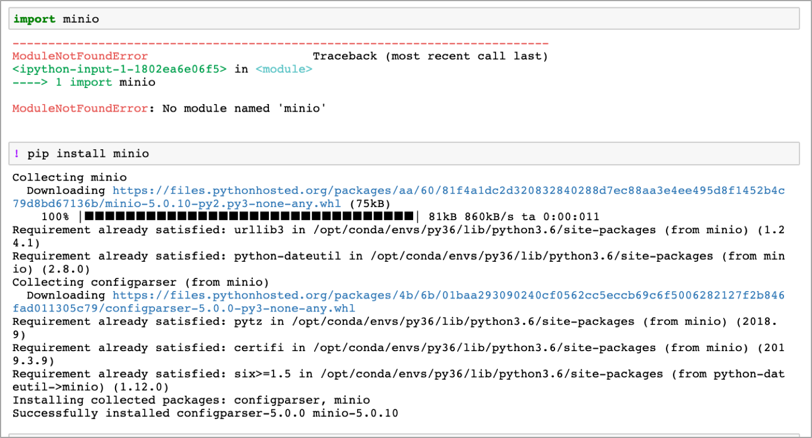
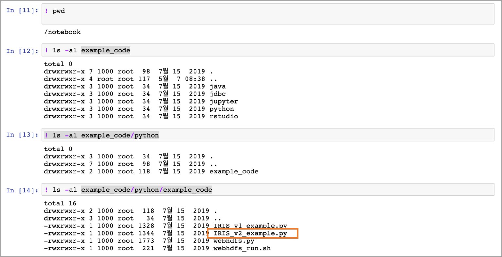
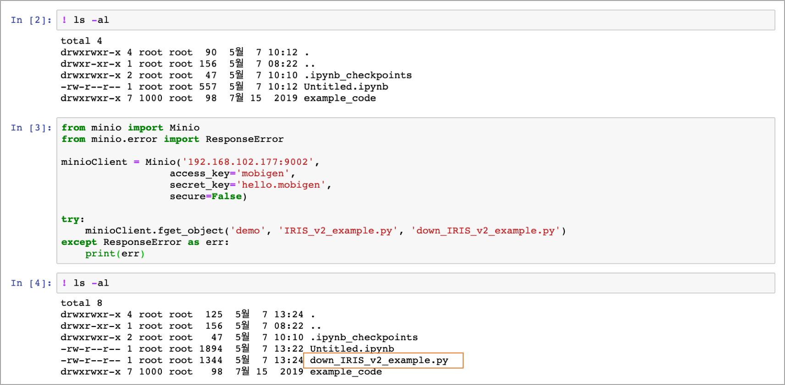

Python 과 MINIO  : minio 라이브러리
=============================================

IRIS **대화형 분석** 에는 RStudio 와 함께 Jupyter Notebook 을 임베딩하여  Python 등을 쉽게 사용할 수 있는 환경을 제공하고 있습니다.

여기서는 IRIS 클라우드의 사용자에게 기본 Storage 로 제공하고 있는 MINIO 에 엑세스하는 방법을 python 예제로 설명합니다.(python 3.6)

|

설치하는 package : minio
---------------------------------------

python 에서 MINIO 에 엑세스하기 위해서 minio 라이브러리(`minio <https://pypi.org/project/minio/>`__) 를 사용 합니다.

minio 라이브러리가 설치 되어 있지 않다면 아래 처럼 확인 후에 pip 로 설치합니다.

|

minio API 의 모든 reference 확인은 -> `Python Client API Reference <https://docs.min.io/docs/python-client-api-reference>`__  

여기서는 file 을 MINIO 에 upload 하고, download 하는 방법만 설명하겠습니다.

|

MINIO 에 파일을 업로드하기
-------------------------------------------------------

나의 Jupyter Notebook 의 로컬 path 에 있는 IRIS_v2_example.py 라는 file 을 MINIO 에 업로드하는 예제입니다.

|

코드 예제 

**fput_object** 함수를 사용합니다.  

.. code::

  fput_object(bucket_name, object_name, file_path, content_type='application/octet-stream', metadata=None, progress=None, part_size=510241024)

./example_code/python/example_code/IRIS_v2_example.py  파일을 MINIO 에 current 디렉토리에 업로드합니다.

.. code::

  from minio import Minio
  from minio.error import ResponseError

  minioClient = Minio('my.end_point',   # ip:port  or URL
                  access_key='*****',
                  secret_key='******',
                  secure=False)     

  # file upload
  try:
         minioClient.fput_object('my-bucket', 'IRIS_v2_example.py', './example_code/python/example_code/IRIS_v2_example.py')
  except ResponseError as err:
         print(err)

|

MINIO 의 object 를 로컬 path 에 파일로 다운로드
-------------------------------------------------------------------

**fget_object** 함수를 사용합니다. 

.. code::

  fget_object(bucket_name, object_name, file_path, request_headers=None)

.. code::

  from minio import Minio
  from minio.error import ResponseError

  minioClient = Minio('my.end_point',   # ip:port  or URL
                  access_key='*****',
                  secret_key='******',
                  secure=False)     

  try:
    minioClient.fget_object('my-bucket', 'IRIS_v2_example.py', 'down_IRIS_v2_example.py')
  except ResponseError as err:
    print(err)
         

