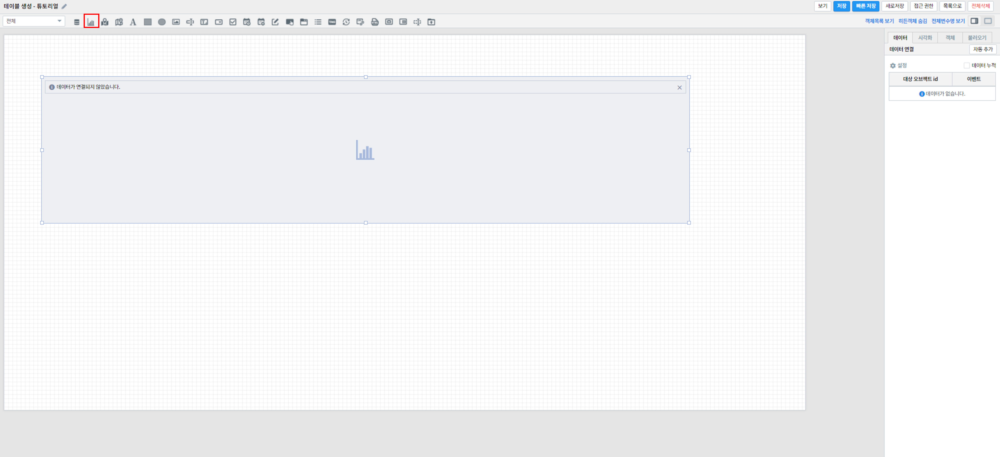
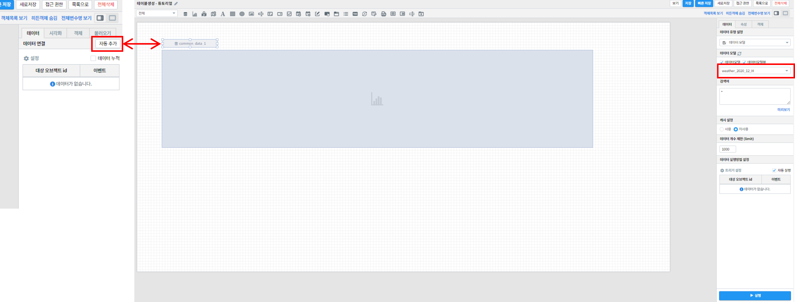
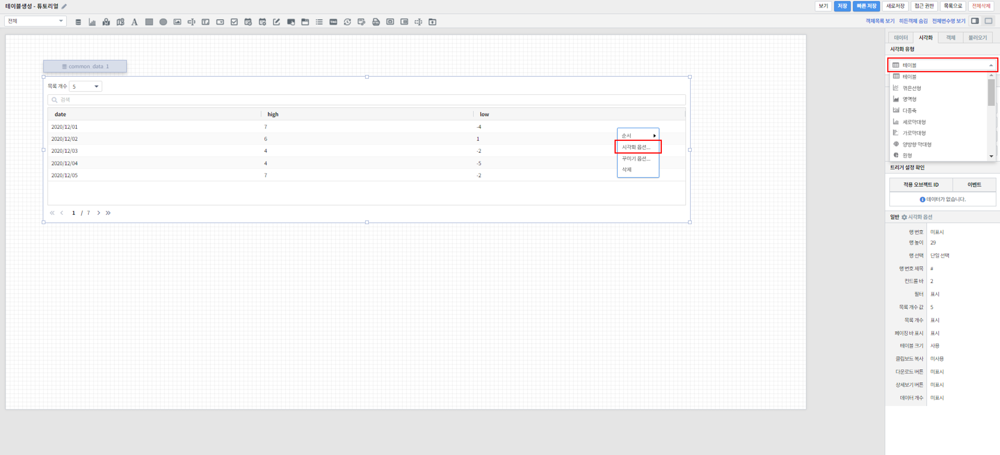
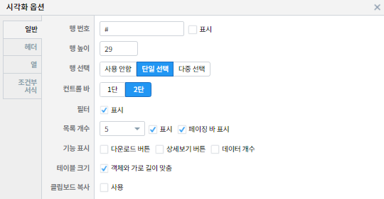
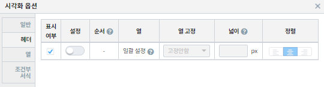
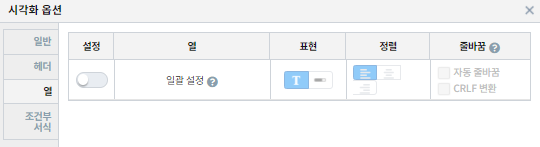
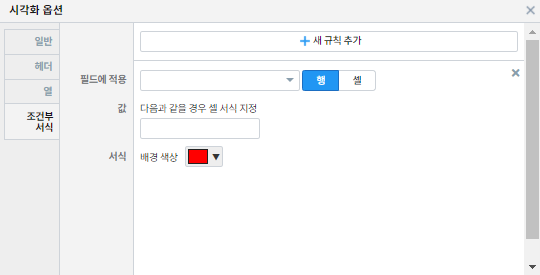
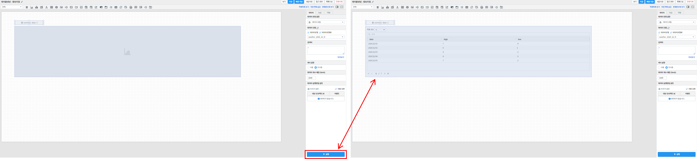

===================================================================
테이블
===================================================================
변경사항 
| 참고 보고서 : 
| `테이블생성_튜토리얼 <http://b-iris.mobigen.com:80/studio/exported/6e0d08468e184572a039ed923a4d21b1fdbef6c7f7c64685b1a463706d5c7f01>`__ 
| 데이터를 테이블 형태로 보고서에 추가하는 방법에 관하여 기술합니다.

| 
.. contents::
    :backlinks: top
    
|

테이블 영역 생성
=================================================================
- 표시된 "차트" 아이콘을 클릭한 후 마우스 드래그 앤 드롭으로 테이블이 그려질 영역을 생성합니다.

|

데이터 설정
=================================================================
- 화면 우측의 "데이터" 탭에서 자동추가를 클릭 후 데이터 모델 객체에서 가져올 데이터 모델을 선택해줍니다.
- 연결하고 싶은 데이터 모델 객체가 따로 있었다면 설정을 자동추가를 클릭하는 대신 밑에 설정을 클릭하고 원하는 데이터 모델 객체를 선택해주면 됩니다.

|

시각화 옵션 설정
=================================================================
- 우측 "시각화" 탭에서 시각화 유형을 테이블인지 확인해줍니다.
- 차트 화면을 우클릭 하면 시각화 옵션으로 그리고자 하는 테이블의 세부적인 것들을 조정할 수 있습니다.

| 
시각화 옵션
-------------------------------------------------------------------

.. list-table::
   :header-rows: 1

   * - 옵션
     - 설명
   * - |opt1|
     - 행번호 여부, 필터여부(검색창), 목록개수 등의 옵션을 설정
   * - |opt2|
     - 테이블에 표시되는 컬럼의 순서, 테이블 간격, 헤더의 글씨정렬(좌/우/가운데 정렬)의 옵션을 설정
   * - |opt3|
     - 테이블에 표시되는 컬럼의 표현방식(텍스트/비율그래프), 셀 값의 글씨정렬(좌/우/가운데 정렬)의 옵션을 설정
   * - |opt4|
     - 설정한 컬럼(필드)의 값과 일치하는 열의 셀 배경색을 조건으로 설정. 여러가지 조건으로 다양한 셀 배경색 조정 가능

|

결과 확인
=================================================================

- 설정을 마친 후 우측 하단의 실행 버튼을 클릭하면, 아래 그림과 같이 결과가 표시됩니다.
- 제대로 적용됐는지 확인하고자 한다면, 우측 상단의 보기 버튼을 눌러 작성 결과를 다시 한 번 확인하면 됩니다.
- 결과가 정상적으로 표출될 경우, 작성 화면에서 빠른저장 버튼을 눌러 결과를 저장합니다.
- 자동저장이 안되기 때문에 수시로 빠른 저장을 눌러줘야 합니다.

|

주의사항
-------------------------------------------------------------------

.. code::

    보기 버튼을 눌렀을 때, 차트가 자동으로 실행되지 않을 경우,

    "자동 실행"을 설정하지 않을 경우 보고서 조회 시 자동으로 실행되지 않습니다.

    데이터 탭 하단의 데이터 실행방법 설정에 있는 자동 실행을 선택한 후 다시 확인해보시기 바랍니다.
    (아래 그림 참조)

.. image:: ./images/table_10.png
    :alt: 자동실행 설정
