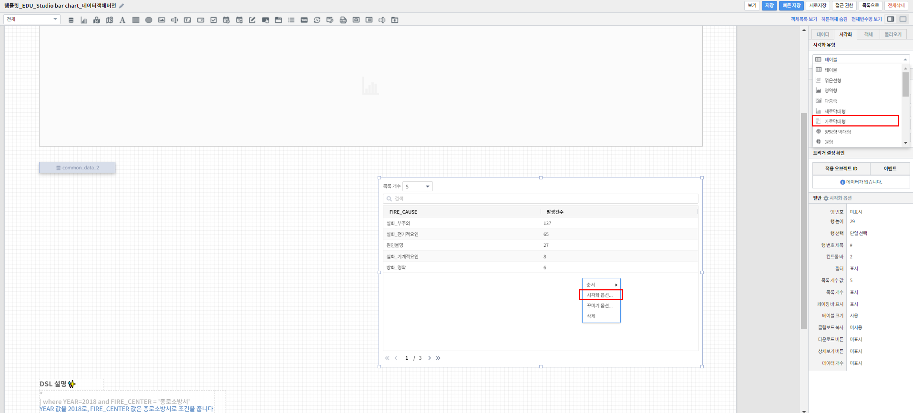
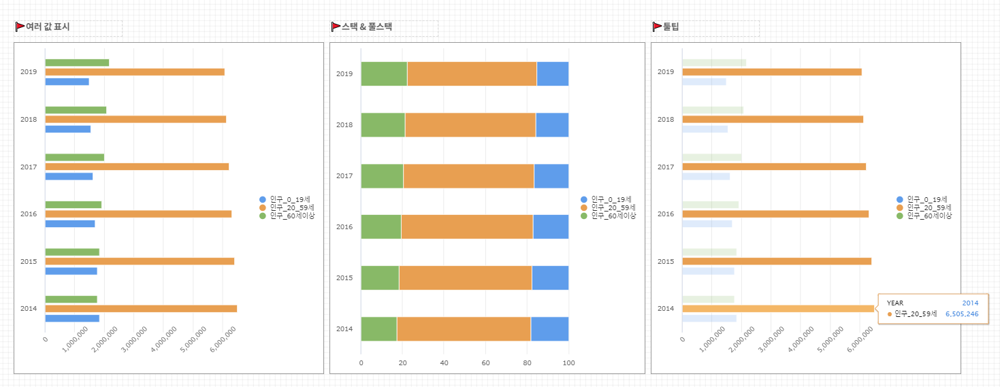

===================================================================
가로 막대형 차트 그리기
===================================================================

| 본 문서는 가로 막대형 차트를 보고서에 추가하는 방법에 관하여 기술합니다.
| 데이터를 표현할 때 높이(또는 길이)로써 값을 표현하며, 이를 다른 값 또는 축과 비교할 수 있습니다.
| 중점을 두고 관찰하고자 하는 항목에 대해 다른 색상을 이용하여 사용자의 시선을 끌 수 있으며 직관적으로 정보를 전달 할 수 있습니다.
| 막대를 세로로 할 수도 있고 가로로 할 수도 있습니다. 가독성 면에선 항목이 적을수록 가로가 좋고 항목이 많을수록 세로가 좋습니다.
| 스택형은 데이터의 빈도를 그룹별로 누적 빈도를, 풀스택형은 전체를 기준으로 그룹별 상대적 비율(누적퍼센트)을 집계해 줍니다.

| 
.. contents::
    :backlinks: top
    
| 
-------------------------------------------------------------------
가로 막대형 차트 영역 생성
-------------------------------------------------------------------
- 표시된 "차트" 아이콘을 클릭한 후 마우스 드래그 앤 드롭으로 테이블이 그려질 영역을 생성합니다.

.. image:: ./images/tu_01.png
    :alt: 가로막대형_차트영역생성

| 
-------------------------------------------------------------------
데이터 설정
-------------------------------------------------------------------
- 우측의 "데이터" 탭에서 자동추가를 클릭 후 데이터 모델 객체에서 가져올 데이터 모델을 선택해줍니다.
- 그리고 싶은 차트에 맞게 검색어를 써서 원하는 차트를 출력할 수 있습니다.
- 또한, 연결하고 싶은 데이터 모델 객체가 따로 있었다면 설정을 자동추가를 클릭하는 대신 밑에 설정을 클릭하고 원하는 데이터 모델 객체를 선택해주면 됩니다.

.. image:: ./images/bar_08.png
    :alt: 가로막대형_데이터설정
| 
-------------------------------------------------------------------
시각화 옵션 설정
-------------------------------------------------------------------
-  원하는 테이블로 나왔는지 확인한 후 우측 "시각화" 탭에서 시각화 유형을 가로막대형으로 선택해줍니다.
- 차트 화면을 우클릭 하면 그리고자 하는 차트에 맞게 시각화 옵션으로 세부적인 것들을  조정할 수 있습니다.

시각화 옵션
=================================================================

.. |opt1| image:: ./images/barh_01.PNG
    :scale: 90%
    :alt: 가로막대형 시각화 옵션 (1)

.. |opt2| image:: ./images/barh_02.PNG
    :scale: 90%
    :alt: 가로막대형 시각화 옵션 (2)

.. |opt3| image:: ./images/barh_03.PNG
    :scale: 90%
    :alt: 가로막대형 시각화 옵션 (3)

.. |opt4| image:: ./images/barh_04.PNG
    :scale: 90%
    :alt: 가로막대형 시각화 옵션 (4)

.. |opt5| image:: ./images/barh_05.PNG
    :scale: 90%
    :alt: 가로막대형 시각화 옵션 (5)
    
.. |opt6| image:: ./images/barh_06.PNG
    :scale: 90%
    :alt: 가로막대형 시각화 옵션 (6)

.. list-table::
   :header-rows: 1

   * - 옵션
     - 설명
   * - |opt1|
     - 막대형 스택모드, 데이터 값 표시, 다운로드 버튼, 상세보기 버튼 설정
   * - |opt2|
     - 가로막대형 차트의 X축 표시 여부, 축 제목, 레이블 회전 관련 설정
   * - |opt3|
     - 가로막대형 차트의 Y축 표시 여부, 축 제목, 레이블 회전 관련 설정
   * - |opt4|
     - 가로막대형 차트의 범례 및 범례 위치 관련 설정
   * - |opt5|
     - 가로막대형 차트 툴팁의 범위 설정
   * - |opt6|
     - 가로막대형 차트 X축 및 Y축에 해당하는 데이터 관련 설정
     
| 
시각화 옵션 예시
=================================================================    
- 아래의 차트와 같이 나타낼 막대 값이 여러 개인 경우나 툴팁 설정 등 시각화옵션으로 조정할 수 있습니다.
- 자세한 설명을 보시려면  `세로 막대형 차트 그리기 <https://docs.iris.tools/manual/IRIS-Tutorial/IRIS_Studio/00_common/02_bar/bar.html>`__ 의 설명을 참고하시면 됩니다.
     

| 
-------------------------------------------------------------------
결과 확인
-------------------------------------------------------------------
- 설정을 마친 후 우측 하단의 실행 버튼을 클릭하면, 아래 그림과 같이 결과가 표시됩니다.
- 제대로 적용됐는지 확인하고자 한다면, 우측 상단의 보기 버튼을 눌러 작성 결과를 다시 한 번 확인하면 됩니다.
- 결과가 정상적으로 표출될 경우, 작성 화면에서 빠른저장 버튼을 눌러 결과를 저장합니다.
- 자동저장이 안되기 때문에 수시로 빠른 저장을 눌러줘야 합니다.

.. image:: ./images/barh_08.png
    :alt: 가로막대형_시각화 결과 확인

| 
-------------------------------------------------------------------
주의사항
-------------------------------------------------------------------

.. code::

    보기 버튼을 눌렀을 때, 차트가 자동으로 실행되지 않을 경우,

    "자동 실행"을 설정하지 않을 경우 보고서 조회 시 자동으로 실행되지 않습니다.

    데이터 탭 하단의 데이터 실행방법 설정에 있는 "자동 실행"을 선택한 후 다시 확인해보시기 바랍니다.
    (아래 그림 참조)

.. image:: ./images/tu_02.png
    :scale: 90%
    :alt: 자동실행 설정

.. code::

    차트에 아무 컬럼도 표시되지 않을 경우,

    1) 시각화 옵션 데이터 설정에 오류가 있는지 확인합니다.
    2) 데이터 설정에 문제가 없다면, 우측 하단의 실행 버튼을 클릭한 후 다시 확인하시기 바랍니다.

