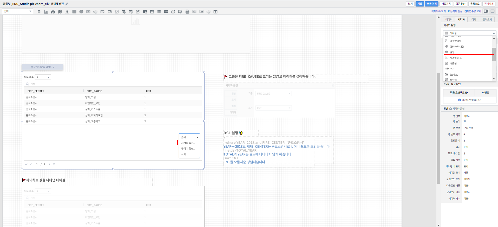

===================================================================
원형
===================================================================

| 원형 컴포넌트는 데이터의 각 범주의 합계 또는 평균 등 전체에 대한 각 범주 값의 상대적 비율을 원형 그래프 형태로 표시하고자 할 때 사용하는 컴포넌트입니다. 
데이터의 단일 값이 아닌 해당 범주 별 비율이 집계되어야 하며, 데이터 범주의 전체적인 비율을 쉽게 파악할 수 있습니다. 

| 
.. contents::
    :backlinks: top
    
| 
-------------------------------------------------------------------
원형 차트 영역 생성
-------------------------------------------------------------------
- 표시된 "차트" 아이콘을 클릭한 후 마우스 드래그 앤 드롭으로 테이블이 그려질 영역을 생성합니다.

.. image:: ./images/tu_01.png
    :alt: 원형차트생성

| 
-------------------------------------------------------------------
데이터 설정
-------------------------------------------------------------------

- 우측의 "데이터" 탭에서 자동추가를 클릭 후 데이터 모델 객체에서 가져올 데이터 모델을 선택해줍니다.
- 그리고 싶은 차트에 맞게 검색어를 써서 원하는 차트를 출력할 수 있습니다.
- 또한, 연결하고 싶은 데이터 모델 객체가 따로 있었다면 설정을 자동추가를 클릭하는 대신 밑에 설정을 클릭하고 원하는 데이터 모델 객체를 선택해주면 됩니다.

.. image:: ./images/pie_06.png
    :alt: 데이터모델선택
| 
-------------------------------------------------------------------
시각화 옵션 설정
-------------------------------------------------------------------
- 원하는 테이블로 나왔는지 확인한 후 우측 "시각화" 탭에서 시각화 유형을 원형으로 선택해줍니다.
- 차트 화면을 우클릭 하면 그리고자 하는 차트에 맞게 시각화 옵션으로 세부적인 것들을  조정할 수 있습니다.

    
    
시각화 옵션
=================================================================

.. |opt1| image:: ./images/pie_02.PNG
    :scale: 90%
    :alt: 원형 시각화 옵션 (1)

.. |opt2| image:: ./images/pie_03.PNG
    :scale: 90%
    :alt: 원형 시각화 옵션 (2)

.. |opt3| image:: ./images/pie_04.PNG
    :scale: 90%
    :alt: 원형 시각화 옵션 (3)

.. |opt4| image:: ./images/pie_05.PNG
    :scale: 90%
    :alt: 원형 시각화 옵션 (4)

.. list-table::
   :header-rows: 1

   * - 옵션
     - 설명
   * - |opt1|
     - 원형 차트에 값 표시 여부, 다운로드, 상세보기 버튼 표시 등의 여부를 설정\

       다운로드 버튼과 상세보기 버튼 , 데이터 개수 버튼 등의 표시 설정
   * - |opt2|
     - 조각의 최소 크기를 설정\
     
       내부 원 크기 설정
   * - |opt3|
     - 범례의 표시 여부와 위치를 설정
   * - |opt4|
     - 데이터 그룹과 크기 설정
| 
시각화 옵션 예시
=================================================================
- 원형 차트의 조각이 많을 경우 최소크기의 %를 정해서 other로 원하는 값을 더 정확히 확인할 수 있습니다.
- 또한 내부 원 크기를 이용하여 디자인 할 수 있습니다.

| 
-------------------------------------------------------------------
결과 확인
-------------------------------------------------------------------
- 설정을 마친 후 우측 하단의 실행 버튼을 클릭하면, 아래 그림과 같이 결과가 표시됩니다.
- 제대로 적용됐는지 확인하고자 한다면, 우측 상단의 보기 버튼을 눌러 작성 결과를 다시 한 번 확인하면 됩니다.
- 결과가 정상적으로 표출될 경우, 작성 화면에서 빠른저장 버튼을 눌러 결과를 저장합니다.
- 자동저장이 안되기 때문에 수시로 빠른 저장을 눌러줘야 합니다.

.. image:: ./images/pie_07.png
    :alt: 원형 시각화 결과 확인
| 
- 또한 아래와 같이 `sort <https://docs.iris.tools/manual/IRIS-Manual/IRIS-Discovery-Middleware/command/commands/sort.html?highlight=sort>`__ 를 이용해서 정렬 방법대로 원형차트 조각 크기 순서를 시계 방향을 기준으로 바꿀 수 있습니다.

| 
-------------------------------------------------------------------
주의사항
-------------------------------------------------------------------

.. code::

    보기 버튼을 눌렀을 때, 차트가 자동으로 실행되지 않을 경우,

    "자동 실행"을 설정하지 않을 경우 보고서 조회 시 자동으로 실행되지 않습니다.

    데이터 탭 하단의 데이터 실행방법 설정에 있는 "자동 실행"을 선택한 후 다시 확인해보시기 바랍니다.
    (아래 그림 참조)

.. image:: ./images/tu_02.png
    :scale: 90%
    :alt: 자동실행 설정

.. code::

    차트에 아무 컬럼도 표시되지 않을 경우,

    1) 시각화 옵션 데이터 설정에 오류가 있는지 확인합니다.
    2) 데이터 설정에 문제가 없다면, 우측 하단의 실행 버튼을 클릭한 후 다시 확인하시기 바랍니다.

