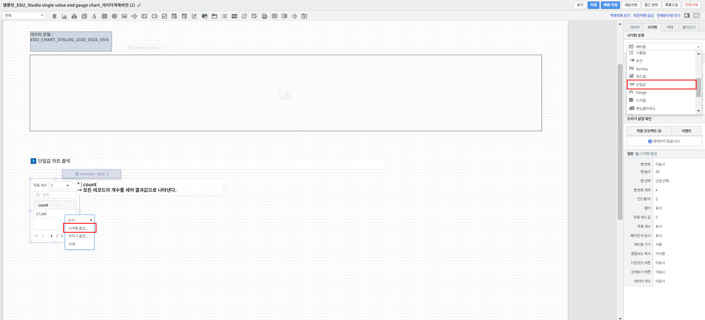

===================================================================
단일값 추가하기
===================================================================
| 
| 참고 보고서 : `템플릿_EDU_Studio single value and gauge chart_데이터객체버전 <http://b-iris.mobigen.com:80/studio/exported/6c39685ed8de4444a0702957a054096342a99d4a213e454781c5af6154c17992>`__ 
| 
| 단일값 컴포넌트는 데이터의 내용, 기간 또는 타 컴포넌트와의 상호작용에 따라 변경되어 표시되어야 하는 대표값 중 단일 값의 형태를 띠는 데이터가 있을 때 쓰는 컴포넌트입니다.
| 예를 들어, 기간 내 발생한 로그 데이터의 총 수, 특정 고객의 수신 메일 개수와 같이 단일한 값만으로 통계적 의미를 가질 때 쓸 수 있는 컴포넌트입니다.
|
 
.. contents::
    :backlinks: top
    
| 
-------------------------------------------------------------------
단일값 영역 생성
-------------------------------------------------------------------
- 표시된 "차트" 아이콘을 클릭한 후 마우스 드래그 앤 드롭으로 테이블이 그려질 영역을 생성합니다.

.. image:: ./images/tu_01.png
    :alt: 단일값_차트영역생성

| 
-------------------------------------------------------------------
데이터 설정
-------------------------------------------------------------------
- 우측의 "데이터" 탭에서 자동추가를 클릭 후 데이터 모델 객체에서 가져올 데이터 모델을 선택해줍니다.
- 그리고 싶은 차트에 맞게 검색어를 써서 원하는 차트를 출력할 수 있습니다.
- 또한, 연결하고 싶은 데이터 모델 객체가 따로 있었다면 설정을 자동추가를 클릭하는 대신 밑에 설정을 클릭하고 원하는 데이터 모델 객체를 선택해주면 됩니다.
- 단일값 컴포넌트로 표시할 데이터는 결과값이 1개여야 합니다.

.. image:: ./images/single_02.png
    :alt: 단일값_데이터설정

| 
-------------------------------------------------------------------
시각화 옵션 설정
-------------------------------------------------------------------
- 우측 "시각화" 탭에서 시각화 유형을 단일값으로 선택해줍니다.
- 차트 화면을 우클릭 하면 그리고자 하는 차트에 맞게 시각화 옵션으로 세부적인 것들을  조정할 수 있습니다.

시각화 옵션
=================================================================

.. |opt1| image:: ./images/single_03.png
    :alt: 단일값 시각화 옵션 (1)

.. |opt2| image:: ./images/single_04.png
    :alt: 단일값 시각화 옵션 (2)

.. list-table::
   :header-rows: 1

   * - 옵션
     - 설명
   * - |opt1|
     - 단일값 글자의 글꼴, 색상, 크기, 스타일 등을 설정
       |br|
       |br| 다운로드 버튼과 상세보기 버튼 표시를 설정
   * - |opt2|
     - 가로/세로 정렬과 텍스트 정렬 방향을 설정

| 
-------------------------------------------------------------------
결과 확인
-------------------------------------------------------------------
- 설정을 마친 후 우측 하단의 실행 버튼을 클릭하면, 아래 그림과 같이 결과가 표시됩니다.
- 제대로 적용됐는지 확인하고자 한다면, 우측 상단의 보기 버튼을 눌러 작성 결과를 다시 한 번 확인하면 됩니다.
- 결과가 정상적으로 표출될 경우, 작성 화면에서 빠른저장 버튼을 눌러 결과를 저장합니다.
- 자동저장이 안되기 때문에 수시로 빠른 저장을 눌러줘야 합니다.

.. image:: ./images/single_05.PNG
    :alt: 단일값 시각화 결과 확인

| 
-------------------------------------------------------------------
주의사항
-------------------------------------------------------------------

.. code::

    보기 버튼을 눌렀을 때, 차트가 자동으로 실행되지 않을 경우,

    "자동 실행"을 설정하지 않을 경우 보고서 조회 시 자동으로 실행되지 않습니다.

    데이터 탭 하단의 데이터 실행방법 설정에 있는 "자동 실행"을 선택한 후 다시 확인해보시기 바랍니다.
    (아래 그림 참조)

.. image:: ./images/tu_02.png
    :scale: 90%
    :alt: 자동실행 설정

.. code::

    차트에 아무 컬럼도 표시되지 않을 경우,

    1) 시각화 옵션 데이터 설정에 오류가 있는지 확인합니다.
    2) 데이터 설정에 문제가 없다면, 우측 하단의 실행 버튼을 클릭한 후 다시 확인하시기 바랍니다.

