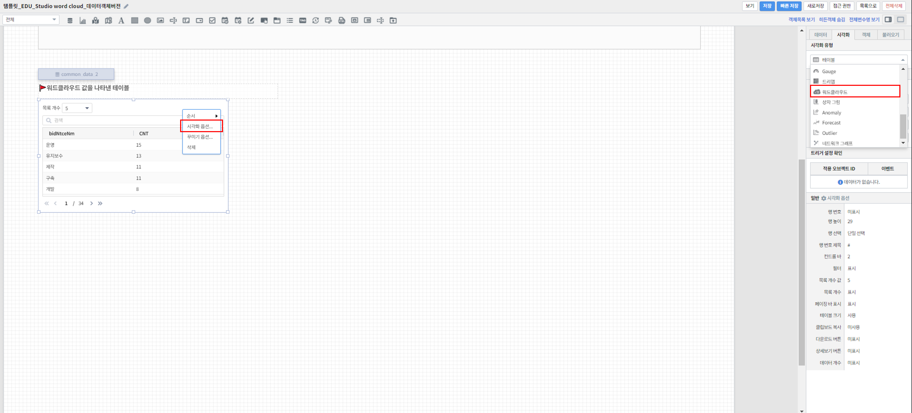

===================================================================
워드클라우드 그리기
===================================================================
| 
단어의 출현빈도 또는 가중치에 따라 단어의 크기를 다르게 하여 그리는 워드클라우드(Word Cloud)를 보고서에 추가하는 방법에 관하여 기술합니다.

| 
.. contents::
    :backlinks: top
    
| 
-------------------------------------------------------------------
워드클라우드 차트 영역 생성
-------------------------------------------------------------------
- 표시된 "차트" 아이콘을 클릭한 후 마우스 드래그 앤 드롭으로 테이블이 그려질 영역을 생성합니다.

.. image:: ./images/tu_01.png
    :alt: 워드클라우드_차트영역생성

| 
-------------------------------------------------------------------
데이터 설정
-------------------------------------------------------------------
- 우측의 "데이터" 탭에서 자동추가를 클릭 후 데이터 모델 객체에서 가져올 데이터 모델을 선택해줍니다.
- 그리고 싶은 차트에 맞게 검색어를 써서 원하는 차트를 출력할 수 있습니다.
- 또한, 연결하고 싶은 데이터 모델 객체가 따로 있었다면 설정을 자동추가를 클릭하는 대신 밑에 설정을 클릭하고 원하는 데이터 모델 객체를 선택해주면 됩니다.
- 워드클라우드를 그리기 위해서는 단어 컬럼과 단어의 출현에 따른 가중치가 될 수치 컬럼이 필요합니다.

.. image:: ./images/word_04.png
    :alt: 워드클라우드_데이터설정

| 
-------------------------------------------------------------------
시각화 옵션 설정
-------------------------------------------------------------------
- 원하는 테이블로 나왔는지 확인한 후 우측 "시각화" 탭에서 시각화 유형을 가로막대형으로 선택해줍니다.
- 차트 화면을 우클릭 하면 그리고자 하는 차트에 맞게 시각화 옵션으로 세부적인 것들을  조정할 수 있습니다.

시각화 옵션
=================================================================

.. |opt1| image:: ./images/word_01.PNG
    :scale: 90%
    :alt: 워드클라우드 시각화 옵션 (1)

.. |opt2| image:: ./images/word_02.PNG
    :scale: 90%
    :alt: 워드클라우드 시각화 옵션 (2)

.. |opt3| image:: ./images/word_03.PNG
    :scale: 90%
    :alt: 워드클라우드 시각화 옵션 (3)

.. list-table::
   :header-rows: 1

   * - 옵션
     - 설명
   * - |opt1|
     - 다운로드 버튼과 상세보기 버튼 표시여부를 설정
   * - |opt2|
     - 워드클라우드에 표시되는 글자의 최소/최대 크기를 설정
   * - |opt3|
     - 워드클라우드에 표시할 단어 컬럼을 "키 값"에, 단어 크기에 적용될 가중치 컬럼을 "가중치"에 설정

| 
-------------------------------------------------------------------
결과 확인
-------------------------------------------------------------------
- 설정을 마친 후 우측 하단의 실행 버튼을 클릭하면, 아래 그림과 같이 결과가 표시됩니다.
- 제대로 적용됐는지 확인하고자 한다면, 우측 상단의 보기 버튼을 눌러 작성 결과를 다시 한 번 확인하면 됩니다.
- 결과가 정상적으로 표출될 경우, 작성 화면에서 빠른저장 버튼을 눌러 결과를 저장합니다.
- 자동저장이 안되기 때문에 수시로 빠른 저장을 눌러줘야 합니다.

.. image:: ./images/word_06.png
    :alt: 워드클라우드_시각화 결과 확인

| 
-------------------------------------------------------------------
주의사항
-------------------------------------------------------------------

.. code::

    보기 버튼을 눌렀을 때, 차트가 자동으로 실행되지 않을 경우,

    "자동 실행"을 설정하지 않을 경우 보고서 조회 시 자동으로 실행되지 않습니다.

    데이터 탭 하단의 데이터 실행방법 설정에 있는 "자동 실행"을 선택한 후 다시 확인해보시기 바랍니다.
    (아래 그림 참조)

.. image:: ./images/tu_02.png
    :scale: 90%
    :alt: 자동실행 설정

.. code::

    차트에 아무 컬럼도 표시되지 않을 경우,

    1) 시각화 옵션 데이터 설정에 오류가 있는지 확인합니다.
    2) 데이터 설정에 문제가 없다면, 우측 하단의 실행 버튼을 클릭한 후 다시 확인하시기 바랍니다.

.. code::

    워드클라우드 키워드 개수 상한

    워드클라우드로 그릴 수 있는 키워드 개수는 시스템 요구사항에 따라 상한이 존재합니다.
    워드클라우드 이미지의 가독성과 해석력도 고려하는 점에서, 워드클라우드로 표현할 데이터의 키워드의 개수가 너무 많지 않게 설정하시길 권고드립니다.

