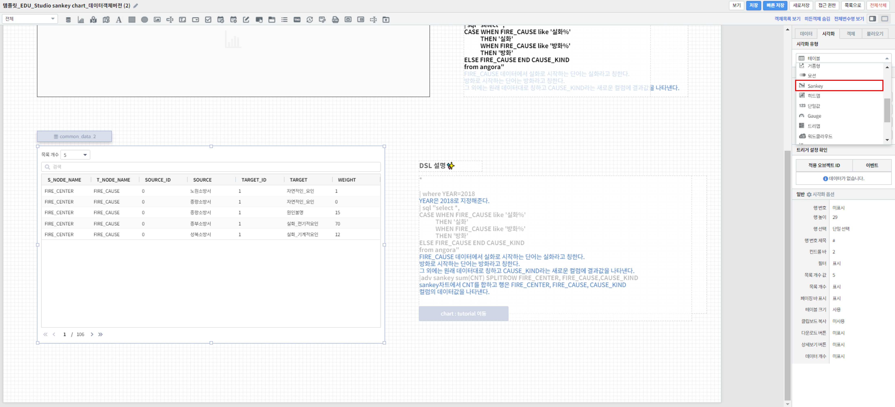

==================================================
Sankey 차트
==================================================
| 참고 보고서 : 
| `템플릿_EDU_Studio sankey chart_데이터객체버전 <http://b-iris.mobigen.com:80/studio/exported/fa93fe5aee674a6ca0d047c65b0fee5045f6958070e94c91913a09ef1011c4e8>`__ 
| Sankey 차트를 활용하여 각 변수간의 데이터의 흐름을 나타내는 관계형 그래프를 그릴 수 있습니다. 그래프의 연결선 굵기는 데이터의 양을 표현합니다. 
| 
---------------------------------
Sankey 차트 영역 생성
---------------------------------
- 표시된 "차트" 아이콘을 클릭한 후 마우스 드래그 앤 드롭으로 테이블이 그려질 영역을 생성합니다.

.. image:: ./images/tu_01.png
    :alt: sankey차트생성

| 
-------------------------------------------------------------------
데이터 설정
-------------------------------------------------------------------

- 우측의 "데이터" 탭에서 자동추가를 클릭 후 데이터 모델 객체에서 가져올 데이터 모델을 선택해줍니다.
- 그리고 싶은 차트에 맞게 검색어를 써서 원하는 차트를 출력할 수 있습니다.
- 또한, 연결하고 싶은 데이터 모델 객체가 따로 있었다면 설정을 자동추가를 클릭하는 대신 밑에 설정을 클릭하고 원하는 데이터 모델 객체를 선택해주면 됩니다.

.. image:: ./images/sankey_01.png
    :alt: 데이터모델선택
| 
-------------------------------------------------------------------
시각화 옵션 설정
-------------------------------------------------------------------
- 원하는 테이블로 나왔는지 확인한 후 우측 "시각화" 탭에서 시각화 유형을 sankey로 선택해줍니다.
- 다른 차트들과 달리 차트 화면을 우클릭 하여 차트에 맞게 시각화 옵션으로 조절할 수 없고 adv라는 명령어를 써서 그려줍니다.
| 참고 (`adv <http://docs.iris.tools/manual/IRIS-Manual/IRIS-Discovery-Middleware/command/commands/adv.html>`_ 명령어의 자세한 활용법은 링크를 참조하세요)

   
| 
-------------------------------------------------------------------
결과 확인
-------------------------------------------------------------------
- 설정을 마친 후 우측 하단의 실행 버튼을 클릭하면, 아래 그림과 같이 결과가 표시됩니다.
- 제대로 적용됐는지 확인하고자 한다면, 우측 상단의 보기 버튼을 눌러 작성 결과를 다시 한 번 확인하면 됩니다.
- 결과가 정상적으로 표출될 경우, 작성 화면에서 빠른저장 버튼을 눌러 결과를 저장합니다.
- 자동저장이 안되기 때문에 수시로 빠른 저장을 눌러줘야 합니다.

.. image:: ./images/sankey_03.png
    :alt: sankey 시각화 결과 확인

| 
-------------------------------------------------------------------
주의사항
-------------------------------------------------------------------

.. code::

    보기 버튼을 눌렀을 때, 차트가 자동으로 실행되지 않을 경우,

    "자동 실행"을 설정하지 않을 경우 보고서 조회 시 자동으로 실행되지 않습니다.

    데이터 탭 하단의 데이터 실행방법 설정에 있는 "자동 실행"을 선택한 후 다시 확인해보시기 바랍니다.
    (아래 그림 참조)

.. image:: ./images/tu_02.png
    :scale: 90%
    :alt: 자동실행 설정

.. code::

    차트에 아무 컬럼도 표시되지 않을 경우,

    1) adv를 썼던 명령어를 한 번 더 확인하고 수정합니다.
    2) 데이터 설정에 문제가 없다면, 우측 하단의 실행 버튼을 클릭한 후 다시 확인하시기 바랍니다.
