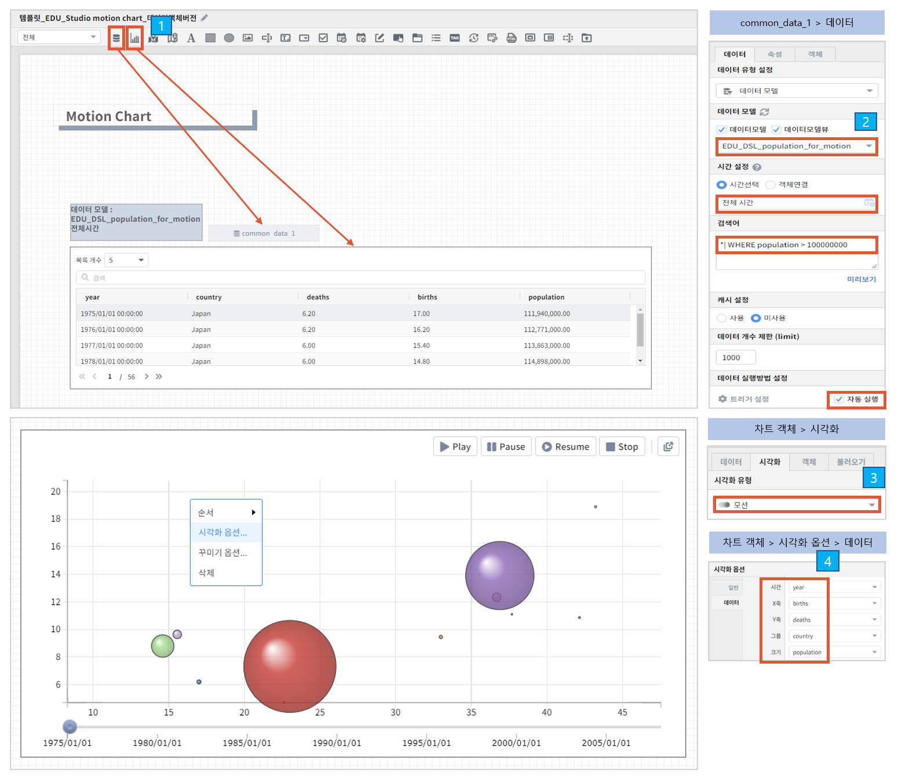

==================================================
모션 차트
==================================================

| 모션차트는 시간에 따른 데이터를 X축으로 구성하고 해당 값을 Y축으로 구성하여 시간의 흐름에 따라 데이터 양의 변화를 버블의 크기로 나타내는 차트입니다. 
|

* 예제 보고서 : `템플릿_EDU_Studio motion chart_데이터객체버전 <http://b-iris.mobigen.com:80/studio/exported/b6e894d803044270b2d4a0ddcab23ca0ba8cff7e510d41a9bbe3eeb716508ef5>`__
|

---------------------------------------------------
common_data_1 설정
---------------------------------------------------
- 데이터 탭
        - 데이터 모델 : EDU_DSL_population_for_motion
                - 나라별 출생율, 사망율, 총 인구 수
        - 시간 설정 : 전체시간
- 검색어
        - 총 인구 수가 100000000 이상인 데이터만 가져옵니다.
.. code::

        *| WHERE population > 100000000
        
---------------------------------------------------
차트 객체 설정
---------------------------------------------------
- 시각화 탭 
        - 시각화 유형 : 모션
- 시각화 옵션
        - 데이터 탭
                - 시간 : year
                - X축 : births
                - y축 : deaths
                - 그룹 : country
                - 크기 : population
                
---------------------------------------------------
차트 
---------------------------------------------------
**데이터**

- ``시간`` : 반드시 timestamp 타입이어야 합니다.
- ``x축, y축`` : 둘 다 숫자여야 합니다.
- ``그룹`` : 나라 같은 구분 할 수 있는 데이터를 말합니다.
- ``크기`` : 버블의 크기를 나타낼 수 있는 데이터를 말합니다.

**객체**

- ``Play`` : 재생
- ``Pause`` : 일시정지
- ``Resume`` : 다시 재생
- ``Stop`` : 중단
