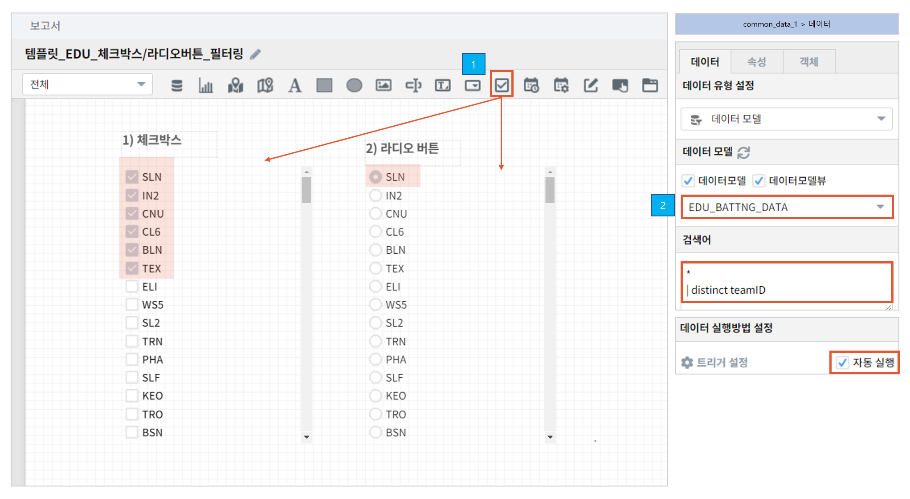
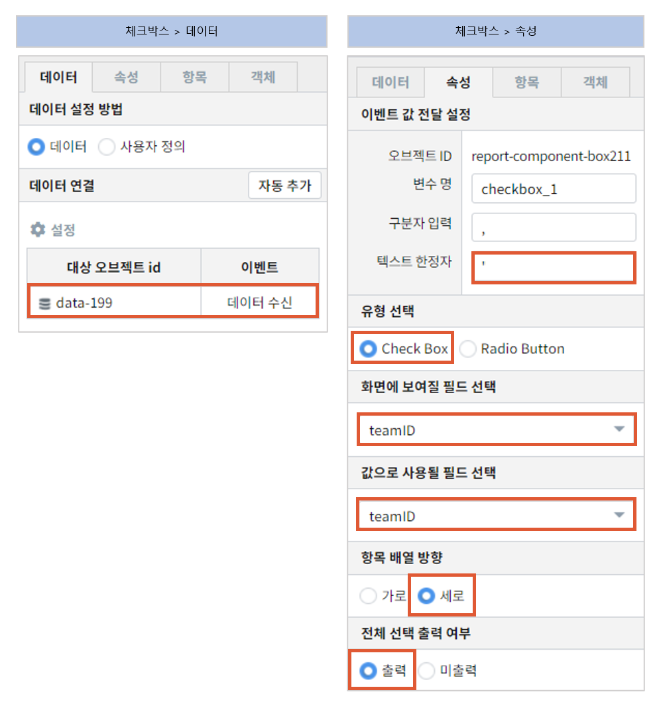
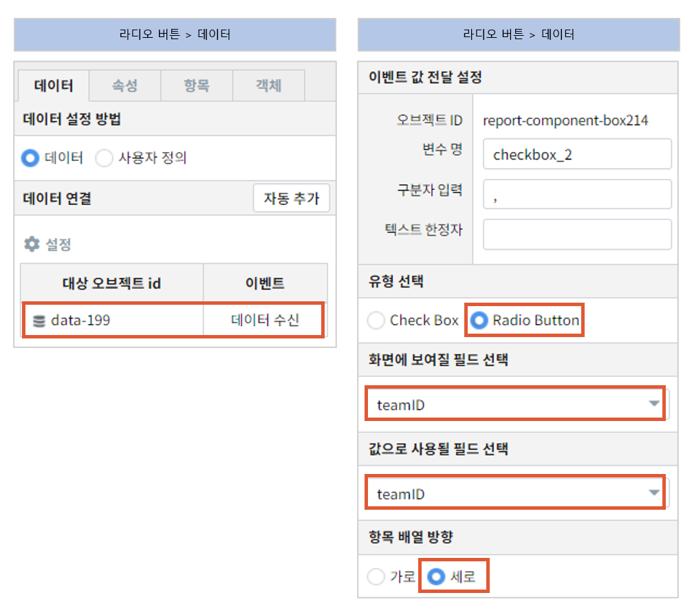

==================================================
체크박스/라디오버튼을 활용하여 데이터 필터링하기
==================================================

| 체크박스는 여러 항목을 선택할 때, 라디오 버튼은 한 가지 항목만 선택할 때 사용합니다.
|

* 예제 보고서 : `템플릿_EDU_체크박스/라디오버튼_필터링 <http://b-iris.mobigen.com:80/studio/exported/5af4b636c70544fb9a949a0dee83dc36c4155678faaa49c0aacd5ca5566f8de4>`__
|

| 체크박스는 다중 선택이 가능하고, 라디오 버튼은 단일 선택만 가능하다는 게 각 객체의 특징입니다.
| 체크박스/라디오버튼 객체의 속성에서 유형 선택 중 원하는 유형 선택할 수 있습니다.
---------------------------------------------------
common_data_1 설정
---------------------------------------------------
- 데이터 탭
        - 데이터 모델 : EDU_BATTNG_DATA
                - 야구 관련
- 검색어
        - teamID 데이터의 중복 제거를 합니다.
.. code::

        *| distinct teamID
 
--------------------------------------------------
 체크박스
--------------------------------------------------

- common_data_1 에 트리거를 설정합니다.
- 텍스트 한정자와 구분자를 입력하면 다중 선택 시 값을 예시와 같은 형태로 전달합니다. ex) 'A','B','C'
- 화면에 보여지는 필드와 값으로 전달할 필드를 teamID로 선택합니다.
- **전체 선택 출력 여부** 는 체크박스에만 해당하는 속성입니다. 출력을 선택하면 체크박스 상단에 전체선택이라는 옵션이 나타납니다.

--------------------------------------------------
 라디오 버튼
--------------------------------------------------

- common_data_1 에 트리거를 설정합니다.
- 라디오 버튼은 단일값 선택만 가능하기 때문에 한정자를 입력할 수 없습니다.
- 화면에 보여지는 필드와 값으로 전달할 필드를 teamID로 선택합니다.
|

- 활용

