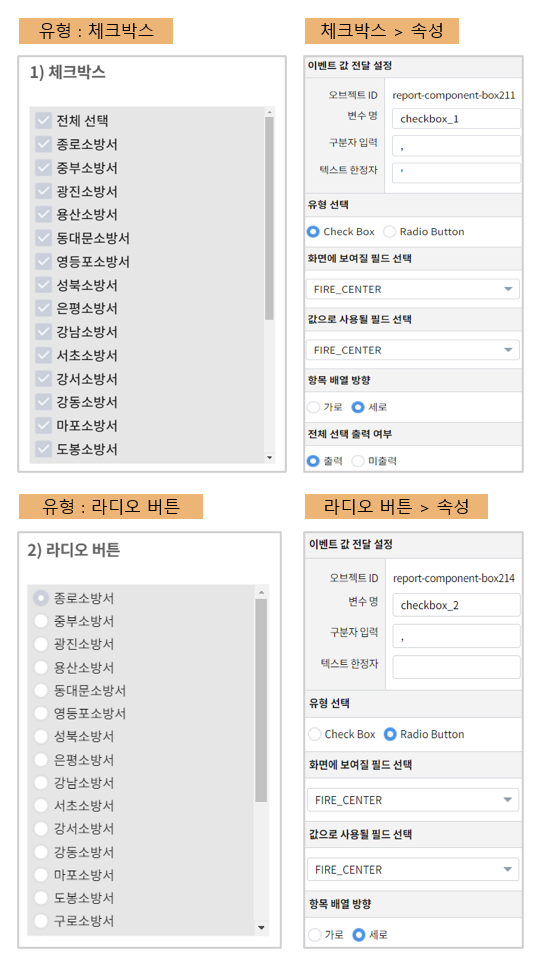
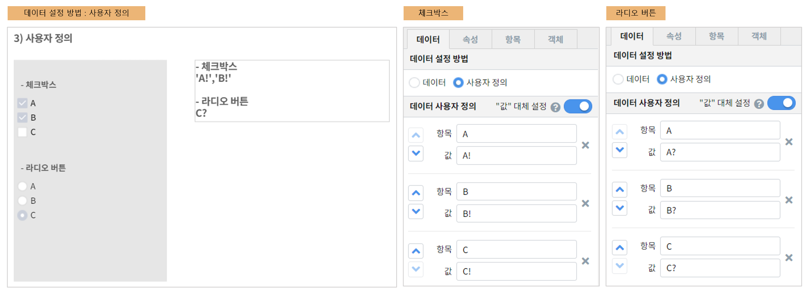

==================================================
체크박스/라디오버튼을 활용하여 데이터 필터링하기
==================================================

| 체크박스는 여러 항목을 선택할 때, 라디오 버튼은 한 가지 항목만 선택할 때 사용합니다.
|

---------------------------------------------------
체크박스 / 라디오 버튼
---------------------------------------------------
**데이터 탭**

- 데이터 객체에 트리거를 설정합니다.

**속성 탭**

- 이벤트 값 전달 설정
        - 구분자 입력
        - 텍스트 한정자 : 체크박스에만 해당되는 속성입니다.
                - 구분자 : ``,`` / 한정자 : ``'`` 입력 시 예시와 같은 형태로 값이 전달 됩니다.
                - ex) 'A','B','C'
- 유형 선택
        - 체크박스 / 라디오 버튼 중 선택합니다.
- 화면에 보여질 필드
        - 체크박스 / 라디오에 나타낼 값을 선택합니다.
- 값으로 사용될 필드 선택
        - 전달할 값을 선택합니다.
- 전체 선택 출력 여부 : 체크박스에만 해당되는 속성입니다.
        - ``출력`` 선택 시 체크박스 상단에 전체 선택이 나타납니다.
|

---------------------------------------------------
사용자 정의
---------------------------------------------------
**데이터 탭**

- 데이터 설정 방법 > 사용자 정의를 선택합니다.
- 각 항목과 값을 입력합니다.

**속성 탭**

- 나타낼 유형(체크박스 / 라디오 버튼)을 선택합니다.
- 체크박스는 구분자와 한정자도 입력합니다.

**다른 객체**
체크박스 / 라디오 버튼 에서 선택한 값을 다른 객체(데이터 모델, 라벨 등)에 나타낼 수 있습니다.
- 체크박스 / 라디오 객체에 트리거를 설정합니다.
- 예시) 라벨 객체의 설정할 변수/값 에 아래와 같이 입력합니다.

.. code::

        - 체크박스
        ${checkbox_5}

        - 라디오 버튼
        ${checkbox_6}
