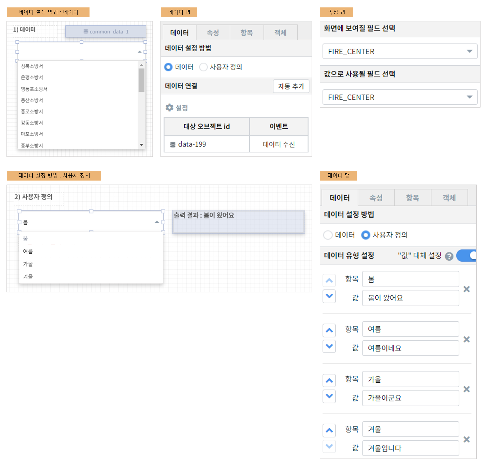

==================================================
콤보박스를 활용하여 데이터 필터링하기
==================================================

| 콤보박스의 드롭다운 목록을 선택하여 데이터를 필터링할 수 있습니다.
|

--------------------------------------------------
콤보박스
--------------------------------------------------
**데이터 탭**

- 데이터 설정 방법
        - 데이터 
                - 데이터 객체에 트리거를 설정하여 콤보박스를 나타낼 수 있습니다.
        - 사용자 정의
                - 고정된 값을 나타낼 때 쓰입니다.
                - 직접 항목과 값을 입력할 수 있습니다.
                
**속성 탭**

``해당 속성들은 데이터 설정 방법의 데이터에만 해당 됩니다.``

- 화면에 보여질 필드 선택
        - 콤보박스에 나타낼 값을 선택합니다.
- 값으로 사용될 필드 선택
        - 전달할 값을 선택합니다.
        
**항목 탭**

- 디폴트 값 선택
        - 초기값을 설정합니다.

**다른 객체**
콤보박스에서 선택한 값을 다른 객체(데이터 모델, 라벨 등)에 나타낼 수 있습니다.
- 콤보박스 객체에 트리거를 설정합니다.
- 예시) 라벨 객체의 설정할 변수/값 에 아래와 같이 입력합니다.
.. code::
                
                출력 결과 : ${combo_3}
        
        
