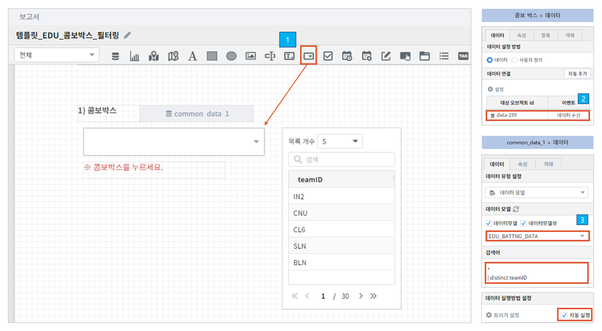
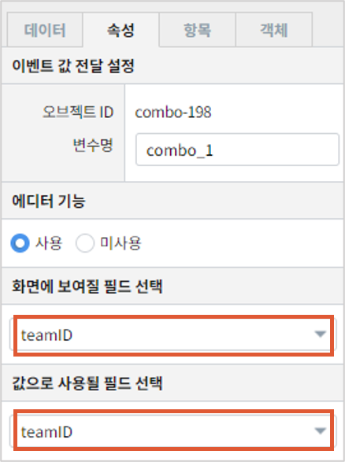

==================================================
콤보박스를 활용하여 데이터 필터링하기
==================================================

| 콤보박스의 드롭다운 목록을 선택하여 데이터를 필터링할 수 있습니다.
|

* 예제 보고서 : `템플릿_EDU_콤보박스_필터링 <http://b-iris.mobigen.com:80/studio/exported/f80e45fbc3ac45f6b66dfb492e1506ed709f1c12e62c473788567fe595de31f8>`__

|
--------------------------------------------------
common_data_1
--------------------------------------------------
- 데이터 탭 
        - 데이터 모델 : EDU_BATTNG_DATA
                - 야구 관련
        - 검색어
                - teamID 데이터의 중복 제거를 합니다.
.. code::

        *| distinct teamID
--------------------------------------------------
콤보박스
--------------------------------------------------
| 콤보박스 객체에서 트리거를 common_data_1 으로 설정합니다.
| common_data_1 을 실행한 후 속성 탭에서 **나타낼 값** 과 **전달할 값** 을 선택합니다.
|

- 활용
