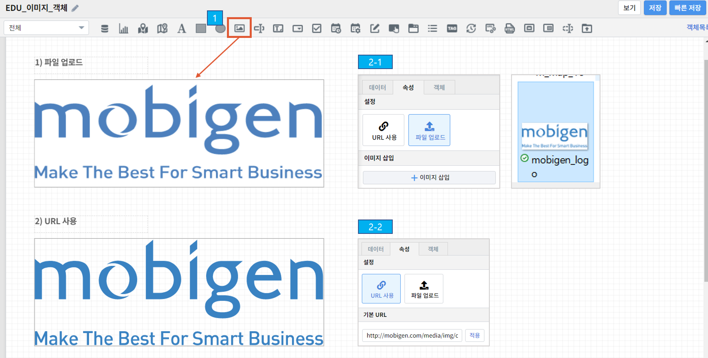

==================================================
이미지 넣기
==================================================
|

|
- 파일 업로드 : 저장된 이미지 파일을 불러와 나타냅니다.
| ``이미지 객체`` 선택 > [속성] 파일 업로드 > + 이미지 삽입 > 저장된 파일 클릭
|
- URL 사용 : 이미지 파일의 URL을 사용하여 이미지를 나타냅니다.
| ``이미지 객체`` 선택 > [속성] URL 사용 > URL 붙여넣고 적용 클릭
|
| URL : http://mobigen.com/media/img/common/mobigen_logo.svg
|
- 툴팁 설정 : 이미지 객체에서 마우스 오버 시 입력한 내용이 표시됩니다.
| ``이미지 객체`` 선택 > [속성] 툴팁 설정 > 사용 체크 > 내용 입력
|

