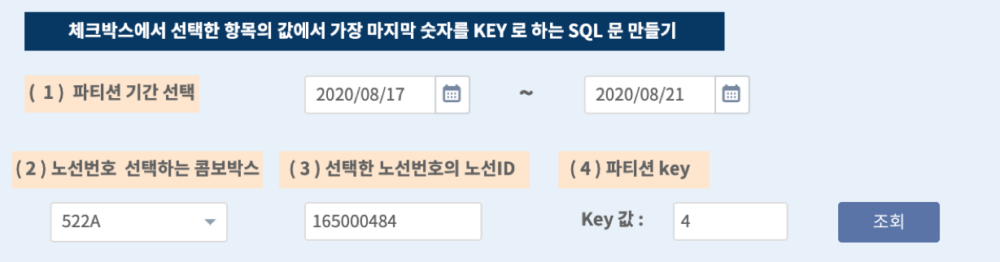
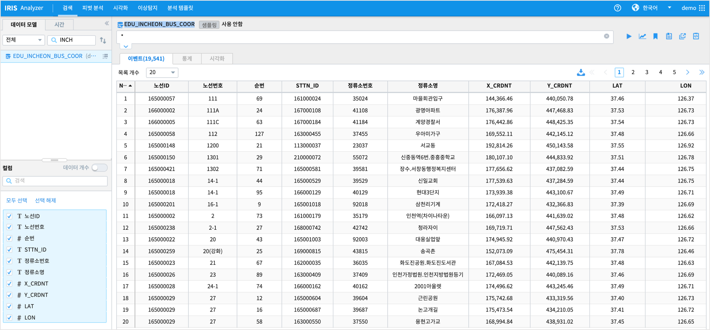
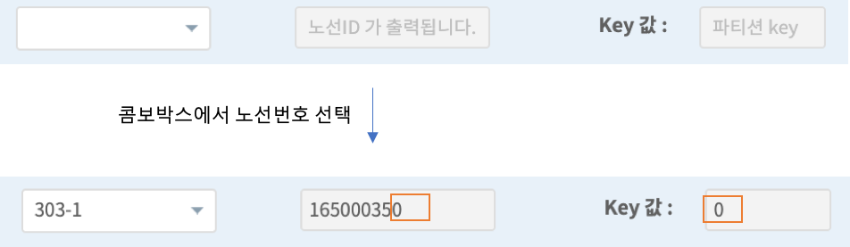
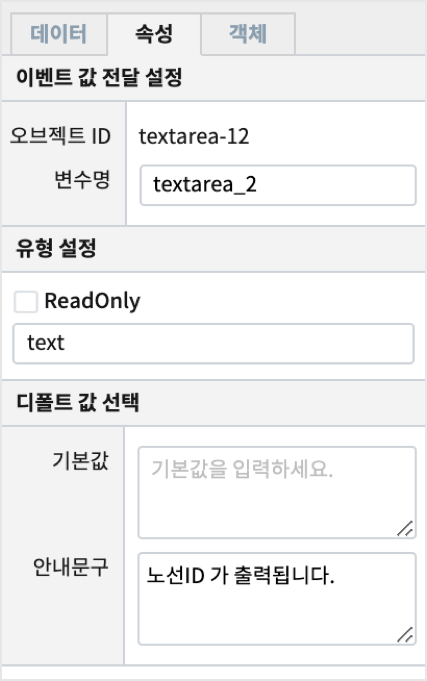
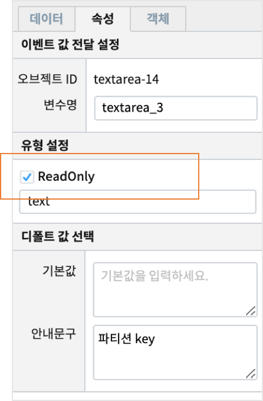
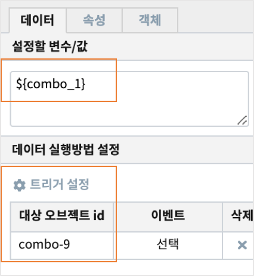
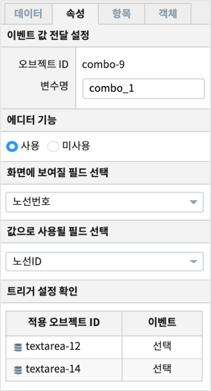

===================================================================
텍스트 상자
===================================================================

[텍스트 상자] 텍스트 상자 객체는 Text Area에 사용자가 입력하거나 외부로부터 값을 받아 화면에 보여 줍니다.
줄바꿈 문자가 포함된 여러 줄의 텍스트를 입력, 처리가 가능합니다.

* 예제 보고서 `EDU_IRISDB_textarea_nunjucks example <http://b-iris.mobigen.com:80/studio/exported/f5f69aefc2c540a3b64598a5375b50fbe5e00482a15e4b2a84cb6036c5e3628a>`__

-------------------------------------------------------------------
사용 데이터
-------------------------------------------------------------------

| 공공데이터 포털에서 `인천광역시 버스노선별 정류장 현황 <https://www.data.go.kr/data/15048265/fileData.do>`__  데이터를 사용하였습니다. 
| 데이터 모델 : EDU_INCHEON_BUS_COOR

-------------------------------------------------------------------
텍스트 상자 설정
-------------------------------------------------------------------

| 텍스트 상자는 콤보박스 선택 이벤트를 통해서 내용이 채워집니다.
| 트리거로 설정된 콤보박스에서 노선번호가 선택되면  첫번째 텍스트 상자에 노선번호의 노선ID 를 표시합니다.
| 콤보박스에서의 선택 이벤트가 발생하기 전에는 텍스트 상자의 속성 탭에서 "안내 문구" 를 연한 색상으로 표시됩니다.
| 두번째 텍스트 상자는 노선ID 가 표시된 텍스트 상자의 변수에서 가장 마지막 문자만을 표시하도록 설정합니다.

'''''''''''''''''''''''''''''''''''''''''''''''''
트리거 이벤트 발생 전 텍스트 상자 설정하기
'''''''''''''''''''''''''''''''''''''''''''''''''

| 트리거 설정된 콤보박스에서 선택하기 전(이벤트 발생 전)

| 1번 텍스트 상자의 "속성" 탭에서 "안내 문구" 에 내용을 입력하여 이벤트 발생하면 표시되는 내용을 안내할 수 있습니다.

| 2번 텍스트 상자의 "속성" 탭에서 "안내 문구" 에 내용을 입력합니다.
| "기본값" 에 입력하면 표시되는 내용이 이벤트설정 전의 디폴트값으로 인식되어 연하게 표시되지 않고, 원래의 표시 값 설정으로 출력합니다.
| 유형 설정을 ReadOnly 로 체크하면 텍스트 상자안에 문자를 직접 입력하지 않고, 설정한 변수와 값만 표시할 수 있습니다.

트리거 이벤트 발생 시 텍스트 상자 설정하기
'''''''''''''''''''''''''''''''''''''''''''''''''

| 데이터 탭에서 **데이터 실행방법 설정** 에서 노선번호를 선택할 수 있는 콤보박스를 트리거로 설정합니다.
| **설정할 변수/값** 애 트리거 설정한 콤보박스의 변수명을 입력합니다.

| 콤보박스는 **화면에 보여질 필드** 와 **값으로 사용될 필드** 를 다르게 설정하여, 변수 combo_1 에는 노선ID 가 저장되게 설정하였습니다.

고급 활용 팁 : 설정할 변수/값에 Nunjucks 사용하기
''''''''''''''''''''''''''''''''''''''''''''''''''''''''''''''''''''''''''''''''''''''''''''''''''

| IRIS 테이블의 파티선 Key 값을 표시하는 텍스트 상자는 노선ID 가 출력되는 텍스트 상자의 변수(textarea_2)를 사용합니다.
| 예를 들어 파티션 Key로 노선ID 의 마지막 번호로 정했다고 했을 때, 
| 설정할 변수/값 영역에는 다음처럼 입력하면 텍스트 상자의 변수(textarea_2) 값인 노선ID 의 마지막 위치의 문자를 가져올 수 있습니다.

.. code::

  ${textarea_2 | last}

