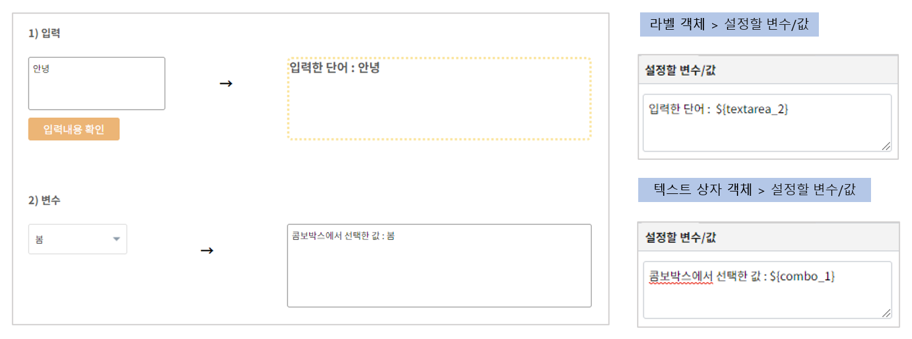
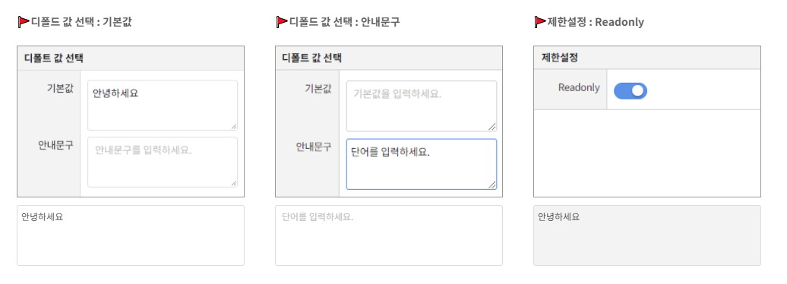

===================================================================
텍스트 상자
===================================================================

| ``텍스트 상자`` 객체는 Text Area에 사용자가 입력하거나 외부로부터 값을 받아 화면에 보여 줍니다.
| 줄바꿈 문자가 포함된 여러 줄의 텍스트를 입력, 처리가 가능합니다.
|
* 예제 보고서 `템플릿_EDU_텍스트상자 <http://b-iris.mobigen.com:80/studio/exported/dfdfca2c243244cdb83f3488913a44e221c0b47f9e4a43389d8e4fce1b6c6cf6>`__
|

- 입력
| ``텍스트 상자`` 객체에 입력한 값을 ${변수명}을 통해 다른 객체에서 사용할 수 있습니다.
|
- 변수/값 설정
| 다른 객체에 있는 값을 가져와 나타낼 수 있습니다.
|
--------------------------------------
텍스트 상자 객체 > 속성
--------------------------------------

|
- 기본값 : 텍스트 상자 객체의 초기값을 설정할 수 있습니다.
- 안내 문구 : 안내할 문구를 입력하면 옅은 색 문자로 텍스트 입력 객체에 나타납니다.
- Readonly : 입력이 불가하고 읽기만 가능한 상태가 됩니다.
