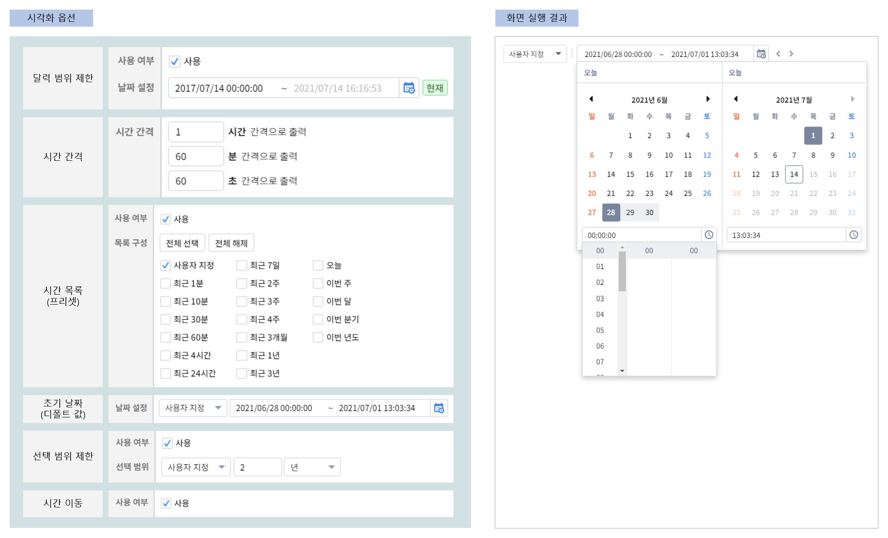
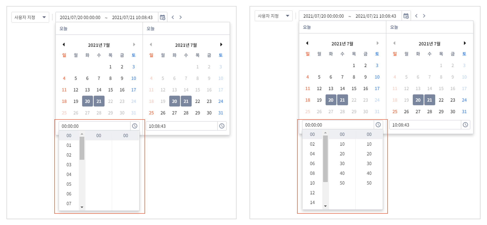
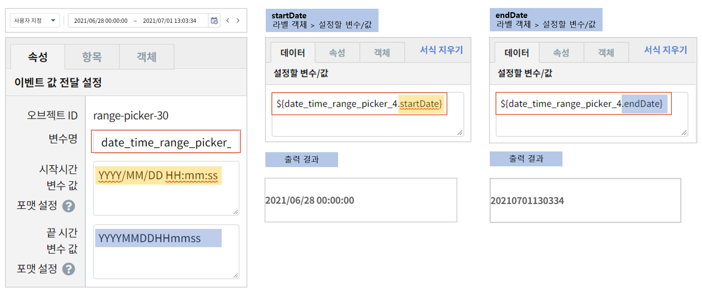
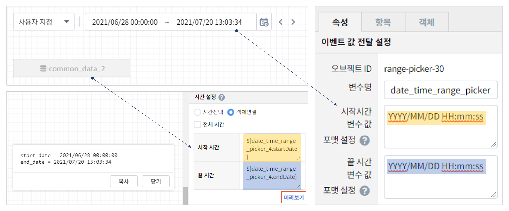

===================================================================
기간 설정
===================================================================

| 기간 설정 객체는 시계열 데이터의 조회 시작 시간과 종료 시간을 설정할 때 필요한 다양한 기능을 제공합니다.
|
- 예제보고서 :  `EDU_component_기간설정 <http://b-iris.mobigen.com:80/studio/exported/7613b6636c874259ba89b142a29bb4217357f13d9c4b465b86dc496620eddd61>`__
|
| - 보고서에서 설정한 ``기간 설정`` 객체의 시각화 옵션과 화면 실행 결과 예시
|

- 달력 범위 제한

| ``달력 범위 제한`` 옵션은 달력에서 조회가 가능 기간 범위를 정하는 옵션입니다.
| 날짜 설정에서 조회할 데이터가 있는 시간으로 범위를 제한하여 범위를 벗어난 날짜는 선택이 되지 않게 합니다.
|

- 시간 간격

| 달력아이콘을 클릭하여 날짜와 시간을 설정할 때, 달력 하단의 시간 설정시 표시되는 시간 간격을 의미합니다.

| 예시 ) ``1시간 / 60분 / 60초 간격``  과 ``2시간 / 10분 / 10초 간격``  
|

|

- 시간 목록(프리셋)

| 사용자가 직접 날짜,시간을 입력하지 않고, 콤보박스의 목록에 있는 "최근 10분" 과 같은 ``시간 목록`` 을 선택하면, 현재 시간 기준으로 날짜, 시간이 자동으로 설정됩니다.
| 이 때 설정할 수 있는 사전 시간 목록 리스트를 선택하는 옵션입니다.
|

- 초기 날짜(디폴트값)

| 사용자가 기간 설정하기 전에 디폴트로 지정한 초기 날짜로 보고서에서 바로 보여지는 날짜입니다.
| 이 데이터는 ``속성 - 이벤트값 전달 설정`` 에서 확인할 수 있는 변수명에 저장됩니다.
|

- 선택 범위 제한

| 선택 범위 제한 기능은 한 번에 조회 가능한 ``최대 조회 기간`` 을 설정합니다.
| 조회할 데이터의 양와 조회 목적, 시스템 성능에 맞게 적절한 조회 기간 범위를 정합니다.
|

- 시간 이동

| 사용여부에서 사용을 체크하면 ``<, >``  버튼으로 조회 기간만큼 앞,뒤로 기간을 shift 해서 시작 시간, 종료 시간 기간을 자동 변경합니다.
|
-------------------------------------------------------------------
 기간 설정 객체의 변수와 시각화옵션
-------------------------------------------------------------------
|
- 기간 설정의 변수와 변수 값 예시

- 변수명 : ``date_time_range_picker_번호`` 형식, 변수명 변경이 가능합니다.
- 시간 포맷 :  ``YYYY/MM/DD HH:mm:ss``, 원하는 포멧으로 설정할 수 있습니다.
- 주의 : 변수값의 시간 포맷은 변수에 저장되는 포맷일 뿐이고, 보고서의 테이블이나 차트 객체에 표시되는 포맷은 아닙니다. 
|
- 데이터 모델 객체 연결 예시

``YYYYMMDDHHmmss`` 로 설정하면 데이터객체의 시간설정 시 **객체연결**  을 통해 기간설정에서 클릭한 시작 시간과 끝 시간을 변수로 설정할 수 있습니다.
