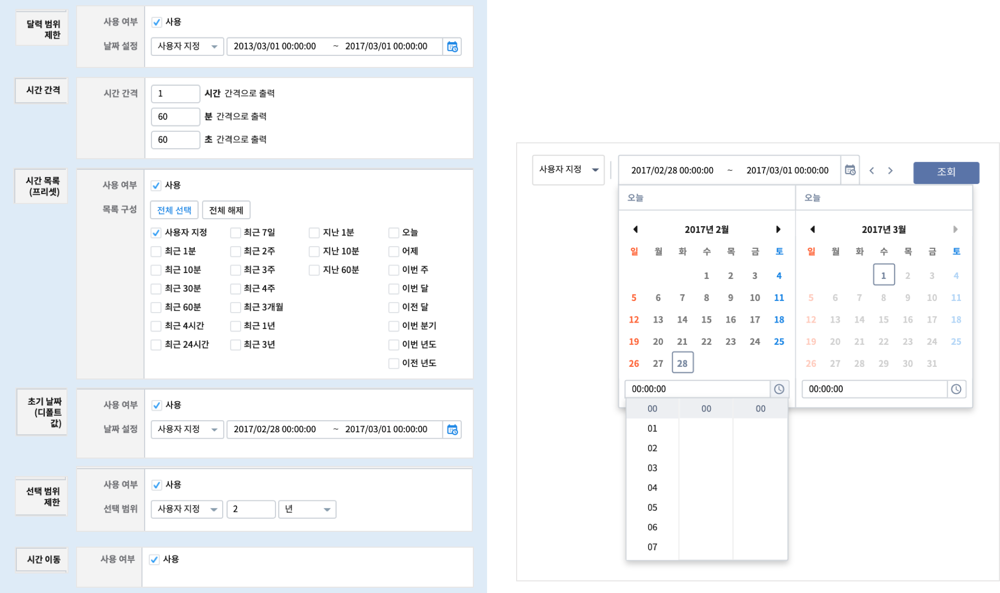
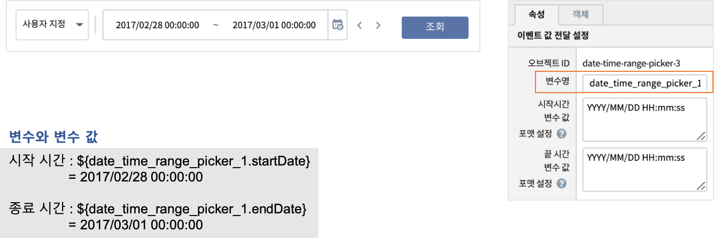
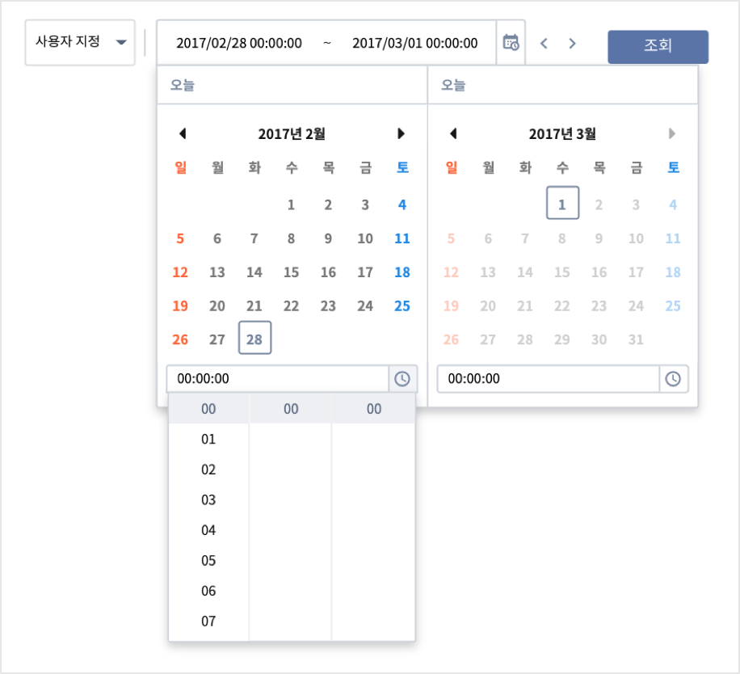
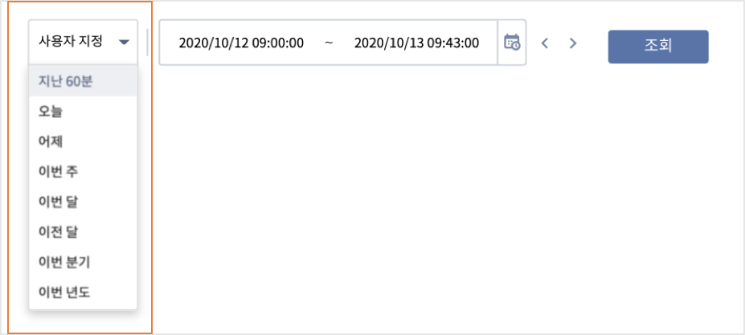
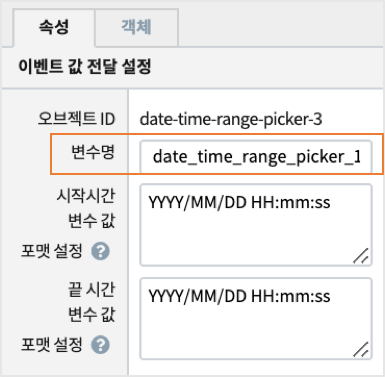
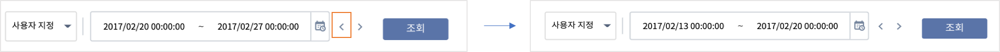

===================================================================
기간 설정
===================================================================

| 기간 설정 객체는 시계열 데이터의 조회 시작 시간과 종료 시간을 설정할 때 필요한 다양한 기능을 제공합니다.

* 예제 보고서 `EDU_예제_기간설정 <http://b-iris.mobigen.com:80/studio/exported/7613b6636c874259ba89b142a29bb4217357f13d9c4b465b86dc496620eddd61>`__

* 보고서에서 설정한 ``기간 설정`` 객체의 시각화 옵션

-------------------------------------------------------------------
보고서 : EDU_예제_기간설정
-------------------------------------------------------------------

- 데이터 모델 : EDU_Beijing_air_2013_2017_18

| 데이터 모델 **EDU_Beijing_air_2013_2017_18** 은 2013/03/01 ~ 2017/02/28 동안 중국 Beijing 11개 측정지점(station) 에서 매일 18:00 에 측정한 대기질 측정 정보입니다.
| 따라서 "기간 설정" 시 데이터 조회 시작 시간, 끝 시간 설정시 데이터가 있는 기간만 설정이 가능하도록 해야 합니다.
| 기간 설정의 시각화옵션에서 "달력 범위 제한" 과 "초기 날짜(디폴트값)" 설정을 통해 조회 가능한 시간 범위를 사용자 지정으로 설정할 수 있습니다.

| 기간 설정의 변수와 변수 값 예시

**달력 범위 제한**

| ``달력 범위 제한`` 옵션은 달력에서 조회 기간을 설정할 수 있는 범위를 제한하는 옵션입니다.
| 날짜 설정에서 조회할 데이터가 있는 시간으로 범위를 제한하여 범위를 벗어난 날짜는 선택이 되지 않게 합니다.
| 사용을 체크한 후 콤보 박스에서 적절한 기간 범위를 선택합니다.
| 이 보고서에서는 "사용자 지정" 을 선택한 후 데이터가 존재하는 2013/03/01 00:00:00 <= 달력 범위 < 2017/03/01 00:00:00  로 설정했습니다.

**시간 간격**

| 달력에서 조회 날짜 외에 시간을 정할 때, 콤보박스에 표시되는 시간 간격을 의미합니다.

- 예시

| - 1시간 / 60분 / 60초 간격

| - 2시간 / 10분 / 10초 간격

.. image:: ./images/period_60_2.png
    :scale: 40%
    :alt: period_60_2

**시간 목록(프리셋)**

| 사용자가 직접 날짜,시간을 지정하지 않고, 콤보박스의 목록에 있는 "최근 10분" 과 같은 ``시간 목록`` 을 선택하면, 현재 시간 기준으로 날짜, 시간이 자동으로 설정됩니다.
| 콤보 박스 목록에 넣을 시간 목록을 선택하는 옵션입니다.

**초기 날짜(디폴트값)**

| 사용자가 기간 설정하기 전에 디폴트로 지정한 초기 날짜입니다.
| 이 데이터는 ``속성 - 이벤트값 전달 설정`` 에서 확인할 수 있는 변수명에 저장됩니다.

**선택 범위 제한**

| 선택 범위 제한 기능은 한 번에 조회 가능한 ``최대 조회 기간`` 을 설정합니다.
| 조회할 데이터의 사이즈와 조회 목적, 시스템 성능에 맞게 적절한 조회 기간 범위를 정합니다.
| ``<, >``  버튼으로 조회 기간만큼 앞,뒤로 기간을 shift 해서 시작 시간, 종료 시간 기간을 자동 설정합니다.

