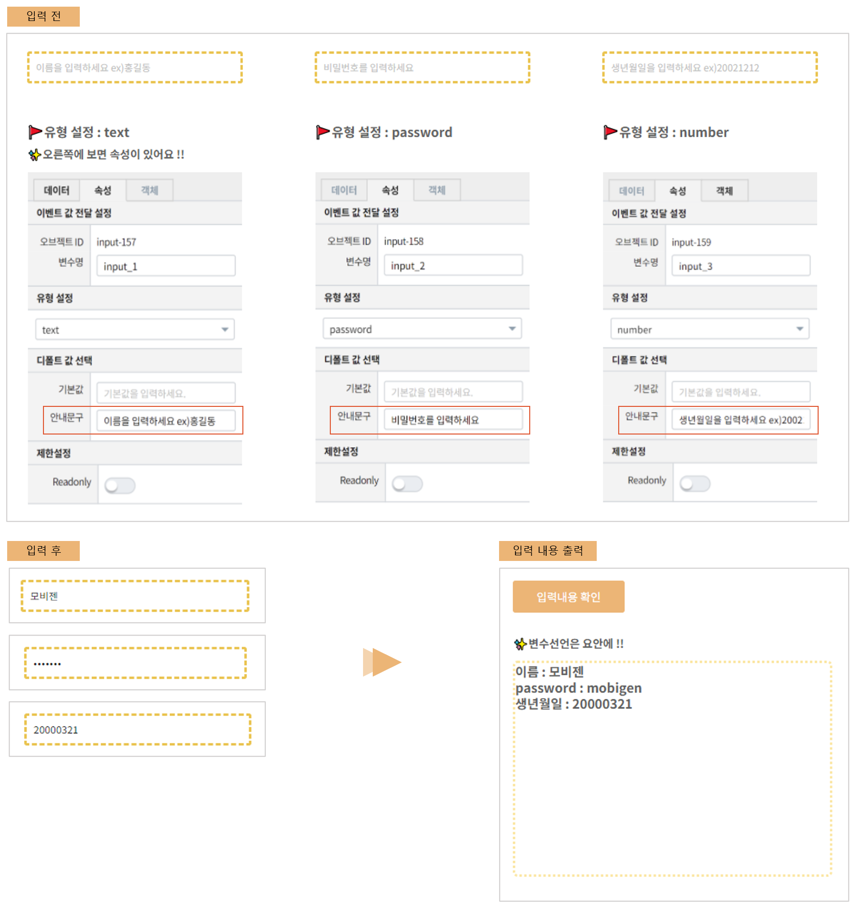

===================================================================
텍스트 입력
===================================================================

| 텍스트 입력(input box) 객체는 Input Box에 사용자가 입력한 값이나 외부로부터 값을 받아 화면에 보여 줍니다.
| 입력 유형은 ``text`` , ``password`` , ``number`` 가 있습니다.
|

* 예제 보고서 : `EDU_(1)텍스트입력 <http://b-iris.mobigen.com:80/studio/exported/c759ae4b953b4fedaa3a79c940d9cc2f0968b35f35fd48379a2a11ea7282228e>`__
|

- 입력 전
| **속성 > 디폴트 값 선택**
| 기본값 : 텍스트 입력 객체의 초기값을 설정할 수 있습니다.
| 안내 문구 : 안내할 문구를 입력하면 옅은 색 문자로 텍스트 입력 객체에 나타납니다.
|
- 입력 후
| text : 문자열을 나타냅니다.
| password : 문자열을 보이지 않는 형태로 나타냅니다.
| number : 숫자만 입력이 가능합니다.
|
- 입력 내용 출력
| 입력한 값은 각 객체의 변수명을 통해 출력할 수 있습니다.
| 라벨 객체 설정할 변수/값 에 아래 코드를 입력하세요.
|
.. code::
  
    이름 :  ${input_1}
    password : ${input_2}
    생년월일 : ${input_3}
|
- 활용
| 텍스트 입력은 회원 가입 화면처럼 이름, 비밀번호, 전화 번호 등을 입력하는 input box 생성에 많이 사용됩니다.

