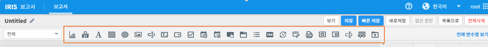

기능 컴포넌트
================================================================

IRIS Studio를 선택하면 아래 그림과 같은 버튼들을 화면 상단에서 확인할 수 있습니다. 
각 버튼은 IRIS Studio 의 기능을 컴포넌트 형태로 구성하여 등록해 놓은 것으로, 사용자는 버튼을 선택 후 작업영역에 드래그 앤 드랍을 수행하여 직관적으로 활용할 수 있습니다. 

하위 메뉴에서 각 버튼별 기능에 대해 설명합니다. 

.. toctree::
    :hidden:

    01_table/table.rst
    02_bar/bar.rst
    03_barh/barh.rst
    04_piechart/piechart.rst
    05_single_value/single_value.rst
    06_treemap/treemap.rst
    07_wordcloud/wordcloud.rst
    08_sankey/index.rst
    09_motion/index.rst
    10_checkbox_report/checkbox_report.rst
    11_combobox_report/combobox_report.rst
    12_insert_image_report/insert_image_report.rst
