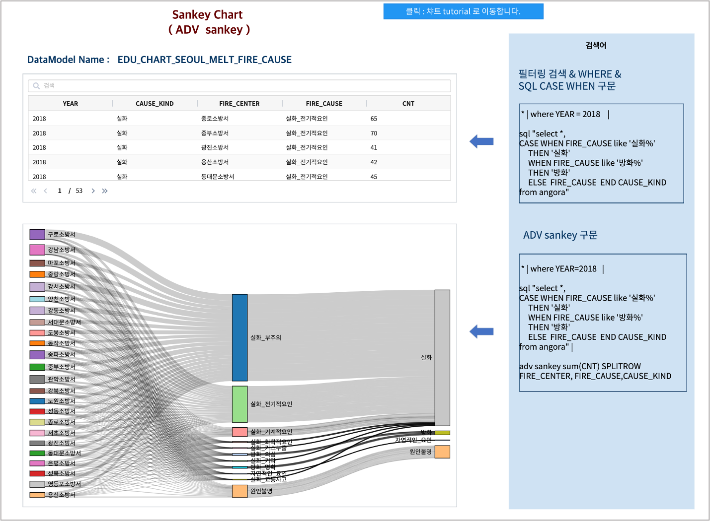

Sankey
========================================================================

IRIS Studio 의 **챠트-테이블** 의 sql 검색어 결과로 나온 데이터를 **adv sankey** 명령어로 sankey 차트로 바로 그릴 수 있습니다.

sankey 챠트를 그리기 위해서는 from-노드에서 to-노드, 즉 source 에서 target 으로 표시되는 edge 데이터의 통계량이 필요합니다.

데이터 모델
------------------------------

| 데이터 모델 : EDU_CHART_SEOUL_MELT_FIRE_CAUSE
| 기간 : 2011 ~ 2018년 연간 통계
| 내용 : 서울시 소방서별 / 화재원인별 발생 건수 통계
|

.. list-table::
   :header-rows: 1

   * - YEAR
     - FIRE_CENTER
     - FIRE_CAUSE
     - CNT
   * - 2018
     - 강남소방서
     - 실화_화학적요인
     - 6
   * - 2018
     - 강남소방서
     - 실화_기타
     - 3
   * - 2018
     - 강동소방서
     - 실화_가스누출
     - 4
   * - 2018
     - 강동소방서
     - 실화_부주의
     - 191
   * - 2018
     - xx소방서
     - ...
     - ...
  

화재원인 중분류 컬럼 CAUSE_KIND 생성
--------------------------------------------------------------------

총 11개의 화재 원인(FIRE_CAUSE)을 7개의 실화 원인을 "실화" 로, 2개의 방화 원인을  "방화" 로 묶어서 ``CAUSE_KIND``  라는 중분류에 해당하는 새 화재 원인 컬럼을 생성합니다.
이 때 DSL ``case``  문을 이용하여 중분류 컬럼의 값을 생성합니다.

- 검색어 구문

.. code::

    * | where YEAR = 2018  
      | case when FIRE_CAUSE like '실화%' 
             then '실화'
             when FIRE_CAUSE like '방화%'
             then '방화'
             otherwise FIRE_CAUSE as CAUSE_KIND

- 결과

.. list-table::
   :header-rows: 1

   * - YEAR
     - FIRE_CENTER
     - FIRE_CAUSE
     - CNT
     - CAUSE_KIND
   * - 2018
     - 강남소방서
     - 실화_화학적요인
     - 6
     - 실화
   * - 2018
     - 강남소방서
     - 실화_기타
     - 3
     - 실화
   * - 2018
     - 강남소방서
     - 방화_명확
     - 5
     - 방화
   * - 2018
     - 종로소방서
     - 자연적인_요인
     - 1
     - 자연적인_요인
   * - 2018
     - xx소방서
     - ...
     - ...
     - ...
  

adv sankey 결과
-------------------------------------------------------

| ``adv sankey`` 명령어로 sankey 챠트를 그릴 수 있는 형태의 데이터로 변환합니다.
| 챠트 유형을 테이블로 설정하면 변환된 데이터의 형태를 확인할 수 있습니다.
| 챠트 유형을 sankey 로 설정하면 바로 sankey 챠트가 그려집니다.

- 검색어

.. code::

    * | where YEAR = 2018  
      | case when FIRE_CAUSE like '실화%'  then '실화'
             when FIRE_CAUSE like '방화%'  then '방화'
             otherwise FIRE_CAUSE as CAUSE_KIND
      
      | adv sankey sum(CNT) SPLITROW FIRE_CENTER, FIRE_CAUSE, CAUSE_KIND

| SPLITROW 뒤에 나오는 필드가 sankey 챠트의 각 NODE이며, FIRE_CENTER -> FIRE_CAUSE -> CAUSE_KIND  로 flow 가 정해집니다.
| 선의 굵기는 각 NODE -> NODE 일 때의 값을 의미하며, 여기서는 발생건수(CNT)의 합계입니다.
|
| 제일 왼쪽 각 소방서의 노드(사각형) 크기는 2018년 각 소방서의 화재발생건수의 합계입니다.
|
| 예를 들어 구로소방서 노드의 크기는 2018년 구로소방서 촤재발생건수의 합 434 에 해당하는 크기입니다.
| 구로소방서 -> 실화부주의 로 가는 선의 굵기는 구로소방서에서 2018년에 실화부주의로 발생한 화재건수 267 건입니다.
| 두번째 노드 화재원인 중 실화부주의 노드 크기는 3939 건으로 왼쪽 24개 소방서에서 실화부주의로 발생한 화재건수의 합입니다.
| 가장 오른쪽 실화 의 크기 5701 건은 실화부주의 -> 실화, 실화_전기적요인 -> 실화, 실화_기계적요인 -> 실화 ,,, 의 합입니다.

