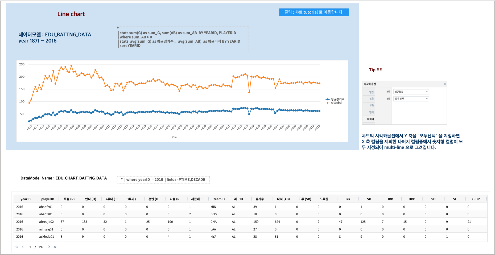

꺾은선형
========================================================================

| 꺾은선형 챠트는 순차적인 값을 간단하게 시각화할 때 유용한 차트로 X축에 따른 Y축의 값을 연결된 라인으로 보여줍니다.
| 주로 시간에 따른 데이터의 트랜드를 볼 때 많이 사용됩니다. 

데이터 모델
------------------------------

| 데이터 모델 : EDU_CHART_BATTNG_DATA
| 기간 :  1871년 ~ 2016년
| 내용 :  1871년 ~ 2016년 동안 미국 야구의 선수별 타격(Batting) 지표 데이터

챠트 - 꺾은 선형
-------------------------------------------

- 검색어

.. code::

   * | stats sum(G) as sum_G,
             sum(AB) as sum_AB  BY YEARID, PLAYERID  | where sum_AB > 0
     | stats  avg(sum_G) as 평균경기수 ,  
              avg(sum_AB)  as 평균타석 BY YEARID | sort YEARID

| 연간 평균 경기수, 평균 타석수를 구하는 검색어입니다.

.. image:: images/chart_line_13.png
    :scale: 50%
    :alt: chart_line_13

| 꺾은 선형 챠트에서 Y축으로 설정한 1개의 변수로만 챠트를 그릴 수 도 있지만,  그림처럼 여러 개의 변수를 설정하여 다른 색으로 여러 라인을 동시에 그릴 수 있습니다.
| 방법은 ``시각화옵션-데이터탭`` 에서 Y축 데이터를 "모두선택" 으로 지정하면, X축에 지정한 변수 외에 남아 있는 변수 중에서 숫자형 변수가 모두 설정되어 동시에 여러 라인으로 챠트를 그릴 수 있습니다.
|
| 또한 꺾은 선형 챠트에서 유용한 시각화옵션 중 하나는 챠트에 마우스를 대면 보이는 툴팁 설정입니다.
| ``시각화옵션-툴팁`` 에서 "전체항목표시" 는 같은 시점의 모든 포인트에 대한 값을 툴팁으로 보여주는 옵션이며, "개별항목표시" 는 마우스오버된 라인에 해당하는 항목만 툴팁으로 보여주는 옵션입니다.
