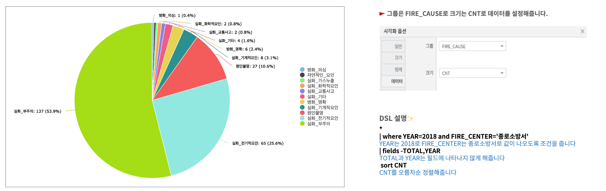

원형 챠트
============================================================================

| 데이터의 각 범주의 합계 또는 평균 등을 원(pie) 에서 차지하는 비율로 보여주는 챠트입니다.
| 전체에 대한 각 범주 값의 상대적 비율을 데이터의 범주별 합계, 평균 등과 함께 표시합니다.
| 원형챠트는 각 범주가 가지는 비율 및 전체적인 비율 분포 등을 쉽게 파악할 수 있는 장점이 있습니다.

데이터 모델
------------------------------

| 데이터 모델 : EDU_CHART_SEOUL_MELT_FIRE_CAUSE
| 기간 : 2011 ~ 2018년 연간 통계
| 내용 : 서울시 소방서별 / 화재원인별 발생 건수 통계
|

.. list-table::
   :header-rows: 1

   * - YEAR
     - FIRE_CENTER
     - FIRE_CAUSE
     - CNT
   * - 2018
     - 강남소방서
     - 실화_화학적요인
     - 6
   * - 2018
     - 강남소방서
     - 실화_기타
     - 3
   * - 2018
     - 강동소방서
     - 실화_가스누출
     - 4
   * - 2018
     - 강동소방서
     - 실화_부주의
     - 191
   * - 2018
     - xx소방서
     - ...
     - ...

원형 챠트
-------------------------------------------

- 검색어

.. code::

    * | where YEAR=2018 and FIRE_CENTER='종로소방서'  
      | fields -TOTAL,YEAR 
      | sort CNT

| 종로소방서의 2018년 데이터로 필터링한 후 TOTAL, YEAR 컬럼을 뺀 데이터 입니다.
| 검색 명령어 `fields <http://docs.iris.tools/manual/IRIS-Manual/IRIS-Discovery-Middleware/command/commands/fields.html>`__ 를 참조하세요.

- 테이블 결과

.. list-table::
   :header-rows: 1

   
   * - FIRE_CENTER
     - FIRE_CAUSE
     - CNT
   * - 종로소방서
     - 방화_의심
     - 1
   * - 종로소방서
     - 자연적인_요인
     - 1
   * - 종로소방서
     - 실화_가스누출
     - 1
   * - 종로소방서
     - 실화_화학적요인
     - 1
   * - 종로소방서
     - 실화_교통사고
     - 2
   * - 종로소방서
     - 실화_기타
     - 4
   * - 종로소방서
     - 방화_명확
     - 6
   * - 종로소방서
     - 실화_기계적요인
     - 8
   * - 종로소방서
     - 원인불명
     - 27
   * - 종로소방서
     - 실화_전기적요인
     - 65
   * - 종로소방서
     - 실화_부주의
     - 137

- 원형 챠트

