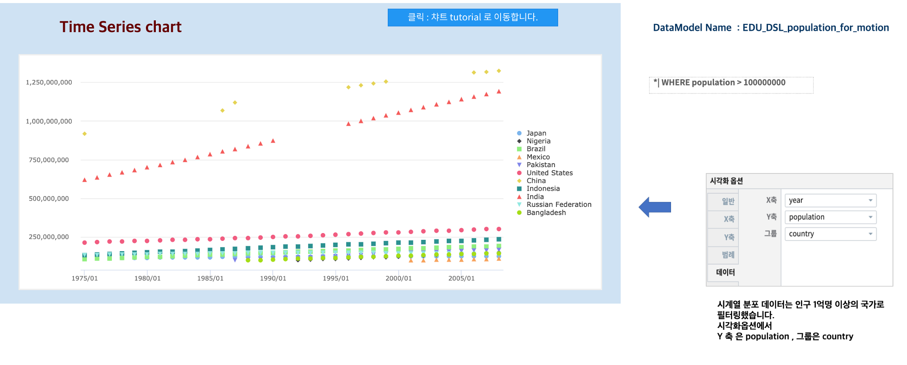

시계열분포
========================================================================

시간 필드가 포함된 데이터, 즉 시계열데이터를 시간에 따른 Scatter 차트 형태로 보여 주는 챠트입니다.

데이터 모델
------------------------------

| 데이터 모델 : EDU_DSL_population_for_motion
| 기간 :  1975 ~ 2008년
| 내용 :  1975 ~ 2008년 까지 국가별 출생율, 사망율, 인구수 추이
|

.. list-table::
   :header-rows: 1

   * - year
     - country
     - deaths
     - births
     - population
   * - 1975
     - United States
     - 8.8
     - 14.6
     - 215973000
   * - 1975
     - Russian Federation
     - 9.643
     - 15.563
     - 134200000
   * - ...
     - ...
     - ...
     - ...
     - ...
   * - 2008
     - Bangladesh
     - 6.213
     - 21.3
     - 145478300

챠트 - 시계열 분포
-------------------------------------------

- 검색어

.. code::

    * | WHERE population > 100000000

| 챠트에 보여지는 국가수를 줄이기 위해 인구 1억명 이상인 경우에만 한정하여 필터링 하여 1억명 이상 인구 국가들의 인구변화를 시간에 따른 챠트로 출력합니다.
