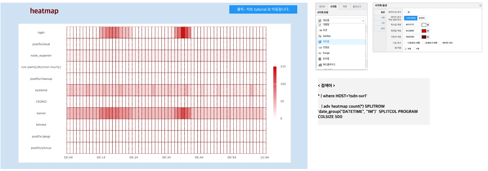

히트맵
============================================================================

| 히트맵(heatmap) 은 2차원 수치 데이터를 색깔로 시각화한 그래프입니다.
| 히트맵은 많은 양의 데이터를 시각화하는 데 적합하며 유사한 색 영역으로 표시되어 비슷한 특성의 클러스터를 시각적으로 파악하는데 사용할 수 있습니다.

데이터 모델
------------------------------

| 데이터 모델 : EDU_SYSLOG_2020_0325_09
| 기간 : 2020/03/25 09:00 ~ 10:00
| 내용 : 서버(HOST) 에서 출력되는 SYSLOG 데이터

.. list-table::
   :header-rows: 1

   * - DATETIME
     - HOST
     - FACILITY
     - PRIORITY
     - LEVEL
     - LEVEL_INT
     - TAG
     - PROGRAM
   * - 20200325090401
     - tsdn-svr1
     - cron
     - info
     - info
     - 7
     - 4e
     - CROND
   * - 20200325090401
     - gcs1
     - daemon
     - info
     - info
     - 7
     - 1e
     - systemd
   * - ...
     - ...
     - ...
     - ...
     - ...
     - ...
     - ...
     - ...    
   * - 20200325100424
     - tsdn-svr1
     - kern
     - warning
     - warning
     - 5
     - 04
     - kernel

히트맵 챠트
-------------------------------------------

- 검색어

.. code::

    * | where HOST='tsdn-svr1' 
      | adv heatmap count(*) SPLITROW 'date_group("DATETIME", "1M")' SPLITCOL PROGRAM COLSIZE 500

| 전체 SYSLOG 데이터에서 HOST='tsdn-svr1' 로 필터링한 후
| adv heatmap 명령어는 입력으로 받은 데이터(파이프로 전달받은) 를 heatmap 을 그릴 수 있는 데이터로 변환합니다.
| 자세한 설명 - 검색어 `adv <http://docs.iris.tools/manual/IRIS-Manual/IRIS-Discovery-Middleware/command/commands/adv.html>`__ 를 참조하세요.
|
| X축은 1분단위의 시간필드, Y축은 PROGRAM 의 개별 값, cell 안의 값은 시간(1분)단위 PROGRAM 별 레코드수(COUNT) 이며
| cell 의 값에 따라 색상으로 시각화되어 표현됩니다.

- 히트맵 챠트

