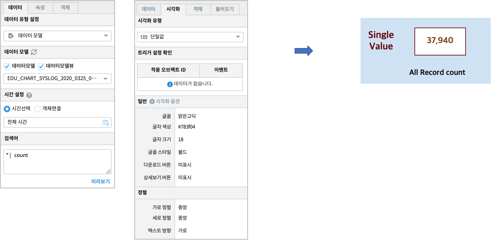

단일값
============================================================================

| 데이터를 값 하나의 형태로 보여 줍니다.

데이터 모델
------------------------------

| 데이터 모델 : EDU_SYSLOG_2020_0325_09
| 기간 : 2020/03/25 09:00 ~ 10:00
| 내용 : 서버(HOST) 에서 출력되는 SYSLOG 데이터

.. list-table::
   :header-rows: 1

   * - DATETIME
     - HOST
     - FACILITY
     - PRIORITY
     - LEVEL
     - LEVEL_INT
     - TAG
     - PROGRAM
   * - 20200325090401
     - tsdn-svr1
     - cron
     - info
     - info
     - 7
     - 4e
     - CROND
   * - 20200325090401
     - gcs1
     - daemon
     - info
     - info
     - 7
     - 1e
     - systemd
   * - ...
     - ...
     - ...
     - ...
     - ...
     - ...
     - ...
     - ...    
   * - 20200325100424
     - tsdn-svr1
     - kern
     - warning
     - warning
     - 5
     - 04
     - kernel

단일값 챠트
-------------------------------------------

- 검색어

.. code::

  * | count

| 전체 데이터의 레코드(row) 수 
| 검색 명령어 `count <http://docs.iris.tools/manual/IRIS-Manual/IRIS-Discovery-Middleware/command/commands/count#count>`__ 참고하세요.

| 시각화옵션에서 글꼴과 글자크기, 색상, 스타일, 정렬 등을 지정할 수 있습니다.
