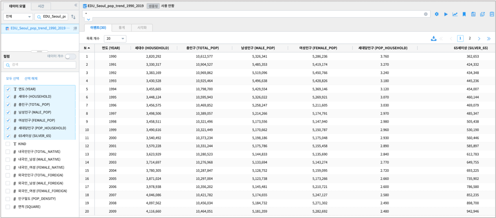
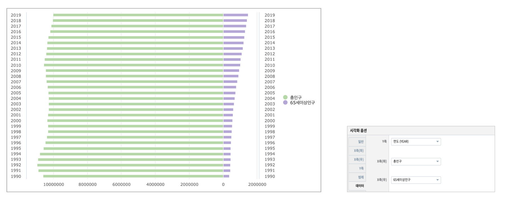

양방향 막대 챠트 
============================================================================

| 양방향 막대 챠트는 좌우 대칭형으로 세로축(Y축)은 같이 공유하면서 2개의 항목을 중앙을 기준으로 좌, 우 양쪽으로 각각의 항목 값을 표시한 챠트입니다.

- 예제 보고서 : `EDU_Studio BidirectionalBarChart(양방향) <http://b-iris.mobigen.com:80/studio/exported/fed5e1f0d7004c4abe7c5993ca8823b9e97ac9c762924fb0ba7c77ff6b9de851>`__

데이터 모델
------------------------------

| 데이터 모델 : EDU_Seoul_pop_trend_1990_2019
| 기간 : 1990 ~ 2019년 연간 통계
| 내용 : 서울시 인구 추이 통계
| 활용 컬럼 : YEAR(연도), TOTAL_POP(총 인구), SILVER_65(65세 이상 인구)

양방향 막대 챠트
---------------------------------------------

| 연도별로 총인구(죄측)의 변화와 65세 이상 인구(우측)의 변화를 양방향 막대 그래프로 표시합니다.

- 검색어

.. code::

  * | fields YEAR,
             TOTAL_POP as 총인구,
             SILVER_65 as 65세이상인구

- 양방향 막대 그래프

