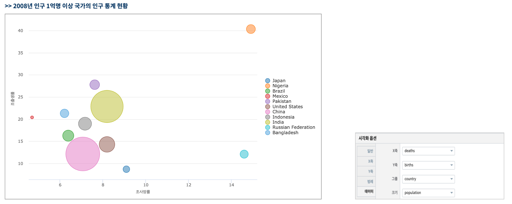

거품형 챠트 (bubble chart)
============================================================================

| 거품형 챠트는 X축, Y축, 거품의 크기로 데이터의 관계 및 변화를 표시한 챠트입니다.

- 예제 보고서 : `EDU_Studio BubbleChart(거품형) <http://b-iris.mobigen.com:80/studio/exported/fd9d7d9ad5c64cf9ab86860a2b5ace9b01ee2347cf9a4e29b546f408aaac56dd>`__

데이터 모델
------------------------------

| 데이터 모델 : EDU_DSL_population_for_motion
| 기간 : 1975 ~ 2008년 동안 연간 통계 
| 내용 : 국가별 연간 인구 통계 

.. list-table::
   :header-rows: 1

   * - year
     - country
     - deaths
     - births
     - population
   * - 2008
     - Japan
     - 9.1
     - 8.7
     - 127704040
   * - ...
     - ...
     - ...
     - ...
     - ...
   * - 2008
     - Nigeria
     - 14.907
     - 40.326
     - 150665730

거품형 챠트(bubble chart)
---------------------------------------------

| 2008년도에 인구 1억명 이상인 11개 국가를 대상으로 X축에 조사망률, Y축에 조출생률, 총 인구수를 거품의 크기에 지정하여 bubble chart 로 그려봅니다.

- 검색어

.. code::

  * | where year in ( 2008 ) and population > 100000000

- 거품형 챠트

