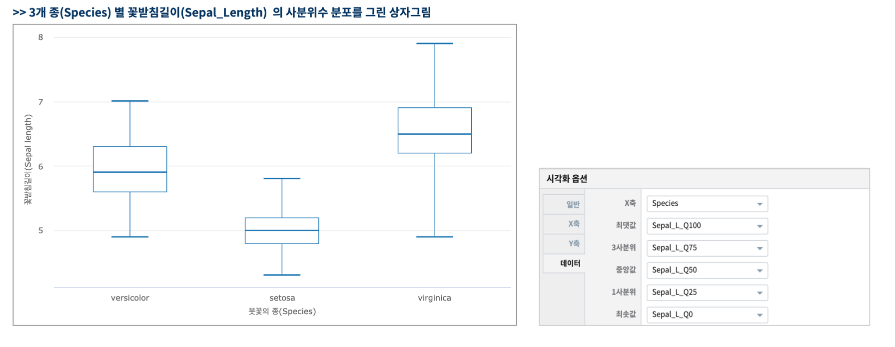

상자그림 (Box Plot)
============================================================================

| 거품형 챠트는 X축, Y축, 거품의 크기로 데이터의 관계 및 변화를 표시한 챠트입니다.

- 예제 보고서 : `EDU_Studio BubbleChart(거품형) <http://b-iris.mobigen.com:80/studio/exported/fd9d7d9ad5c64cf9ab86860a2b5ace9b01ee2347cf9a4e29b546f408aaac56dd>`__

데이터 모델
------------------------------

- 데이터 모델 : EDU_DATA_iris
- 붓꽃(iris) 의 3개 종(Species) 별로 
    - 꽃받침길이(Sepal_Length), 꽃받침넓이(Sepal_Width), 꽃잎길이(Petal_Length), 꽃잎넓이(Petal_Width)

.. list-table::
   :header-rows: 1

   * - Sepal_Length
     - Sepal_Width
     - Petal_Length
     - Petal_Width
     - Species
   * - 5.1
     - 3.5
     - 1.4
     - 0.2
     - setosa
   * - ...
     - ...
     - ...
     - ...
     - ...
   * - 5.9
     - 3
     - 5.1
     - 1.8
     - virginica

상자그림 (Box Plot)
---------------------------------------------

| 예제의 붓꽃 데이터의 꼿받침 길이, 넓이와 같이 측정하여 얻을 수 있는 수치형 데이터(관측값 데이터)를 양적 데이터라고 합니다. 
| 상자그림(box plot)는 양적 데이터의 최소값, 최대값, 중간값, 25% 에 해당하는 1사분위수, 75%에 해당하는 3사분위수를 동시에 표시할 수 있는 챠트입니다.

- 검색어
    - 종(Species)별로 꽃받침 길이(Sepal_Length)의 사분위수를 구합니다.

.. code::

    * | stats  quantile(Sepal_Length, 25) as Sepal_L by Species

- 검색어 결과

.. list-table::
   :header-rows: 1

   * - Species
     - Sepal_L_Q0
     - Sepal_L_Q25
     - Sepal_L_Q50
     - Sepal_L_Q75
     - Sepal_L_Q100
   * - versicolor
     - 4.9
     - 5.6
     - 5.9
     - 6.3
     - 7.0
   * - setosa
     - 4.3
     - 4.8
     - 5.0
     - 5.2
     - 5.8
   * - virginica
     - 4.9
     - 6.2
     - 6.5
     - 6.9
     - 7.9

- 상자그림

