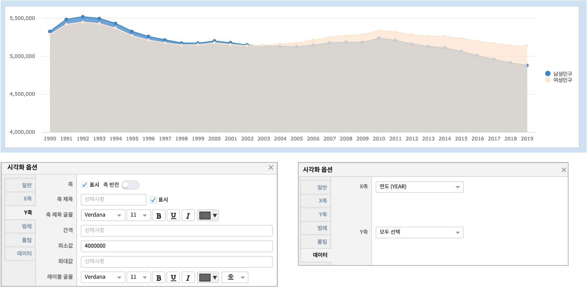
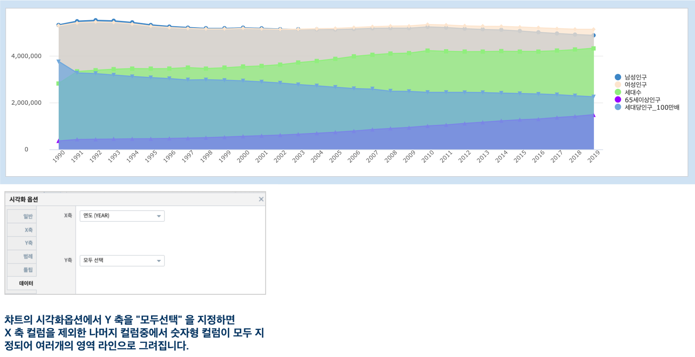

영역형 챠트(Area chart)
============================================================================

| 꺽은선형 챠트를 기반으로 하며, Y축 데이터의 각 점을 연결한 선과 선의 아래 영역을 색으로 채워서 보여줍니다.
| 꺾은선형 챠트가 보여주는 트랜드와 함께 영역의 크기 변화를 표시하여 변화량의 규모를 표현하는 데에 유용합니다. 
|

데이터 모델
------------------------------

| 데이터 모델 : EDU_Seoul_pop_trend_1990_2019
| 기간 : 1990년 ~ 2019년 연간통계
| 내용 : 서울특별시의 인구 통계
|

- 검색어

.. code::

   * | fields YEAR,MALE_POP as 남성인구, FEMALE_POP as 여성인구,
              HOUSEHOLD as 세대수, SILVER_65 as 65세이상인구, POP_HOUSEHOLD as 세대당인구

.. list-table::
   :header-rows: 1

   * - YEAR
     - MALE_POP
     - FEMALE_POP
     - HOUSEHOLD
     - SILVER_65
     - POP_HOUSEHOLD
   * - 1990
     - 5326341
     - 5286236
     - 2820292
     - 362653
     - 3.76
   * - ...
     - ...
     - ...
     - ...
     - ...
     - ...
   * - 2019
     - 4877725
     - 5133258
     - 4327605
     - 1485272
     - 2.25

|

영역형 챠트 예제 1
-------------------------------------------

| 서울시의 남성인구와 여성인구의 변화를 영역형 챠트로 그리는 예제입니다.
|

- 검색어

.. code::

    * | fields YEAR,MALE_POP as 남성인구, FEMALE_POP as 여성인구

- 참고 보고서 : `EDU_CHART_예제_팁_영역형챠트 <http://b-iris.mobigen.com:80/studio/exported/2ec7fc23ebf143d1b25a91b573e2f6f01cf59bf7f33c48a1954b134be51613a4>`__

- 영역형 챠트 시각화옵션에서 Y축의 최소값 설정을 적절하게 조정하면, 시간에 따른 여성인구와 남성인구의 볼륨 변화를 효과적으로 파악할 수 있습니다.
 

영역형 챠트 예제 2
-------------------------------------------

| 서울시의 남성인구, 여성인구, 세대수, 세대당인구, 65세이상인구 의 변화를 영역형 챠트로 그리는 예제입니다.
| 유의할 점은 대상 필드중 ``POP_HOUSEHOLD(세대당인구)`` 는 다른 필드와 수치적인 크기 차이(백만 vs 1)가 매우 크므로, 값에 100만을 곱한 값으로 챠트를 그립니다.
|

- 검색어
  

.. code::

    *
    | calculate POP_HOUSEHOLD * 1000000 as POP_HOUSEHOLE_100만배
    | fields YEAR,MALE_POP as 남성인구, FEMALE_POP as 여성인구, 
             HOUSEHOLD as 세대수, SILVER_65 as 65세이상인구,
             POP_HOUSEHOLE_100만배 as 세대당인구_100만배

|

- 참고 보고서 : `EDU_Studio area chart(영역형챠트) <http://b-iris.mobigen.com:80/studio/exported/30dbb72d42924d8a8b9a39e451e5940b6c29536bdbdf4ca9baa45f55d7908e52>`__
  
            

| 1990년 ~ 2019년 동안 서울특별시의 인구통계 데이터입니다.
| 전체 컬럼 중 필요한 컬럼만 ``fields`` 검색어로 필터링하였습니다.
| 세대당인구를 의미하는 POP_HOUSEHOLD 는 데이터의 단위가 너무 작아서 100만배로 증폭한 값으로 챠트에 표시합니다.
|
| 서울시 인구는 세대수는 늘어나지만, 세대당 인구수는 감소추세이며
| 1990년대에는 남성인구가 더 많았지만, 현재는 여성인구가 많으며, 65세 이상 인구의 꾸준한 증가가 눈에 뜁니다.
