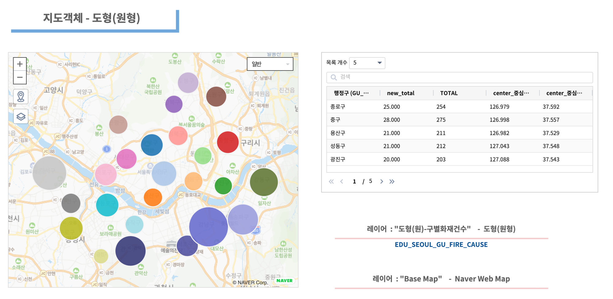
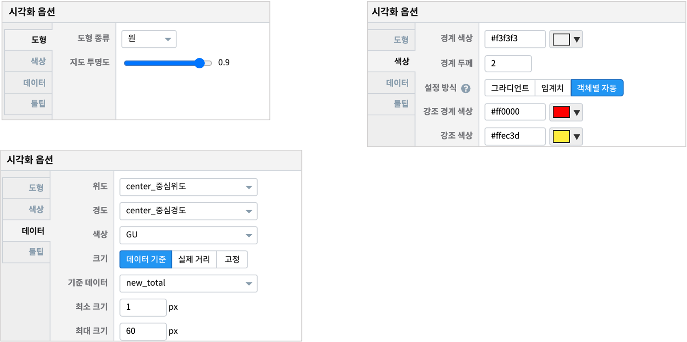

========================================================
지도유형 - 도형(원형)
========================================================

| 지도유형 ``도형``  에서 ``원형``은  위/경도 좌표를 중심으로 데이터를 원으로 지도에 표시됩니다.
|

**도형(원형)**

| 원의 크기는 서울시 행정구별 화재건수에 해당합니다.

|
- 데이터
    - 데이터모델 "EDU_SEOUL_GU_FIRE_CAUSE"   와 "EDU_SEOUL_GU_CENTER" 를 merge
    - 서울 행정구별 화재 건수(2018년도) 와 서울시 행정구의 중심위치의 좌표를 merge 합니다.
    - GU_NAME, TOTAL  + 행정구명, 중심경도, 중심위도

|  
- 레이어 구성
    - ``Base Map``   : Naver Web Map
    - ``도형(원)-구별화재건수``  : 도형-원형

| 
- 시각화옵션

