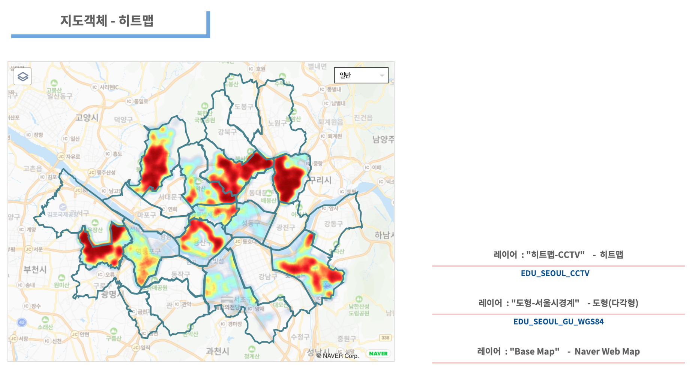
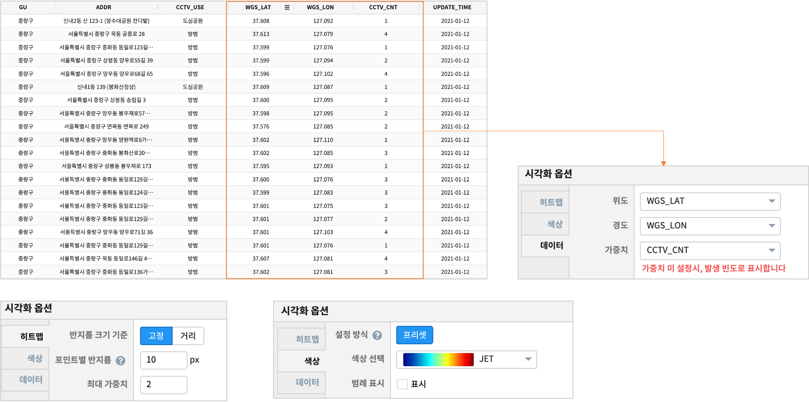

========================================================
지도유형 - 히트맵
========================================================

| 지도에 표시할 지점이 많을 때는 지점들을 마커로 표시하지 않고, ``히트맵`` 의 색상으로 밀도와 분포를 표현할 수 있습니다. 

**히트맵**

|
- 데이터
    - 데이터모델 "EDU_SEOUL_GU_WGS84" 로 서울시와 서울시 행정구 경계를 표시합니다.
    - 데이터모델 "EDU_SEOUL_CCTV" 로 서울시내 안심 CCTV 들의 위/경도 좌표와 갯수를 가져옵니다.

|  
- 레이어 구성
    - ``Base Map``   : Naver Web Map
    - ``도형-서울시경계``  : 도형-다각형
    - ``히트맵-CCTV``  : 히트맵

| 
- 시각화옵션

